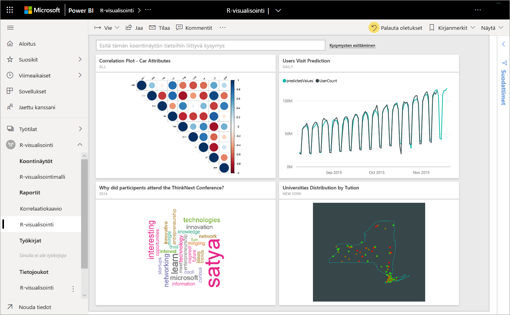
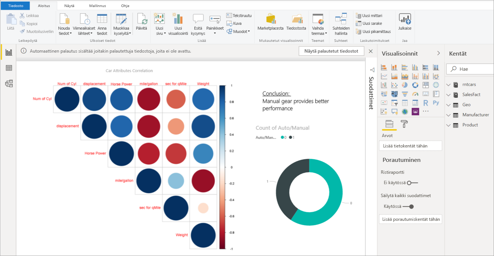
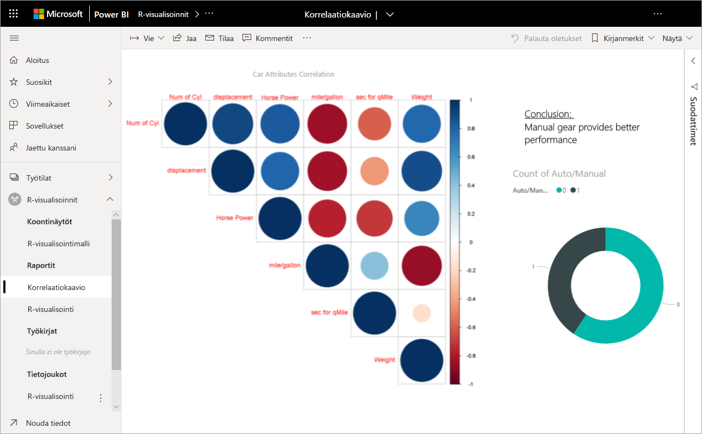
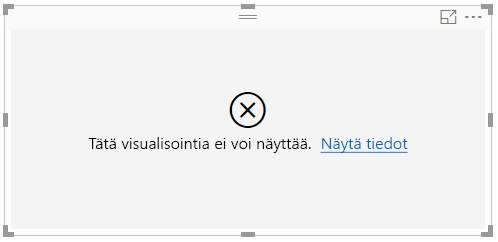
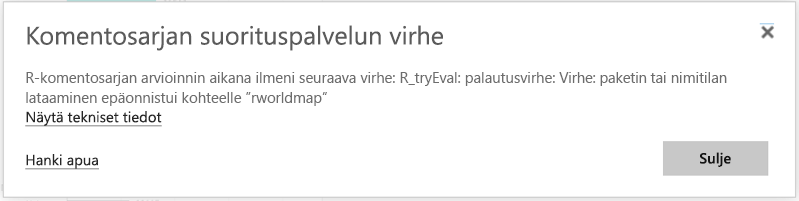

# R-visualisointien luominen ja käyttö Power BI:ssa
R-visualisointeja voidaan tällä hetkellä luoda vain **Power BI Desktopissa**, ja sen jälkeen ne julkaistaan Power BI -palveluun. Katso lisätietoja R-visualisointien luomisesta kohdasta [Power BI -visualisointien luominen R:n avulla](../desktop-r-visuals.md).

## R-visualisointien tarkasteleminen Power BI -palvelussa
Power BI -palvelu tukee R-komentosarjoilla luotujen visualisointien tarkastelemista ja käsittelemistä. R-komentosarjoilla luodut visualisoinnit, joita kutsutaan yleisesti nimellä *R-visualisoinnit*, voivat esittää kehittynyttä tietojen muotoilemista ja analytiikkaa, kuten ennusteita, hyödyntämällä R:n monipuolisia analytiikka- ja visualisointitaitoja.

> [!NOTE]
> [R-ohjelmointikieli](https://www.r-project.org/) on yksi yleisimmin käytetyistä ohjelmointikielistä, jota tilastotieteilijät, datatutkijat ja liiketoiminta-analyytikot käyttävät. R-kielessä on avoimen lähdekoodin yhteisö, joka tarjoaa yli 7 000 lisäosapakettia sekä hyvin laajasti käytetyt R-käyttäjäryhmät. Power BI -palvelussa käytetty R-versio on *Microsoft R 3.4.4.*
> 
> 

Seuraavassa kuvassa on Power BI -koontinäyttö, jossa on kehittyneessä analyysissä käytettyjen R-visualisointien kokoelma.

R-visualisointeja luodaan [Power BI Desktop -raportissa](../desktop-get-the-desktop.md), kuten seuraavassa kuvassa näkyvässä raportissa.

Kun raportti luodaan **Power BI Desktopissa**, voit julkaista raportin, joka sisältää vähintään yhden R-visualisoinnin, Power BI -palveluun. 

 Kaikkia R-paketteja ei tueta palvelussa. Katso tämän artikkelin lopussa olevasta tuettujen pakettien luettelosta tällä hetkellä Power BI -palvelussa tuetut paketit.

Voit ladata tämän [Power BI Desktop -mallitiedoston](https://download.microsoft.com/download/D/9/A/D9A65269-D1FC-49F8-8EC3-1217E3A4390F/RVisual_correlation_plot_sample%20SL.pbix) (.pbix-tiedosto), joka sisältää joitakin R-visualisointeja, nähdäksesi, miten tämä toimii, ja kokeillaksesi sitä.

R-visualisoinnit, jotka on luotu **Power BI Desktopissa** ja sitten julkaistu Power BI -palveluun, toimivat suurelta osin minkä tahansa muun Power BI -palvelun visualisoinnin tavoin: voit olla vuorovaikutuksessa niiden kanssa, suodattaa ja osittaa niitä ja kiinnittää niitä koontinäyttöön tai jakaa niitä muiden kanssa. Katso lisätietoja koontinäyttöjen ja visualisointien jakamisesta kohdasta [Koontinäytön jakaminen työtoverien ja muiden kanssa](../service-share-dashboards.md). Yksi ero muihin visualisointeihin on se, että R-visualisoinneissa ei voi näyttää työkaluvihjeitä eikä niitä voi käyttää muiden visualisointien suodattamiseen.

Kuten näet seuraavasta kuvasta, R-visualisoinnit Power BI -palvelussa, joko koontinäytössä tai raporteissa, näkyvät ja käyttäytyvät pitkälti kuten mikä tahansa muu visualisointi, eikä käyttäjien tarvitse olla tietoisia pohjana olevasta R-komentosarjasta, joka loi visualisoinnin.

## R-komentosarjojen suojaus
R-visualisointeja luodaan R-komentosarjoista, joiden koodi voi mahdollisesti sisältää suojaus- tai tietosuojariskejä.

Nämä riskit ovat lähinnä olemassa luomisvaiheessa, kun komentosarjan tekijä suorittaa komentosarjan omalla tietokoneellaan.

Power BI -palvelu käyttää *eristys*tekniikkaa, jonka avulla se suojaa käyttäjiä ja palvelua tietoturvariskeiltä.

Tämä *eristys*keino asettaa joitakin rajoituksia Power BI- palvelussa suoritettaville R-komentosarjoille, kuten rajoituksia pääsyssä Internetiin tai muihin resursseihin, joita ei tarvita R-visualisoinnin luomisessa.

## Virhe R-komentosarjoissa
Kun R-komentosarja havaitsee virheen, R-visualisointia ei piirretä ja näyttöön tulee virhesanoma. Lisätietoja virheestä saat valitsemalla **Näytä tiedot** R-visualisoinnin virheestä piirtoalustalla seuraavassa kuvassa esitetyllä tavalla.

Toinen esimerkki on alla olevan kuvan virhesanoma, joka tulee näkyviin, kun R-komentosarjaa ei voitu suorittaa oikein puuttuvan R-paketin vuoksi Azuressa.

## Käyttöoikeudet
R-visualisoinnit edellyttävät [Power BI Pro](../service-self-service-signup-for-power-bi.md) -käyttöoikeutta hahmontamiseen raporteissa, päivitykseen, suodatukseen ja ristiinsuodatukseen. Katso lisätietoja Power BI Pro -käyttöoikeuksista ja siitä, miten ne eroavat maksuttomista käyttöoikeuksista, kohdasta [Power BI Pro -sisältö – mikä se on?](../service-admin-purchasing-power-bi-pro.md)

Power BI:n maksuttomat käyttäjät kuluttavat vain ruutuja, jotka on jaettu heidän kanssaan Premium-työtiloissa. Saat lisätietoja ohjeartikkelista [Power BI Pron ostaminen](../service-admin-purchasing-power-bi-pro.md).

Seuraavassa taulukossa on kuvattu R-visualisoinnin ominaisuudet käyttöoikeuksien perusteella.

|  |R-visualisointien luominen Power BI Desktopissa  | Luo PBI-palveluraportteja R-visualisointien avulla |Näytä R-visualisoinnit raporteissa  | Näytä R-ruudut koontinäytöissä |
|---------|---------|---------|---------|--------|
|**Vieras** (Power BI Embedded)     |  Tuetaan|  Ei tueta      | Tuetaan vain Premium/Azure-kapasiteetissa  | Tuetaan vain Premium/Azure-kapasiteetissa |
|**Muun kuin hallittu vuokraaja** (toimialue ei ole vahvistettu) | Tuetaan | Ei tueta |  Ei tueta |Tuetaan (B2B-skenaario) |
|**Hallittu vuokraaja** maksuttomalla käyttöoikeudella    |  Tuetaan       |  Ei tueta       |    Tuetaan vain Premium-kapasiteetissa    | Tuetaan |
**Hallittu vuokraaja** Pro-käyttöoikeudella     |   Tuetaan      | Tuetaan      | Tuetaan    |Tuetaan|

## Tunnetut rajoitukset
R-visualisoinneilla Power BI -palvelussa on joitakin rajoituksia:

* R-visualisointien tuki rajoittuu paketteihin, jotka on kerrottu kohdassa [Lue, mitä R-paketteja tuetaan](../service-r-packages-support.md). Mukautettujen pakettien tukea ei ole tällä hetkellä.
* Tietojen kokorajoitukset – R-visualisointien piirtämiseen käyttämä tietomäärä on rajoitettu 150 000 riviin. Jos valittuna on yli 150 000 riviä, vain 150 000 ylintä riviä käytetään ja kuvassa näkyy sanoma.
* Resoluutio - kaikki R-visualisoinnit näytetään tarkkuudella 72 DPI.
* Laskenta-ajan rajoitus – jos R-visualisoinnin laskenta kestää kauemmin kuin 60 sekuntia, komentosarja aikakatkaistaan ja tuloksena on virhe.
* R-visualisoinnit päivitetään tietojen päivittämisen, suodattamisen ja korostamisen yhteydessä. Kuitenkaan itse kuva ei ole vuorovaikutteinen, eikä se tue työkaluvihjeitä.
* R-visualisoinnit reagoivat muiden visualisointien korostamiseen, mutta et voi napsauttaa R-visualisointien elementtejä ristiinsuodattaaksesi muita elementtejä.
* R-visualisointeja ei tällä hetkellä tueta *Aika*-tietotyypissä. Käytä sen sijaan Päivämäärä ja aika -tietotyyppiä.
* R-visualisoinnit eivät näy käytettäessä **Julkaise verkkoon** -arvoa.
* R-visualisointeja ei tällä hetkellä voi tulostaa koontinäytön ja raporttien tulostamisella
* R-visualisointeja ei tueta tällä hetkellä Analysis Servicesin DirectQuery-tilassa
* R-visualisoinneilla on kyky muuntaa tekstiotsikoita graafisiksi elementeiksi. Power BI-palvelu edellyttää seuraavaa lisävaihetta:
  
  * Lisää seuraavaksi seuraava rivi R-komentosarjan alkuun:
    
        powerbi_rEnableShowText =  1
* Kiinan, japanin ja korean fontit edellyttävät kaikkia seuraavia lisätoimia toimiakseen oikein Power BI -palvelussa:
  
  * Asenna ensin R-paketin *showtext* ja kaikki sen riippuvuudet. Voit tehdä tämän suorittamalla seuraavan komentosarjan:
    
        *install.packages("showtext")*
  * Lisää seuraavaksi seuraava rivi R-komentosarjan alkuun:
    
        powerbi_rEnableShowTextForCJKLanguages =  1

## R-pakettien yleiskatsaus
R-paketit ovat R-funktioiden, tietojen ja käännetyn koodin kokoelmia, jotka on yhdistetty määritellyssä muodossa. Kun R on asennettu, se sisältää vakiojoukon paketteja, ja muut paketit ovat ladattavissa ja asennettavissa. Asennuksen jälkeen R-paketti on ladattava istuntoon, jotta sitä voidaan käyttää. Maksuttomien R-pakettien ensisijainen lähde on CRAN, [kattava R-arkistointiverkko](https://cran.r-project.org/web/packages/available_packages_by_name.html).

**Power BI Desktop** voi käyttää minkä tahansa tyyppistä R-pakettia rajoituksetta. Voit asentaa R-paketit käytettäväksi **Power BI Desktopissa** itse (käyttämällä esimerkiksi [RStudio IDEä](https://www.rstudio.com/)).

**Power BI -palvelun** R-visualisointeja tukevat paketit, jotka löytyvät **Tuetut paketit** -osasta [tästä artikkelista](../service-r-packages-support.md). Jos et löydä paketin sinua kiinnostavaa pakettia Tuetut paketit -luettelosta, voit pyytää paketin tukea. Katso [R-paketit Power BI -palvelussa](../service-r-packages-support.md) -kohdasta lisätietoja siitä, miten voit pyytää tukea.

### R-paketteja koskevat vaatimukset ja rajoitukset
R-paketteja koskevat muutamat vaatimukset ja rajoitukset:

* Power BI -palvelu tukee suurelta osin R-paketteja maksuttomilla ja avoimen lähdekoodin ohjelmiston käyttöoikeuksilla, joita ovat esimerkiksi GPL-2, GPL-3 ja MIT+.
* Power BI -palvelu tukee CRANissa julkaistuja paketteja. Palvelu ei tue yksityisiä tai mukautettuja R-paketteja. Kehotamme käyttäjiä julkaisemaan yksityiset pakettinsa CRANissa ennen paketin pyytämistä käytettäväksi Power BI -palvelussa.
* **Power BI Desktopissa** on kaksi muunnelmaa R-paketeille:
  
  * R-visualisointien kohdalla voit asentaa minkä tahansa paketin, mukaan lukien mukautetun R-paketin
  * Mukautettujen R-visualisointien kohdalla vain julkisia CRAN-paketteja tuetaan pakettien automaattisessa asennuksessa
* Suojaus ja tietosuojasyiden takia emme tällä hetkellä tue palvelussa R-paketteja, jotka tarjoavat asiakas-palvelin-kyselyjä Internetissä (esimerkiksi RgoogleMaps). Verkkopalvelut on estetty tällaisten yritysten kohdalla. [R-paketit Power BI-palvelussa](../service-r-packages-support.md) -kohdassa on luettelo R-paketeista, joita tuetaan ja joita ei tueta.
* Uuden R-paketin hyväksyntäprosessissa on riippuvuuksien puu; joitain riippuvuuksia, jotka pitää asentaa palveluun, ei voida tukea.

### Tuetut paketit:
Pitkä luettelo tuetuista R-paketeista (ja lyhyt luettelo paketeista, joita ei tueta) on seuraavassa artikkelissa:

* [R-paketit Power BI-palvelussa](../service-r-packages-support.md)

