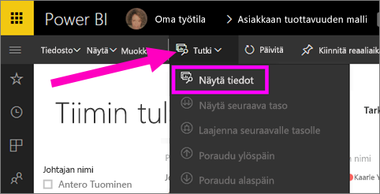
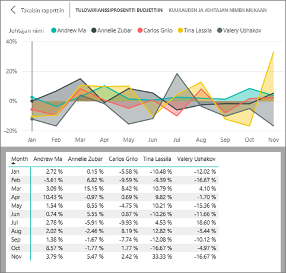
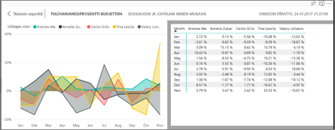
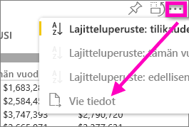

# Visualisoinnin luomiseen käytettyjen tietojen näyttäminen
## Näytä tiedot
Power BI:n visualisointi rakentuu tietojoukoissasi olevista tiedoista. Jos olet kiinnostunut taustatoiminnoista, Power BI:n avulla voit *tarkastella* visualisoinnin luomiseen käytettyjä tietoja. Kun valitset **Näytä tiedot**, Power BI näyttää tiedot visualisoinnin alla (tai vieressä).

Voit myös viedä visualisoinnin luomiseen käytetyt tiedot .xlsx- tai .csv-tiedostona ja tarkastella tietoja Excelissä. Katso lisätietoja artikkelista [Tietojen vieminen Power BI -visualisoinneista](power-bi-visualization-export-data.md).

> [!NOTE]
> *Näytä tiedot* ja *Vie tiedot* ovat kumpikin käytettävissä Power BI -palvelussa ja Power BI Desktopissa. Power BI Desktop sisältää kuitenkin yhden lisäkerroksen: [*Näytä tietueet* näyttää tietojoukon todelliset rivit](../desktop-see-data-see-records.md).
> 
> 

## *Näytä tiedot* -ominaisuuden käyttäminen Power BI -palvelussa
1. Avaa Power BI -palvelussa raportti [luku- tai muokkausnäkymässä](../service-interact-with-a-report-in-editing-view.md) ja valitse visualisointi.  Avaa Power BI Desktopissa raporttinäkymä.
2. Jos haluat tuoda visualisoinnin taustalla olevat tiedot näkyviin, valitse **Tutki** > **Näytä tiedot**.
   
   
3. Tiedot näkyvät oletusarvoisesti visualisoinnin alla.
   
   
4. Jos haluat vaihtaa suuntaa, valitse pystysuuntainen asettelu  visualisoinnin oikeasta yläkulmasta.
   
   
5. Jos haluat viedä tiedot .csv-tiedostona, valitse kolme pistettä ja valitse **Vie tiedot**.
   
    
   
    Katso lisätietoja tietojen viemisestä Exceliin artikkelista [Tietojen vieminen Power BI -visualisoinneista](power-bi-visualization-export-data.md).
6. Jos haluat piilottaa tiedot, poista valinta kohdasta **Tutki** > **Näytä tiedot**.

## Seuraavat vaiheet
[Tietojen vieminen Power BI -visualisoinneista](power-bi-visualization-export-data.md)    
[Visualisoinnit Power BI -raporteissa](power-bi-report-visualizations.md)    
[Power BI -raportit](../consumer/end-user-reports.md)    
Onko sinulla kysyttävää? [Kokeile Power BI -yhteisöä](http://community.powerbi.com/)

