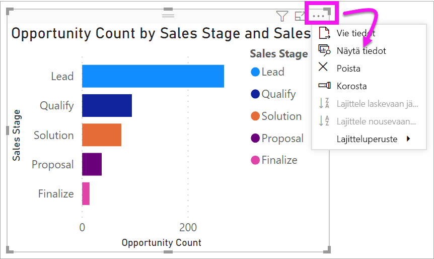
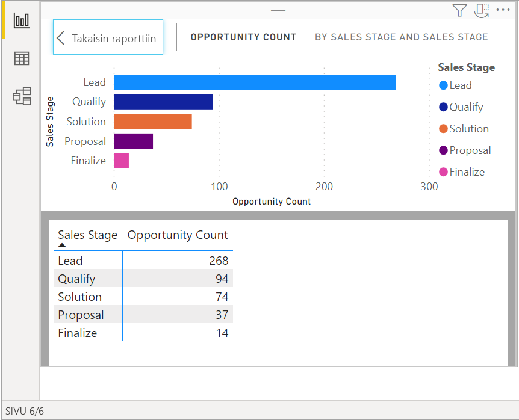
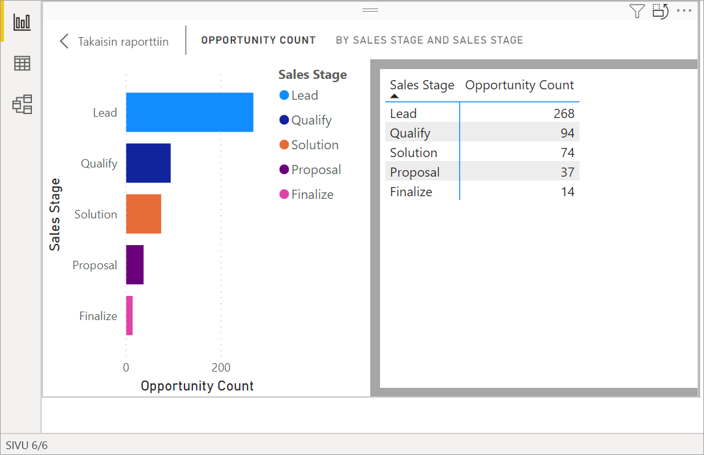
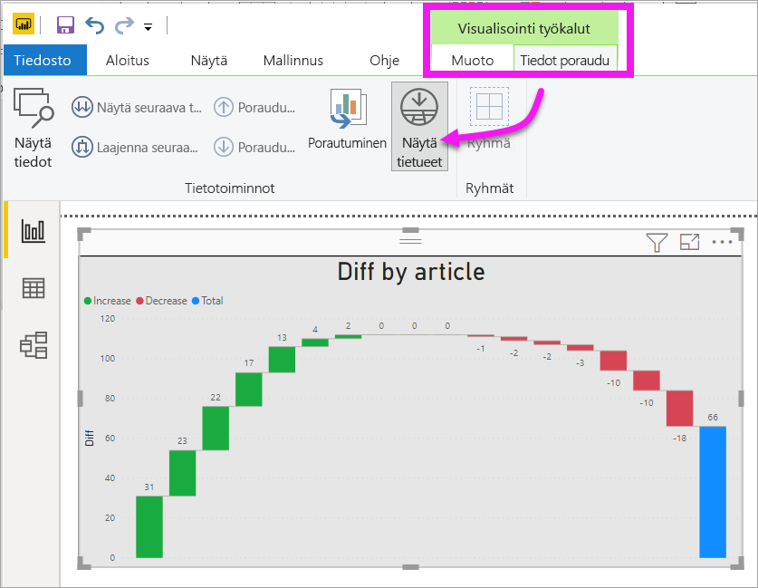
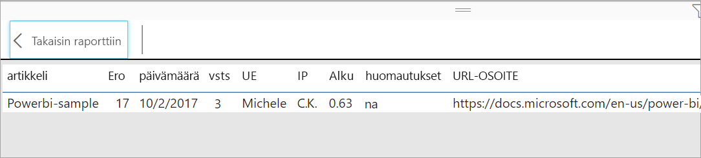

# Visualisoinnin luomiseen käytettyjen tietojen näyttäminen
## Näytä tiedot
Power BI:n visualisointi rakentuu tietojoukoissasi olevista tiedoista. Jos olet kiinnostunut taustatoiminnoista, Power BI:n avulla voit *tarkastella* visualisoinnin luomiseen käytettyjä tietoja. Kun valitset **Näytä tiedot**, Power BI näyttää tiedot visualisoinnin alla (tai vieressä).

Voit myös viedä visualisoinnin luomiseen käytetyt tiedot .xlsx- tai .csv-tiedostona ja tarkastella tietoja Excelissä. Katso lisätietoja artikkelista [Tietojen vieminen Power BI -visualisoinneista](power-bi-visualization-export-data.md).

> [!NOTE]
> *Näytä tiedot* ja *Vie tiedot* ovat kumpikin käytettävissä Power BI -palvelussa ja Power BI Desktopissa. Power BI Desktop sisältää kuitenkin yhden lisäkerroksen: [*Näytä tietueet* näyttää tietojoukon todelliset rivit](../desktop-see-data-see-records.md).
> 
> 

## *Näytä tiedot* -ominaisuuden käyttö 
1. Valitse Power BI Desktopista visualisointi, jotta siitä tulee aktiivinen.

2. Valitse **Lisää toimintoja** (...) ja valitse **Näytä tiedot**. 
    

3. Tiedot näkyvät oletusarvoisesti visualisoinnin alla.
   
   

4. Jos haluat vaihtaa suuntaa, valitse pystysuuntainen asettelu  visualisoinnin oikeasta yläkulmasta.
   
   
5. Jos haluat viedä tiedot .csv-tiedostona, valitse kolme pistettä ja valitse **Vie tiedot**.
   
    
   
    Katso lisätietoja tietojen viemisestä Exceliin artikkelista [Tietojen vieminen Power BI -visualisoinneista](power-bi-visualization-export-data.md).
6. Jos haluat piilottaa tiedot, poista valinta kohdasta **Tutki** > **Näytä tiedot**.

## Näytä tietueet- toiminnon käyttäminen
Voit myös keskittyä yhden tietueen visualisointiin ja porautua sen pohjana oleviin tietoihin. 

1. **Näytä tietueet** -käyttöä varten valitaan visualisointi, jotta siitä tulee aktiivinen. 

2. Valitse työpöydän valinta nauhasta **Visualisointityökalut** > **Tiedot/Poraudu** > **Näytä tietueet**. 

    

3. Valitse arvopiste tai rivi visualisoinnissa. Tässä esimerkissä olemme valinneet neljännen sarakkeen vasemmalta. Power BI osoittaa meille tietojoukon tietueen tälle arvo pisteelle.

    

4. Palaa Desktop-raportin pohjaan valitsemalla **Takaisin raporttiin**. 

## Huomioon otettavat seikat ja vianmääritys

- Jos **Näytä tietueet** -painike on poistettu käytöstä ja himmennettynä valintanauhassa, se tarkoittaa, ettei valittu visualisointi tue Näytä tietueet -toimintoa.
- Et voi muuttaa tietoja Näytä tietueita -näkymässä ja tallentaa niitä takaisin raporttiin.
- Et voi käyttää Näytä tietueet -toimintoa, kun visualisointi käyttää laskettua mittaria.
- Et voi käyttää Näytä tietueet -toimintoa, kun olet yhteydessä reaaliaikaiseen MD-malliin.  

## Seuraavat vaiheet
[Tietojen vieminen Power BI -visualisoinneista](power-bi-visualization-export-data.md)    

Onko sinulla kysyttävää? [Kokeile Power BI -yhteisöä](https://community.powerbi.com/)

