# Vinkkejä värimuotoiluun Power BI:ssä
Power BI tarjoaa useita eri tapoja koontinäyttöjen ja raporttien mukauttamiseen. Tässä artikkelissa on kokoelma vinkkejä, joiden avulla voit tehdä Power BI -visualisoinneistasi mielenkiintoisempia ja tarpeisiisi sopivampia.

Saatavilla ovat seuraavat vinkit. Haluatko antaa vinkin? Hienoa! Lähetä se meille ja saatamme lisätä sen tähän luetteloon.

* Yhden arvopisteen värin muuttaminen
* Kaavion värien pohjaaminen numeeriseen arvoon
* Arvopisteiden värin pohjaaminen kenttäarvoon
* Väriasteikossa käytettyjen värien mukauttaminen
* Erkautuvien väriasteikkojen käyttäminen
* Kumoaminen Power BI:ssä

Jos haluat tehdä muutoksia, sinun on oltava raportin muokkaustilassa. Avaa raportti ja valitse ylävalikosta **Muokkaa raporttia** kuvassa esitetyllä tavalla.

Kun **Visualisoinnit**-ruutu näkyy **Raportti**-piirtoalustan oikeassa reunassa, olet valmis aloittamaan mukauttaminen. Jos ruutua ei näy, avaa se napsauttamalla oikean yläkulman nuolta.

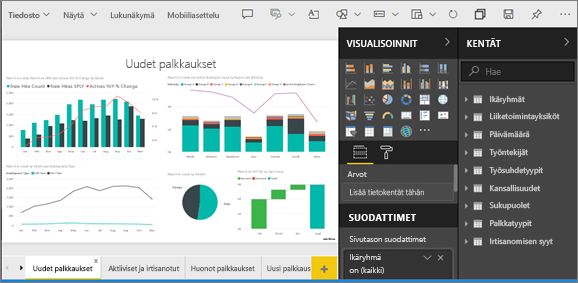

## Yhden arvopisteen värin muuttaminen
Joskus saatat haluta korostaa yhtä tiettyä arvopistettä. Kyseessä voi olla myyntiluvut uuden tuotteen julkaisusta tai kasvaneet laatupistemäärät uuden ohjelman julkaisun jälkeen. Power BI:ssä voit korostaa tiettyä arvopistettä vaihtamalla sen väriä.

Seuraava visualisointi asettaa myydyt yksiköt järjestykseen tuotesegmentin mukaan. 

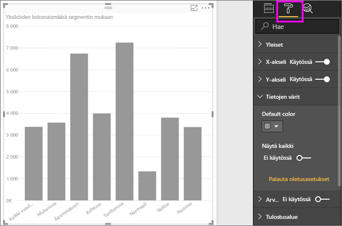

Oletetaan, että haluat korostaa **Kätevyys**-segmenttiä värin avulla näyttääksesi, kuinka hyvin tämä uusi segmentti suoriutuu. Työvaiheet ovat seuraavanlaiset:

Laajenna **Tietojen värit** -osio ja aseta **Näytä kaikki** -kohdan liukusäädin Käytössä-asentoon. Tämä näyttää jokaisen tietoelementin värit visualisoinnissa. Kun pidät hiiriosoitinta arvopisteiden päällä, vieritys on käytössä, joten voit muokata kaikkia arvopisteitä.

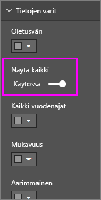

Määritä **Kätevyys** oranssiksi. 

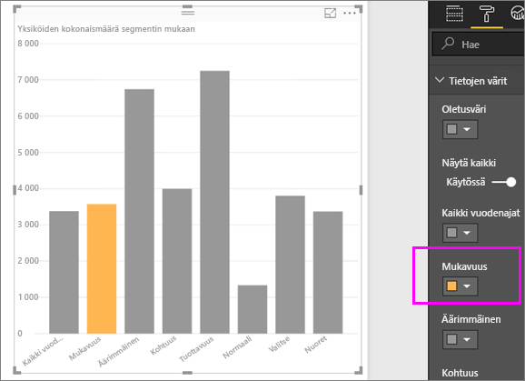

Valittuna **Kätevyys**-arvopiste on kauniin oranssin sävyinen ja erottuu varmasti.

Vaikka muuttaisit visualisointityyppiä ja palaisit sitten takaisin, Power BI muistaa valintasi ja säilyttää **Kätevyyden** osanssina.

Voit vaihtaa visualisoinnissa joko yhden, useamman tai kaikkien tietoelementtien arvopisteiden värin. Saatat esimerkiksi haluta visualisoinnin heijastavan yrityksesi värejä. 

Voit tehdä kaikenlaista väreillä. Seuraavassa osassa tutustumme liukuväreihin.

## Kaavion värien pohjaaminen numeeriseen arvoon
Värin määrittäminen dynaamisesti numeerisen arvon perusteella on usein hyödyllistä kaavioille. Tekemällä tämän voit näyttää eri arvon, kuin mitä palkin koossa käytetään, ja näyttää kaksi arvoa yksittäisessä kaaviossa. Voit myös käyttää tätä arvopisteiden korostamiseen tietyn arvon ylä- tai alapuolella – voit esimerkiksi korostaa pienen kannattavuuden alueita.

Seuraavissa osissa esitellään erilaisia tapoja pohjata väri numeeriseen arvoon.

## Arvopisteiden värin pohjaaminen arvoon
Voit muuttaa arvoon perustuvan värin vetämällä kenttää, johon haluat värin perustuvan, **Kenttä**-ruudun **Värikylläisyys**-alueelle. Seuraavassa kuvassa **%Markkinaosuus samaan aikaan viime vuonna VA** on vedetty **Värikylläisyys**-kohtaan. 

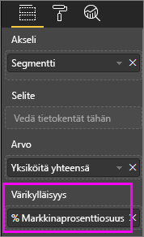

Määritä Muotoilu-ruudun **Tietojen värit** -kohdan alapuolelta, miten **%Markkinaosuus samaan aikaan viime vuonna VA** vaihtaa väriä ja varjostusta pylväskaaviossa. Tässä esimerkissä pienempi %Markkinaosuus on merkitty vaaleammalla ja suurempi tummemmalla sinisellä.

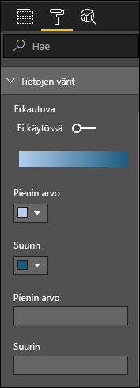

Kuten kuvasta nähdään, vaikka sekä **Tuottavuus**- että **Äärimmäinen**-segmenttien yksiköitä on myyty enemmän (niiden sarakkeet ovat korkeammat), **Kohtuus**-segmentin **%Markkinaosuus samaan aikaan viime vuonna VA** on suurempi (sen sarakkeen värikylläisyys on vahvempi).

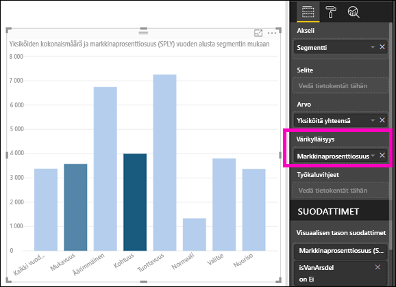

## Väriasteikossa käytettyjen värien mukauttaminen
Voit myös mukauttaa väriasteikossa käytettyjä värejä. Oletusarvon mukaan tietojen pienin arvo on liitetty vähiten kyllästettyyn väriin ja suurin arvo eniten kyllästettyyn väriin. Yllä olevassa kuvassa käytettiin sinistä liukuväriä. 

Laajenna **Tietojen värit** -kohta ja näet liukuvärit, joita tietojen visualisoinnissa käytetään. Värialue näkyy liukuväripalkissa, joka näyttää väriasteikon **Pienin**- ja **Suurin**-väriarvojen välillä niin, että **Pienin**-väriarvo on vasemmalla ja **Suurin**-väriarvo on oikealla.

Jos haluat muuttaa skaalausta ja käyttää eri värivalikoimaa, valitse värin avattava valikko **Pienin**- tai **Suurin**-kohdan vierestä ja valitse sitten väri. Seuraavassa kuvassa on näkyvissä **Suurin**-kohdan värin muuttuminen mustaksi, ja liukuväripalkissa näkyy uusi väriasteikko välillä **Pienin** ja **Suurin**.

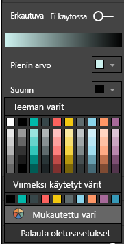

Voit myös muuttaa tapaa, jolla arvot liitetään näihin väreihin. Seuraavassa kuvassa **Pienin**- ja **Suurin**-kohtien värit on määritetty oranssiksi ja vihreäksi.

Huomaa tässä ensimmäisessä kuvassa, miten kaavion palkit vastaavat palkissa näkyvää liukuväriä. Suurin arvo on vihreä, pienin arvo on oranssi ja kunkin palkin välillä on vihreän ja oranssin väliltä oleva sävy.

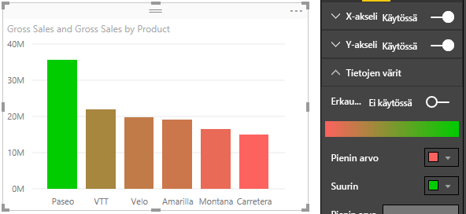

Katsotaan sitten, mitä tapahtuu, jos syötämme **Pienin**- ja **Suurin**-arvoruutuihin numeerisia arvoja, jotka ovat **Pienin**- ja **Suurin**-värivalitsinten alapuolella (näkyy seuraavassa kuvassa). **Pienin**-kohdan arvoksi määritetään 20 000 000 ja **Suurin**-kohdan arvoksi 20 000 001.

Määrittämällä kyseiset arvot liukuväriä ei enää käytetä kaavion arvoihin, jotka ovat **Pienin**- tai **Suurin**-arvojen alapuolella. Palkki, jonka arvo on **Suurin**-arvon yläpuolella, on vihreä, ja palkki, jonka arvo on **Pienin**-arvon alapuolella, on punainen.

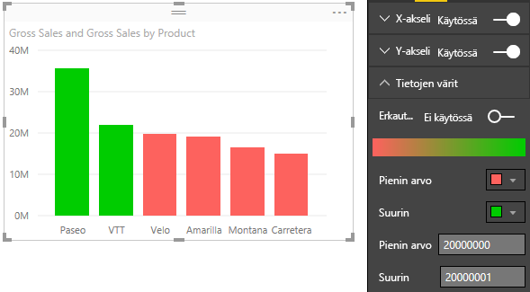

## Erkautuvien väriasteikkojen käyttäminen
Joskus tiedoissa voi olla luonnollisesti erkautuva asteikko. Esimerkiksi lauhkean alueen luonnollinen keskikohta on jäätymispiste, ja kannattavuuspistemäärällä on luonnollinen keskipiste (nolla).

Jos haluat käyttää erkautuvaa väriasteikkoa, vedä **Erkautuva**-liukusäädin kohtaan **Käytössä**. Kun **Erkautuva** on otettu käyttöön, näkyviin tulee ylimääräinen värivalitsin ja arvoruutu, joita kumpaakin kutsutaan **keskukseksi**, seuraavassa kuvassa esitetyllä tavalla.

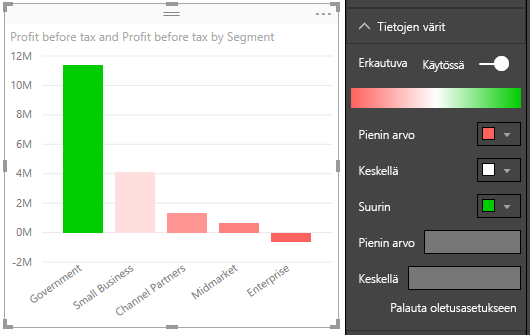

Kun **Erkauvua**-liukusäädin on käytössä, voit määrittää värit **Pienin**-, **Suurin**- ja **Keskus**-kohdille erikseen. Seuraavassa kuvassa **Keskus**-kohdan asetuksena on yksi, joten palkit, joiden arvo on suurempi kuin yksi, ovat vihreän sävyisiä, ja palkit, joiden arvo on pienempi kuin yksi, ovat punaisen sävyisiä.

## Kumoaminen Power BI:ssä
Kuten monissa muissakin Microsoft-palveluissa ja -ohjelmistoissa, myös Power BI:ssä viimeisimmän komennon kumoaminen onnistuu helposti. Oletetaan esimerkiksi, että muutat arvopisteen tai arvopisteiden sarjan väriä etkä ole tyytyväinen väriin, kun se tulee näkyviin visualisoinnissa. Et muista täsmälleen entistä väriä, mutta tiedät haluavasi värin takaisin!

Jos haluat **kumota** yhden tai useita edellisiä toimintoja, toimi seuraavasti:

- Kirjoita CTRL+Z

## Palaute
Onko sinulla vinkki, jonka haluat jakaa? Lähetä se meille ja saatamme lisätä sen tänne.

>[!NOTE]
>Nämä värin, akselin ja niihin liittyvät mukautukset, jotka ovat käytettävissä, kun **Muoto**kuvake on valittuna, ovat myös käytettävissä Power BI Desktopissa.

## Seuraavat vaiheet
[Värimuotoilun ja akseliominaisuuksien käytön aloittaminen](service-getting-started-with-color-formatting-and-axis-properties.md)

