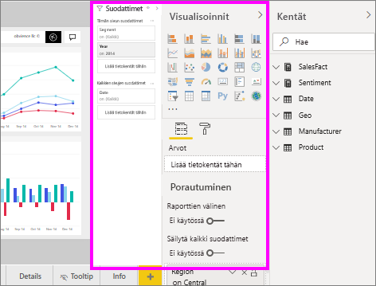
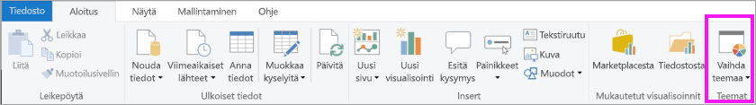
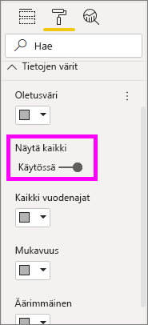
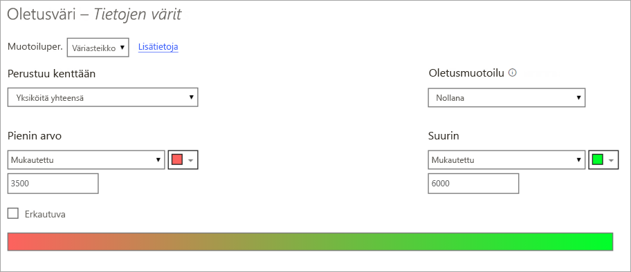
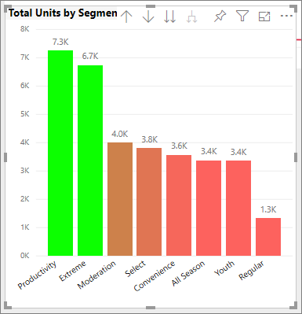
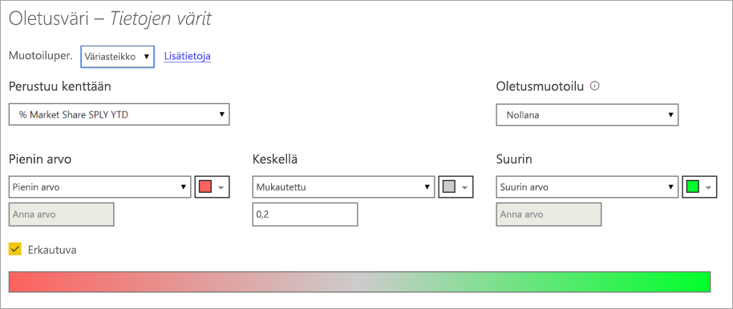
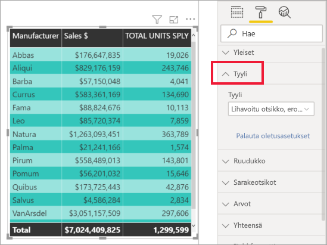
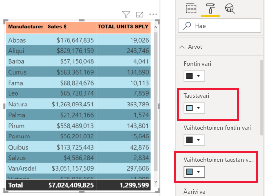
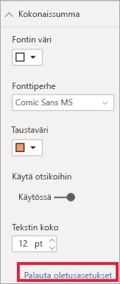

# Vinkkejä värimuotoiluun Power BI:ssä
Power BI tarjoaa useita eri tapoja koontinäyttöjen ja raporttien mukauttamiseen. Tässä artikkelissa on kokoelma vinkkejä, joiden avulla voit tehdä Power BI -visualisoinneistasi mielenkiintoisempia ja tarpeisiisi sopivampia.

Saatavilla ovat seuraavat vinkit. Haluatko antaa vinkin? Hienoa! Lähetä se meille ja saatamme lisätä sen tähän luetteloon.

* Teeman käyttäminen koko raportissa
* Yhden arvopisteen värin muuttaminen
* Ehdollinen muotoilu
* Kaavion värien pohjaaminen numeeriseen arvoon
* Arvopisteiden värin pohjaaminen kenttäarvoon
* Väriasteikossa käytettyjen värien mukauttaminen
* Erkautuvien väriasteikkojen käyttäminen
* Värin lisääminen taulukon riveihin
* Kumoaminen Power BI:ssä

Jos haluat tehdä muutoksia, sinulla on oltava raportin muokkausoikeudet. Avaa raportti Power BI Desktopin **Raportti**-näkymässä. Power BI-palvelussa se tarkoittaa raportin avaamista ja kohdan **Muokkaa** valitsemista valikkoriviltä seuraavassa kuvassa esitetyllä tavalla.

Kun **Suodattimet**- ja **Visualisoinnit**-ruudut näkyvät raporttipohjan oikeassa reunassa, olet valmis aloittamaan mukauttamisen. Jos ruutuja ei näy, avaa ne napsauttamalla oikeassa yläkulmassa olevaa nuolta.

## Ota teema käyttöön
Raporttiteemojen avulla voit soveltaa rakennemuutoksia koko raporttiin, esimerkiksi käyttää yrityksen värejä, muuttaa kuvakejoukkoja tai ottaa käyttöön uuden oletusarvoisen muotoilun visualisoinneille. Kun otat käyttöön raporttiteeman, kaikissa raporttisi visualisoinneissa ja muotoiluissa käytetään valitun teeman värejä. Lisätietoja on ohjeaiheessa [Raporttiteemojen käyttäminen](../desktop-report-themes.md)

Olemme tässä ottaneet käyttöön **Innovoi**-teeman myynti-ja markkinointiraportissa.

## Yhden arvopisteen värin muuttaminen
Joskus saatat haluta korostaa yhtä tiettyä arvopistettä. Kyseessä voi olla myyntiluvut uuden tuotteen julkaisusta tai kasvaneet laatupistemäärät uuden ohjelman julkaisun jälkeen. Power BI:ssä voit korostaa tiettyä arvopistettä vaihtamalla sen väriä.

Seuraava visualisointi asettaa myydyt yksiköt järjestykseen tuotesegmentin mukaan. 

Oletetaan, että haluat korostaa **Kätevyys**-segmenttiä värin avulla näyttääksesi, kuinka hyvin tämä uusi segmentti suoriutuu. Työvaiheet ovat seuraavanlaiset:

Laajenna **Tietojen värit** -kortti ja aseta **Näytä kaikki** -kohdan liukusäädin Käytössä-asentoon. Tämä näyttää jokaisen tietoelementin värit visualisoinnissa. Voit nyt muokata mitä tahansa arvopistettä.

Määritä **Kätevyys** oranssiksi. 

Valittuna **Kätevyys**-arvopiste on kauniin oranssin sävyinen ja erottuu varmasti.

Vaikka muuttaisit visualisointityyppiä ja palaisit sitten takaisin, Power BI muistaa valintasi ja säilyttää **Kätevyyden** osanssina.

Voit vaihtaa visualisoinnissa joko yhden, useamman tai kaikkien tietoelementtien arvopisteiden värin. Saatat esimerkiksi haluta visualisoinnin heijastavan yrityksesi värejä kuten keltaista, vihreää tai sinistä. 

Voit tehdä kaikenlaista väreillä. Seuraavassa osassa tutustumme ehdolliseen muotoiluun.

## Visualisoinnin ehdollinen muotoilu
Värin määrittäminen dynaamisesti numeerisen arvon perusteella on usein hyödyllistä visualisoinneissa. Tekemällä tämän voit näyttää eri arvon, kuin mitä palkin koossa käytetään, ja näyttää kaksi arvoa yksittäisessä kaaviossa. Voit myös käyttää tätä arvopisteiden korostamiseen tietyn arvon ylä- tai alapuolella – voit esimerkiksi korostaa pienen kannattavuuden alueita.

Seuraavissa osissa esitellään erilaisia tapoja pohjata väri numeeriseen arvoon.

### Arvopisteiden värin pohjaaminen arvoon
Jos haluat muuttaa väriä arvon perusteella, aktivoi visualisointi valitsemalla sen. Avaa muotoiluruutu valitsemalla maalitelakuvake ja avaa sitten **Tietojen värit** -kortti. Siirrä kohdistin kortin päälle ja valitse **Ehdollinen muotoilu** -vaihtoehto napsauttamalla kolmea päällekkäistä pistettä.  

**Oletusvärit**-ruudussa voit määrittää ehdolliseen muotoiluun käytettävät kentät avattavien luetteloiden avulla. Tässä esimerkissä on valittu **Myyntifaktat** > **Yksiköitä yhteensä** -kenttä sekä korostettu **Pienin arvo** vaaleansinisellä ja **Suurin arvo** tummansinisellä värillä. 

Voit myös muotoilla visualisoinnin värin käyttämällä kenttää, joka ei ole visualisoinnin osa. Seuraavassa kuvassa **Markkinaprosenttiosuus samaan aikaan viime vuonna VA** on käytössä. 

Kuten näet, vaikka **Productivity**- ja **Extreme**-segmenttien yksiköitä on myyty enemmän (niiden pylväät ovat korkeammat), **Moderation**-segmentin **markkinaprosenttiosuus samaan aikaan viime vuonna vuoden alusta** on suurempi (pylvään värikylläisyys on vahvempi).

### Väriasteikossa käytettyjen värien mukauttaminen
Voit myös muuttaa tapaa, jolla arvot liitetään näihin väreihin. Seuraavassa kuvassa **Pienin**- ja **Suurin**-kohtien värit on määritetty oranssiksi ja vihreäksi.

Huomaa tässä ensimmäisessä kuvassa, miten kaavion palkit vastaavat palkissa näkyvää liukuväriä. Suurin arvo on vihreä, pienin arvo on oranssi ja kunkin palkin välillä on vihreän ja oranssin väliltä oleva sävy.

Seuraavaksi katsotaan, mitä tapahtuu, jos **Pienin** ja **Suurin**-ruutuihin lisätään numeeriset arvot. Valitse **Mukautettu** alasvetovalikosta sekä **Pienin**- että **Suurin**-arvolle ja määritä **Pienin** arvoon 3 500 ja **Suurin** arvoon 6 000.

Määrittämällä kyseiset arvot liukuväriä ei enää käytetä kaavion arvoihin, jotka ovat **Pienin**- tai **Suurin**-arvojen alapuolella. Palkki, jonka arvo on **Suurin**-arvon yläpuolella, on vihreä, ja palkki, jonka arvo on **Pienin**-arvon alapuolella, on punainen.

### Erkautuvien väriasteikkojen käyttäminen
Joskus tiedoissa voi olla luonnollisesti erkautuva asteikko. Esimerkiksi lauhkean alueen luonnollinen keskikohta on jäätymispiste, ja kannattavuuspistemäärällä on luonnollinen keskipiste (nolla).

Voit käyttää erkautuvia väriasteikkoja valitsemalla **Erkautuva**-valintaruudun. Kun **Erkautuva** on otettu käyttöön, näkyviin tulee ylimääräinen värivalitsin, jota kutsutaan **keskukseksi** (ks. seuraava kuva).

Kun **Erkauvua**-liukusäädin on käytössä, voit määrittää värit **Pienin**-, **Suurin**- ja **Keskus**-kohdille erikseen. Seuraavassa kuvassa **Keskus**-kohdan asetuksena on 0,2 **Markkinaprosenttiosuus samaan aikaan viime vuonna VA** -kohdan osalta. Tämän vuoksi pylväät, joiden arvo on suurempi kuin 0,2, näytetään vihreän eri sävyissä, ja palkit, joiden arvo on pienempi kuin yksi, näytetään punaisen eri sävyissä.

## Värin lisääminen taulukon riveihin
Taulukot ja matriisit tarjoavat monia värimuotoiluja koskevia vaihtoehtoja. 

Yksi nopeimmista tavoista käyttää väriä taulukossa tai matriisissa on avata Muotoilu-välilehti ja valita **Tyyli**.  Alla olevassa kuvassa olemme valinneet vaihtoehdon **Lihavoitu otsikko, erottuvat rivit**.

Kokeile muita värimuotoiluasetuksia. Tässä kuvassa olemme vaihtaneet **sarakeotsikoiden** taustavärin ja muuttaneet **arvojen** (rivien) **taustavärin** ja **vaihtoehtoisen taustan värin**.

## Kumoaminen Power BI:ssä
Kuten monissa muissakin Microsoft-palveluissa ja -ohjelmistoissa, myös Power BI:ssä viimeisimmän komennon kumoaminen onnistuu helposti. Oletetaan esimerkiksi, että muutat arvopisteen tai arvopisteiden sarjan väriä etkä ole tyytyväinen väriin, kun se tulee näkyviin visualisoinnissa. Et muista täsmälleen entistä väriä, mutta tiedät haluavasi värin takaisin!

Jos haluat **kumota** yhden tai useita edellisiä toimintoja, paina CTRL+Z.

Jos haluat hylätä kaikki muotoilukorttiin tekemäsi muutokset, valitse **Palauta oletusasetukset**.

## Palaute
Onko sinulla vinkki, jonka haluat jakaa? Lähetä se meille ja saatamme lisätä sen tänne.

## Seuraavat vaiheet
[Värimuotoilun ja akseliominaisuuksien käytön aloittaminen](service-getting-started-with-color-formatting-and-axis-properties.md)

