# Power BI -sisällön jakaminen ulkoisille vieraskäyttäjille Azure Active Directory B2B:n avulla

**Yhteenveto:** Tämä on tekninen raportti, jossa esitellään, miten sisältöä jaetaan organisaation ulkopuolisille käyttäjille käyttämällä Azure Active Directory Business-to-Business (Azure AD B2B)-integrointia.

**Kirjailijat:** Jukka, Jone

**Tekniset tarkistajat:** Adam Wilson, Sheng Liu, Qian Liang, Sergei Gundorov, Jacob Grimm, Adam Saxton, Maya Shenhav, Nimrod Shalit, Elisabeth Olson

> [!NOTE]
> Voit tallentaa tai tulostaa tämän teknisen raportin valitsemalla selaimesta **Tulosta** ja valitsemalla sitten **Tallenna PDF-tiedostona**.

## Johdanto

Power BI tarjoaa organisaatioille 360 asteen näkymän liiketoimintaansa ja antaa organisaatioiden kaikille jäsenille mahdollisuuden tehdä tietoihin perustuvia älykkäitä päätöksiä. Monilla näistä organisaatioista on vahva ja luottamuksellinen suhde ulkoisiin kumppaneihin, asiakkaisiin ja alihankkijoihin. Organisaatioiden on tarjottava ulkoisten kumppanien käyttäjille suojattu yhteys Power BI -koontinäyttöihin ja -raportteihin.

Power BI on integroitu [Azure Active Directory Business-to-Businessin (Azure AD B2B)](https://docs.microsoft.com/azure/active-directory/b2b/what-is-b2b) kanssa, jotta Power BI -sisältöä voidaan jakaa turvallisesti organisaation ulkopuolisille vieraskäyttäjille samalla, kun säilytetään sisäisten tietojen hallinta.

Tämä tekninen raportti sisältää tarvitsemasi tiedot siitä, miten Power BI on integroitu Azure Active Directory B2B:n kanssa. Käsittelemme sen yleisimmän käyttötavan, asennuksen, käyttöoikeudet ja rivitason suojauksen.

> [!NOTE]
> Tässä julkaisussa käytämme Azure Active Directorysta muotoa Azure AD ja Azure Active Directory Business-to-Businessista muotoa Azure AD B2B.

## Skenaariot

Contoso on autovalmistaja ja sillä on useita toimittajia, jotka tuottavat sille valmistuksessa tarvittavia osia, materiaaleja ja palveluja. Contoso haluaa virtaviivaistaa toimitusketjunsa logistiikkaa ja aikoo käyttää Power BI:tä toimitusketjun suorituskyvyn mittarien valvontaan. Contoso haluaa jakaa analyyseja turvallisesti ja hallitusti ulkoisten toimitusketjukumppanien kanssa.

Power BI:tä ja Azure AD B2B:tä käyttämällä Contoso voi ottaa ulkoisille käyttäjille käyttöön seuraavat käyttökokemukset.

### Ad hoc -jakaminen nimikkeittäin

Contosolla on toimittaja, joka valmistaa jäähdyttimiä Contoson autohin. Usein toimittajan pitää optimoida jäähdyttimien luotettavuus käyttämällä Contoson autoista saatavia tietoja. Contoson analyytikko jakaa jäähdyttimien luotettavuusraportin toimittajan insinöörille Power BI:n avulla. Insinööri saa sähköpostilla linkin raportin tarkasteluun.

Yrityskäyttäjät hyödyntävät ad hoc -jakamista yllä kuvatulla tavalla tarpeen mukaan. Power BI:n ulkoiselle käyttäjälle lähettämä linkki on Azure AD B2B -kutsulinkki. Kun ulkoinen käyttäjä avaa linkin, häntä pyydetään liittymään Contoson Azure AD -organisaatioon vieraskäyttäjänä. Kun kutsu on hyväksytty, linkki avaa määritetyn raportin tai koontinäytön. Azure Active Directoryn järjestelmänvalvoja delegoi oikeuksia kutsua ulkoisia käyttäjiä organisaatioon ja valitsee, mitä kyseiset käyttäjät voivat tehdä hyväksyttyään kutsun tämän asiakirjan Hallinto-osiossa kuvatulla tavalla. Contoso-analyytikko voi kutsua vieraskäyttäjän vain, koska Azure AD:n järjestelmänvalvoja on sallinut toiminnon ja koska Power BI:n järjestelmänvalvoja on sallinut käyttäjien kutsua vieraita tarkastelemaan sisältöä Power BI:n vuokraaja-asetuksissa.

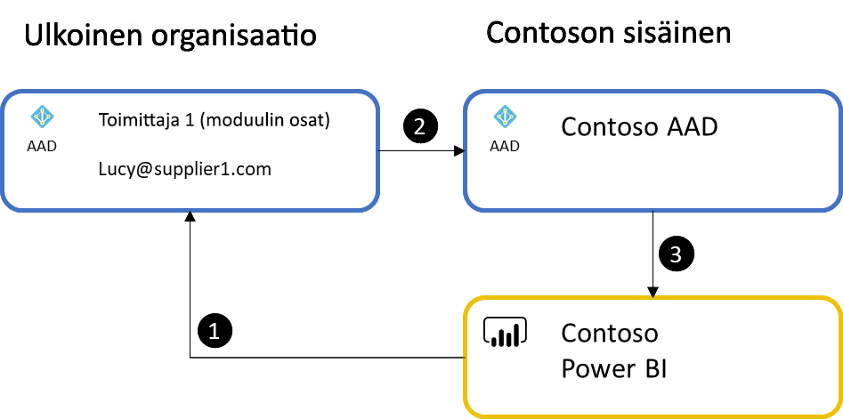

1. Aluksi Contoson sisäinen käyttäjä jakaa koontinäytön tai raportin ulkoisen käyttäjä kanssa. Jos ulkoinen käyttäjä ei vielä ole Contoson Azure AD:n vieras, hänet kutsutaan vieraaksi. Hänen sähköpostiosoitteeseensa lähetetään viesti, joka sisältää kutsun Contoson Azure AD:hen.
2. Vastaanottaja hyväksyy kutsun, ja hänet lisätään vieraskäyttäjäksi Contoson Azure AD:hen.
3. Tämän jälkeen vastaanottaja ohjataan Power BI -koontinäyttöön, -raporttiin tai -sovellukseen, joita käyttäjä tarkastelee vain luku -tilassa.

Prosessi on luonteeltaan ad hoc, sillä Contoson yrityskäyttäjät lähettävät kutsun liiketoiminnan tarpeen mukaan. Jokainen jaettu nimike on yksittäinen linkki, jonka kautta ulkoinen käyttäjä voi tarkastella sisältöä.

Kun ulkoinen käyttäjä on kutsuttu käyttämään Contoson resursseja, hänelle voidaan luoda varjotili Contoso Azure AD:hen eikä häntä tarvitse enää kutsua uudelleen.  Kun käyttäjä yrittää käyttää Contoso-resurssia, esimerkiksi Power BI -koontinäyttöä, ensimmäisen kerran, hän käy läpi suostumusprosessin, joka lunastaa kutsun.  Jos käyttäjä ei anna suostumustaan, hän ei voi käyttää Contoson sisältöä.  Jos käyttäjällä on ongelmia lunastaa kutsu alkuperäisen linkin kautta, Azure AD:n järjestelmänvalvoja voi lähettää tietyn kutsulinkin uudelleen lunastettavaksi.

### Suunniteltu jakaminen nimikkeittäin

Contosolla on alihankkija, joka tekee jäähdyttimien luotettavuusanalyysin. Alihankkijalla on 10 hengen tiimi, joka tarvitsee käyttöoikeuden Contoson Power BI -ympäristön tietoihin. Contoson Azure AD -järjestelmänvalvoja kutsuu kaikki käyttäjät ja käsittelee lisäykset ja muutokset, jos alihankkijan henkilöstössä on muutoksia. Azure AD:n järjestelmänvalvoja luo käyttöoikeusryhmän kaikille alihankkijan työntekijöille. Käyttöoikeusryhmän avulla Contoson työntekijät voivat helposti hallita raporttien käyttöoikeuksia ja varmistaa, että kaikki asiaankuuluvat alihankkijan henkilöstön jäsenet voivat käyttää tarvittavia raportteja, koontinäyttöjä ja Power BI -sovelluksia. Azure AD:n järjestelmänvalvoja voi myös jättäytyä kutsuprosessin ulkopuolelle delegoimalla kutsuoikeudet Contoson tai alihankkijan luotetulle työntekijälle ja varmistaa näin ajantasaisen henkilöstön hallinnan.

Jotkin organisaatiot tarvitsevat enemmän mahdollisuuksia hallita ulkoisten käyttäjien lisäysajankohtaa, useampien ulkoisen organisaation käyttäjien kutsumista, tai monien ulkoisten organisaatioiden kutsumista. Näissä tapauksissa suunniteltua jakamista voidaan käyttää jakamisen laajuuden hallitsemiseen, organisaation käytäntöjen toteuttamiseen ja jopa oikeuksien delegoimiseen luotetuille henkilöille, niin että he voivat kutsua ja hallita ulkoisia käyttäjiä. Azure AD B2B:ssa [IT-järjestelmävalvoja voi lähettää suunniteltuja kutsuja suoraan Azure-portaalissa](https://docs.microsoft.com/azure/active-directory/b2b/add-users-administrator) tai [käyttämällä PowerShellin kautta kutsujen hallinnan ohjelmointirajapintaa](https://docs.microsoft.com/azure/active-directory/b2b/customize-invitation-api), jossa yhdellä kertaa voi kutsua joukon käyttäjiä. Käyttämällä suunniteltujen kutsujen lähestymistapaa organisaatio voi määrittää kutsun lähettäjät ja ottaa käyttöön hyväksymisprosesseja. Azure AD:n lisäominaisuuksien kuten dynaamisten ryhmien avulla suojausryhmän jäsenyyksien automaattinen hallinta on helppoa.

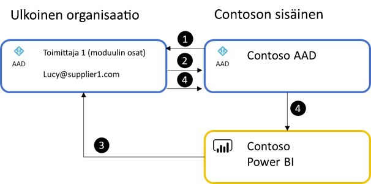

1. Prosessin alussa IT-järjestelmänvalvoja kutsuu vieraskäyttäjän joko manuaalisesti tai Azure Active Directoryn tarjoaman ohjelmointirajapinnan kautta.
2. Käyttäjä hyväksyy kutsun organisaatioon.
3. Kun käyttäjä on hyväksynyt kutsun, Power BI:n käyttäjä voi jakaa raportin tai koontinäytön ulkoisen käyttäjän tai yhteisen käyttöoikeusryhmän kanssa. Ulkoinen käyttäjä saa sähköpostilla linkin kohteeseen samaan tapaan kuin tavallisen Power BI -jaon yhteydessäkin.
4. Kun ulkoinen käyttäjä käyttää linkkiä, hänen organisaationsa hakemistossa oleva käyttöoikeuksien todennus välitetään Contoson Azure AD:hen, jolloin hän pääsee käyttämään Power BI -sisältöä.

### Power BI -sovellusten ad hoc- tai suunniteltu jakaminen

Contosolla on joukko raportteja ja koontinäyttöjä, jotka he haluavat jakaa yhden tai useamman toimittajan kanssa. Jotta kaikilla asiaankuuluvilla ulkoisilla käyttäjillä olisi käyttöoikeus tähän sisältöön, se on pakattu Power BI -sovellukseksi. Ulkoiset käyttäjät lisätään joko suoraan sovelluksen käyttöoikeusluetteloon tai käyttöoikeusryhmien kautta. Tämän jälkeen Contoson edustaja lähettää sovelluksen URL-osoitteen kaikille ulkoisille käyttäjille, esimerkiksi sähköpostiviestissä. Kun ulkoiset käyttäjät avaavat linkin, koko sisältö on helposti käytettävissä yhden käyttökokemuksen sisällä.

Power BI -sovelluksen avulla Contoson on helppo luoda toimittajilleen BI-portaali. Yksittäinen käyttöoikeusluettelo hallitsee kaiken tarvittavan sisällön käyttöä, mikä vähentää nimiketason käyttöoikeuksien tarkistamiseen ja määrittämiseen käytettyä aikaa. Azure AD B2B ylläpitää suojauksen käyttöoikeuksia käyttämällä toimittajan alkuperäisiä käyttäjätietoja, jolloin käyttäjät eivät tarvitse muita tunnistetietoja. Suunniteltuja kutsuja käyttöoikeusryhmien kanssa käytettäessä sovelluksen käyttöoikeuksien hallintaa on yksinkertaistettu, sillä henkilöstöä liittyy projektiin tai lähtee siitä jatkuvasti. Käyttöoikeusryhmien jäsenyydet määritetään manuaalisesti tai käyttämällä [dynaamisia ryhmiä](https://docs.microsoft.com/azure/active-directory/b2b/use-dynamic-groups), niin että kaikki toimittajan ulkoiset käyttäjät lisätään automaattisesti oikeaan käyttöoikeusryhmään.

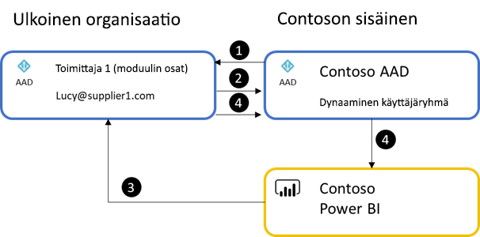

1. Prosessi käynnistyy, kun käyttäjä kutsutaan Contoson Azure AD -organisaatioon Azure-portaalin tai PowerShellin kautta
2. Käyttäjä voidaan lisätä käyttäjäryhmään Azure AD:ssä. Käyttää voidaan joko staattista tai dynaamista käyttäjäryhmää, mutta dynaamiset ryhmät vähentävät manuaalista työtä.
3. Ulkoisille käyttäjille annetaan käyttöoikeus Power BI -sovellukseen käyttäjäryhmän kautta. Sovelluksen URL-osoite lähetetään suoraan ulkoiselle käyttäjälle tai lisätään sivustoon, johon hänellä on käyttöoikeus. Power BI pyrkii parhaansa mukaan lähettämään sovelluslinkin sisältävän sähköpostiviestin ulkoisille käyttäjille, mutta kun käytetään käyttäjäryhmiä, joiden jäsenyydet muuttuvat, Power BI ei pysty lähettämään viestiä kaikille käyttäjäryhmien kautta hallituille ulkoisille käyttäjille.
4. Kun ulkoinen käyttäjä käyttää Power BI -sovelluksen URL-osoitetta, käyttäjä todennetaan Contoson Azure AD:llä, sovellus asennetaan käyttäjälle ja käyttäjä näkee kaikki sovellukseen sisällytetyt raportit ja koontinäytöt.

Sovelluksissa on myös ainutlaatuinen toiminto, jonka ansioista sovellusten tekijät voivat asentaa sovelluksen käyttäjälle automaattisesti, jolloin se on saatavilla, kun käyttäjä kirjautuu sisään. Toiminto asentaa automaattisesti vain niille ulkoisille käyttäjille, jotka ovat jo osa Contoson organisaatiota, kun sovellus julkaistaan tai päivitetään. Näin ollen se sopii parhaiten suunniteltujen kutsujen lähestymistapaan ja toimii silloin, kun sovellus on julkaistu tai päivitetty sen jälkeen, kun käyttäjät on lisätty Contoson Azure AD:hen. Ulkoiset käyttäjät voivat aina asentaa sovelluksen sovelluslinkin avulla.

### Kommentointi ja sisällön tilaaminen kaikissa organisaatioissa

Contoso jatkaessa alihankkijoiden tai toimittajien kanssa työskentelyä ulkoisille insinööreille tulee tarve tehdä yhteistyötä Contoson analyytikoiden kanssa. Power BI tarjoaa useita yhteistyöominaisuuksia, jotka auttavat käyttäjiä vaihtamaan tietoja käyttämästään sisällöstä. Koontinäytön kommentoinnin (ja pian raportin kommentoinnin) avulla käyttäjät voivat keskustella näkemistään arvopisteistä ja esittää kysymyksiä raporttien tekijöille.

Tällä hetkellä ulkoiset vieraskäyttäjät voivat osallistua kommentointiin jättämällä kommentteja ja lukemalla vastauksia. Mutta toisin kuin sisäisiä käyttäjiä vieraskäyttäjiä ei voi mainita (@mentioned), eivätkä he saa ilmoitusta siitä, että he ovat saanet kommentin. Vieraskäyttäjät eivät tällä hetkellä voi käyttää Power BI:n tilausominaisuutta. Tulevassa julkaisuversiossa rajoitukset poistetaan ja vieraskäyttäjä saa sähköpostiviestin, kun hänet mainitaan (@mentions) kommentissa tai kun sähköpostiin toimitetaan tilaus, joka sisältää linkin Power BI -sisältöön.

### Sisällön käyttäminen Power BI -mobiilisovelluksissa

Kun Contoson käyttäjät tulevassa julkaisuversiossa jakavat raportteja tai raporttinäkymiä ulkoisten vieraskäyttäjien kanssa, Power BI lähettää vieraalle sähköposti-ilmoituksen. Kun vieraskäyttäjä avaa linkin raporttiin tai koontinäyttöön mobiililaitteellaan, sisältö avautuu laitteen alkuperäisiin Power BI -mobiilisovelluksiin, jos ne on asennettu. Vieraskäyttäjä voi tämän jälkeen siirtyä hänelle ulkoisessa vuokraajassa jaettujen sisältöjen välillä sekä takaisin omaan kotivuokraajansa sisältöön.

> [!NOTE]
> Vieraskäyttäjä ei voi avata Power BI -mobiilisovellusta eikä siirtyä suoraan ulkoiseen vuokraajan, vaan hänen on avattava linkki ulkoisen vuokraajan nimikkeeseen. Yleisiä vaihtoehtoja on kuvattu [Linkkien jakelu pääorganisaation Power BI:ssä olevaan sisältöön ](#distributing-links-to-content-in-the-parent-organizations-power-bi) -osassa myöhemmin tässä asiakirjassa.

### Power BI -sisällön muokkaus ja hallinta organisaatioiden välillä

Contoso ja sen toimittajat ja alihankkijat toimivat yhdessä yhä tiiviimmin. Alihankkijan analyytikko tarvitsee Contoson jakamiin raportteihin usein lisämittareita tai tietojen visualisointeja. Tiedon pitäisi olla Contoson Power BI -vuokraajassa, mutta ulkoisten käyttäjien pitäisi voida muokata sitä, luoda uutta sisältöä ja jopa jakaa sitä asianmukaisille henkilöille.

Power BI tarjoaa asetuksen, joka antaa **ulkoisille vieraskäyttäjille mahdollisuuden muokata ja hallita sisältöä** organisaatiossa. Ulkoisilla käyttäjillä on oletusarvoisesti vain luku -käyttöön tarkoitettu käyttökokemus. Uusi asetus antaa Power BI -järjestelmänvalvojan kuitenkin valita, mitkä ulkoiset käyttäjät voivat muokata ja hallita sisältöä omassa organisaatiossaan. Kun asetus on otettu käyttöön, ulkoinen käyttäjä voi muokata raportteja ja raporttinäkymiä, julkaista tai päivittää sovelluksia, toimia työtiloissa ja muodostaa yhteyden tietoihin, joita hänellä on oikeus käyttää.

Tämä skenaario kuvataan tarkemmin myöhemmin tämän asiakirjan osiossa Ulkoisten käyttäjien sisällönmuokkauksen ja -hallinnan käyttöönotto Power BI:ssä.

## Organisaatiosuhteet Power BI:tä ja Azure AD B2B:tä käytettäessä

Kun kaikki Power BI:n käyttäjät ovat organisaation sisäisiä, ei ole tarvetta käyttää Azure AD B2B:tä. Kun vähintään kaksi organisaatiota haluaa työstää tietoja ja merkityksellisiä tietoja yhdessä, Power BI:n Azure AD B2B -tuki tekee siitä helppoa ja kustannustehokasta.

Alla on usein vastaan tulevia organisaatiorakenteita, jotka soveltuvat hyvin Azure AD B2B:n tyyliseen organisaatioiden väliseen yhteistyöhön Power BI:ssä. Azure AD B2B sopii hyvin useimpiin tapauksiin, mutta joissakin tilanteissa kannattaa pohtia tämän raportin lopussa käsiteltyjä vaihtoehtoja.

### Tapaus 1: organisaatioiden välinen suora yhteistyö

Contoson suhde jäähdyttimen toimittajaan on esimerkki suorasta yhteistyöstä organisaatioiden välillä. Koska Contosolla ja sen toimittajalla on suhteellisen vähän käyttäjiä, jotka tarvitsevat käyttöoikeuden jäähdyttimien luotettavuustietoihin, Azure AD B2B:lle perustuva ulkoinen jakaminen on ihanteellinen ratkaisu. Se on helppokäyttöinen ja yksinkertainen hallita. Tämä on myös yleinen tapaus konsultointipalveluissa, joissa konsultti saattaa joutua luomaan sisältöä organisaatiolle.

Yleensä tällainen jakaminen tapahtuu käyttäen aluksi hyväksi ad hoc -jakamista nimikkeittäin. Ryhmien kasvaessa tai suhteiden syvetessä lähestymistavaksi muodostuu suunniteltu jakaminen nimikkeittäin, jolloin voidaan vähentää hallinnan kustannuksia. Lisäksi Power BI -sovellusten ad hoc- tai suunniteltu jakaminen, sisällön kommentointi ja tilaaminen organisaatioissa, mobiilisovelluksien sisällön käyttöoikeudet voivat muodostua tärkeiksi, samoin kuin Power BI -sisällön muokkaaminen ja hallinta organisaatioiden välillä. On tärkeä huomata, että jos molempien organisaatioiden käyttäjillä on Power BI Pro -lisenssit omissa organisaatioissaan, he voivat käyttää Pro-käyttöoikeuksia toistensa Power BI -ympäristöissä. Tällaisista käyttöoikeuksista on etua, sillä kutsuvan organisaation ei tarvitse maksaa ulkoisten käyttäjien Power BI Pro -käyttöoikeudesta. Tätä käsitellään tarkemmin myöhemmin tämän asiakirjan Käyttöoikeudet-osassa.

### Tapaus 2: pääkohde ja sen tytär yhtiöt tai kumppanit

Joidenkin organisaatioiden rakenteet ovat tavallista monimutkaisempia. Tällaisiin organisaatioihin kuuluvat osittain tai kokonaan omistetut tytäryhtiöt, konserniyhtiöt tai hallitut palvelutoimittajasuhteet. Näillä organisaatioilla on pääorganisaatio, kuten holding-yhtiö, mutta tämän alla organisaatiot toimivat puoli-itsenäisesti, joskus erilaisia alueellisia vaatimuksia noudattaen. Tämä johtaa siihen, että jokaisella organisaatiolla on oma Azure AD -ympäristönsä ja erilliset Power BI -vuokraajat.

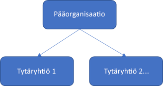

Tässä rakenteessa pääorganisaation täytyy tavallisesti jakaa standardoituja oleellisia tietoja tytäryhtiöilleen. Yleensä tämä jakaminen tapahtuu käyttämällä lähestymistapana Power BI -sovellusten ad hoc- tai suunniteltua jakamista seuraavassa kuvassa esitetyllä tavalla, sillä näin voidaan jakaa standardoitua oleellista sisältöä laajoille käyttäjäryhmille. Käytännössä käytetään kaikkia aiemmin tässä asiakirjassa mainittujen skenaarioiden yhdistelmää.

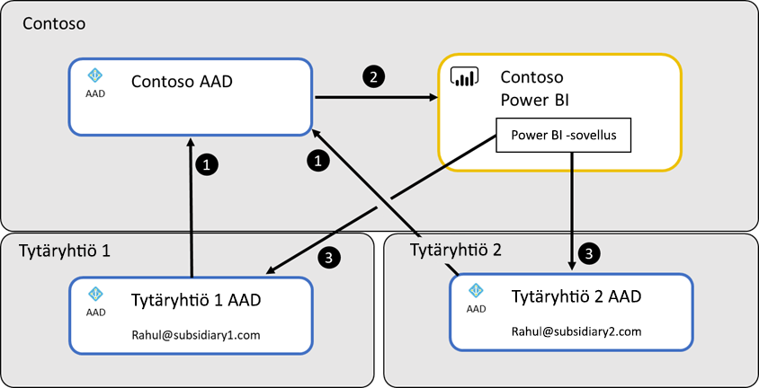

Prosessi on seuraava:

1. Kunkin tytäryhtiön käyttäjät kutsutaan Contoson Azure AD:hen.
2. Tämän jälkeen julkaistaan Power BI -sovellus, joka antaa käyttäjille käyttöoikeuden tarvittaviin tietoihin.
3. Lopuksi käyttäjät avaavat sovelluksen saamansa linkin kautta ja voivat näin tarkastella raportteja.

Tämä rakenne tarjoaa organisaatioille useita tärkeitä haasteita:

- Miten jakaa linkkejä pääorganisaation Power BI:ssä olevaan sisältöön
- Miten antaa tytäryhtiön käyttäjille käyttöoikeus pääorganisaation isännöimään tietolähteeseen

#### Linkkien jakelu pääorganisaation Power BI:ssä olevaan sisältöön

Linkkejä sisältöön jaettaessa käytetään tavallisesti kolmea lähestymistapaa. Ensimmäinen ja tavallisin on lähettää tarvittaville käyttäjille linkki sovellukseen tai sijoittaa linkki SharePoint Online -sivustoon, jossa sen voi avata. Käyttäjät voivat tehdä linkistä kirjanmerkin selaimessa, jonka jälkeen he pääsevät nopeasti käsiksi tarvitsemaansa tietoihin.

Toisessa lähestymistavassa Power BI -sisältöä muokataan ja hallitaan organisaatioiden välisesti. Pääorganisaatio antaa tytäryhtiöiden käyttäjien käyttää omaa Power BI:tään ja hallitsee heidän sisällön käyttöään myöntämällä käyttöoikeuksia. Näin annetaan käyttöoikeus Power BI -aloitussivuun, jossa tytäryhtiön käyttäjä näkee kattavan luettelon hänelle jaetusta sisällöstä pääorganisaation vuokraajassa. Tämän jälkeen tytäryhtiöiden käyttäjille annetaan URL-osoite pääorganisaation Power BI -ympäristöön.

Viimeinen menetelmä käyttää Power BI -sovellusta, joka on luotu Power BI -vuokraajassa kullekin tytäryhtiölle. Power BI -sovellus sisältää koontinäytön, jossa on [ruutuja, joihin on määritetty ulkoisen linkin asetus](https://docs.microsoft.com/power-bi/service-dashboard-edit-tile#hyperlink). Kun käyttäjä valitsee ruudun, hänet viedään asianmukaiseen raporttiin, koontinäyttöön tai sovellukseen pääorganisaation Power BI -sovelluksessa. Tämän lähestymistavan etuna on, että sovellus voidaan asentaa automaattisesti tytäryhtiön kaikille käyttäjille ja se on saatavilla aina, kun käyttäjät kirjautuvat omaan Power BI -ympäristöönsä. Lisäksi lähestymistapa etuna on, että se toimii hyvin Power BI -mobiilisovelluksissa, jotka voivat avata linkin alkuperäisessä sovelluksessa. Voit myös yhdistää tämän toisena esiteltyyn menetelmään, jolloin vaihtaminen Power BI -ympäristöjen välillä muuttuu helpommaksi.

#### Miten antaa tytäryhtiön käyttäjille käyttöoikeus pääorganisaation isännöimään tietolähteeseen

Tytäryhtiön analyytikoiden tarvitsee usein luoda omia analyysejään pääorganisaation antamien tietojen perusteella. Haasteeseen vastataan yleisesti käyttämällä pilvikäyttöä tukevia tietolähteitä.

Ensimmäinen tapa hyödyntää [Azure Analysis Servicesia](https://docs.microsoft.com/azure/analysis-services/analysis-services-overview), jolla rakennetaan sekä pääorganisaation että tytäryhtiöiden analyytikoiden tarpeisiin vastaava yritysluokan tietovarasto, kuten seuraavassa kuvassa on esitetty. Contoso voi isännöidä tiedot ja käyttää ominaisuuksia kuten rivitason suojausta varmistaakseen, että kunkin tytäryhtiön käyttäjät voivat käyttää vain omia tietojaan. Kunkin organisaation analyytikot voivat käyttää tietovarastoa Power BI Desktopin kautta ja julkaista näin syntyviä analyysejä omille Power BI -vuokraajilleen.

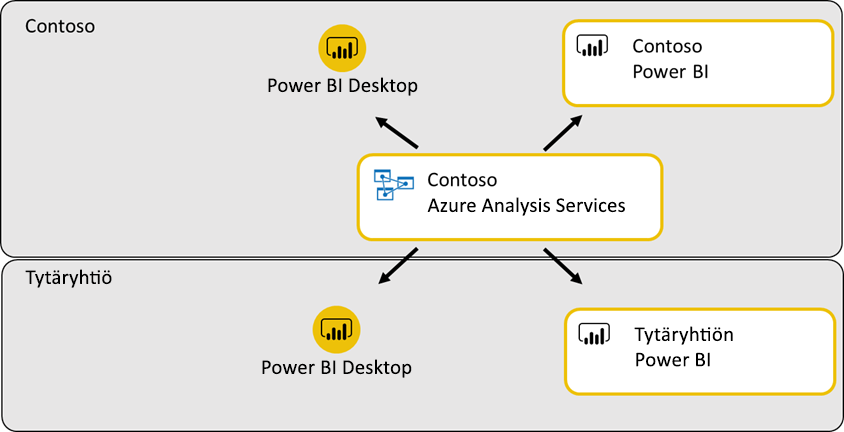

Toinen lähestymistapa hyödyntää [Azure SQL -tietokantaa](https://azure.microsoft.com/services/sql-database/) suhteellisen tietovaraston luomiseen ja tiedon käyttöoikeuksien antamiseen. Tämä toimii samaan tapaan kuin Azure Analysis Services -lähestymistapa, mutta joidenkin ominaisuuksien kuten rivitason suojauksen käyttöönotto ja säilyttäminen voi olla vaikeampaa tytäryhtiöissä.

Hienostuneemmatkin lähestymistavat on mahdollisia, mutta edellä esitettyjä käytetään eniten.

### Tapaus 3: jaettu ympäristö eri kumppaneille

Contoso voi aloittaa kilpailijan kanssa kumppanuuden, jossa auto rakennetaan yhdessä jaetulla kokoonpanolinjalla mutta ajoneuvon jakelu suoritetaan eri automerkkien alla tai eri alueilla. Tämä edellyttää kattavaa yhteistyötä ja tiedon, älyn ja analytiikan yhteisomistajuutta organisaatioissa. Tämä rakenne on yleinen myös konsultointialalla, jossa konsulttitiimi saattaa tehdä projektiin perustuvan analyysin asiakkaalle.

Kuten seuraavassa kuvassa näkyy, nämä rakenteet ovat käytännössä monimutkaisia ja vaativat niitä hoitavan henkilökunnan. Rakenteen tehokkuus perustuu organisaatioiden välillä tehtävään Power BI -sisällön muokkaukseen ja hallintaan, sillä se antaa organisaatioille mahdollisuuden käyttää omille Power BI -vuokraajille ostettuja Power BI Pro -käyttöoikeuksia uudestaan.

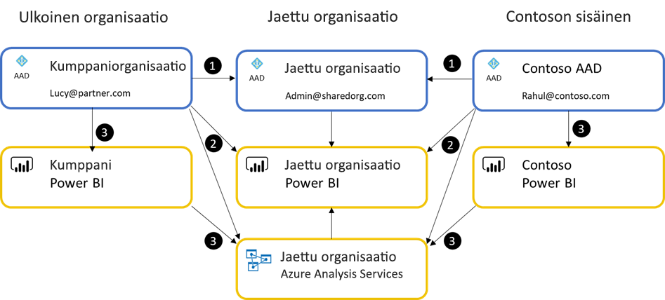

Jotta jaettu Power BI -vuokraaja saadaan perustettua, pitää ensin luoda Azure Active Directory ja sen aktiivisen kansion käyttäjälle pitää ostaa vähintään yksi Power BI Pro -käyttäjätili. Tämä käyttäjä kutsuu tarvittavia käyttäjiä jaettuun organisaatioon. On tärkeää huomata, että tässä skenaariossa Contoson käyttäjiä käsitellään ulkoisina käyttäjinä, kun he toimivat jaetun organisaation Power BI:n sisällä.

Prosessi on seuraava:

1. Jaettu organisaatio perustetaan uutena Azure Active Directoryna, ja organisaatioon luodaan vähintään yksi käyttäjätili. Käyttäjälle tulisi olla määritettynä Power BI Pro -käyttöoikeus.
2. Tämä käyttäjä perustaa Power BI -vuokraajan ja kutsuu tarvitut käyttäjät Contososta ja kumppaniorganisaatiosta. Käyttäjä myös luo kaikki jaetut tietoresurssit, kuten Azure Analysis Servicesin. Contoson ja kumppanin käyttäjät voivat käyttää jaetun organisaation Power BI:tä vieraskäyttäjinä. Jos ulkoisilla käyttäjillä on lupa muokata ja hallita Power BI:n sisältöä, he voivat käyttää Power BI -aloitussivua ja työtiloja, ladata ja muokata sisältöä sekä jakaa raportteja. Yleensä kaikki jaetut resurssit tallennetaan jaettuun organisaatioon ja niitä käytetään jaetun organisaation kautta.
3. Sen mukaan, mitä osapuolet ovat sopineet yhteistyöstä, kunkin organisaation on mahdollista kehittää omia omistusoikeudellisia tietojaan ja analyysejaan jaetun tietovaraston resurssien avulla. He voivat jakaa ne omille sisäisille käyttäjilleen omia sisäisiä Power BI -vuokraajiaan käyttämällä.

### Tapaus 4: jakelu sadoille tai tuhansille ulkoisille kumppaneille

Contoso loi jäähdyttimen luotettavuusraportin yhdelle toimittajalle, mutta nyt Contoso haluaa luoda joukon standardoituja raportteja sadoille toimittajille. Näin Contoso varmistaa, että kaikilla toimittajilla on analyysit, joita ne tarvitsevat tehdäkseen parannuksia tai korjatakseen valmistusvikoja.

Kun organisaation pitää jakaa standardoituja tietoja ja merkityksellisiä tietoja monille ulkoisille käyttäjille tai organisaatioille, se voi käyttää Power BI -sovellusskenaarion ad hoc- tai suunniteltua jakamista. Näin BI-portaalin luominen onnistuu nopeasti ja ilman suuria kehityskustannuksia. Prosessi, jolla tällainen portaali rakennetaan Power BI sovelluksella, käsitellään tapaus tutkimuksessa: BI-portaalin muodostaminen Power BI + Azure AD B2B-portaalin avulla – vaiheittaiset ohjeet myöhemmin tässä asia kirjassa.

Tällaisessa tapauksessa organisaatio yrittää yleensä jakaa merkityksellistä tietoa kuluttajille, erityisesti yrittäessään käyttää Azure B2C:tä Power BI:n kanssa. Power BI ei oletusarvoisesti tue Azure B2C:tä. Jos mietit vaihtoehtoja, kannattaa harkita tämän asiakirjan myöhemmässä Yleisiä vaihtoehtoisia lähestymistapoja -osiossa esitettyä vaihtoehtoa 2.

## Tapaus tutkimus: BI-portaalin luominen Power BI + Azure AD B2B-portaalin avulla – vaiheittaiset ohjeet

Power BI:n integrointi Azure AD B2B:hen antaa Contosolle saumattoman ja vaivattoman keinon tarjota vieraskäyttäjille suojattu käyttöoikeus sen BI-portaaliin. Määrityksessä on kolme vaihetta:

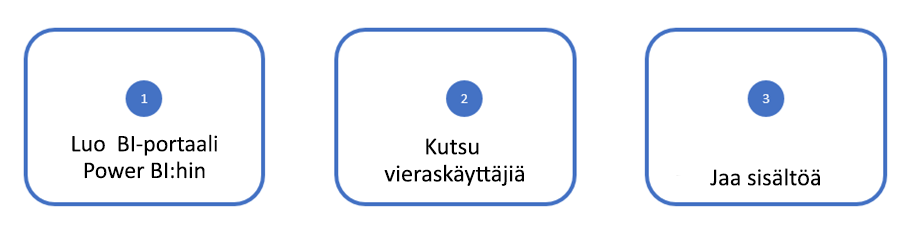

1. Luo  BI-portaali Power BI:hin

    Contoson ensimmäinen tehtävä on luoda BI-portaali Power BI:ssä. Contoson BI-portaali koostuu kokoelmasta varta vasten luotuja koontinäyttöjä ja raportteja, jotka tulevat monien sisäisten käyttäjien ja vieraskäyttäjien saataville. Suositeltu keino tehdä tämä Power BI:ssä on luoda Power BI -sovellus. Lue lisätietoja [Power BI:n sovelluksista](https://powerbi.microsoft.com/blog/distribute-to-large-audiences-with-power-bi-apps/).

- Contoson BI-ryhmä luo työtilan Power BI

    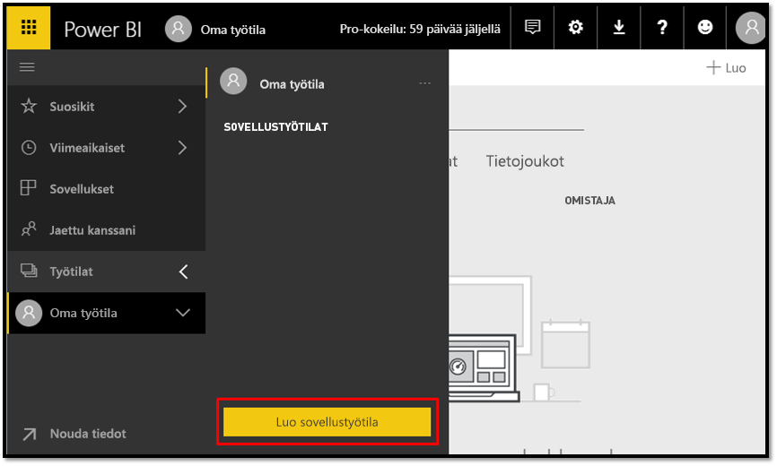
    

- Muut tekijät lisätään työtilaan

    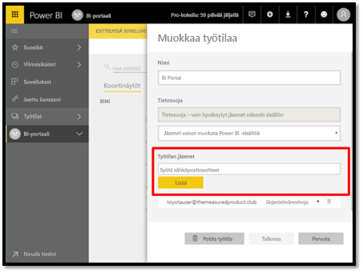

- Sisältö luodaan työtilassa

    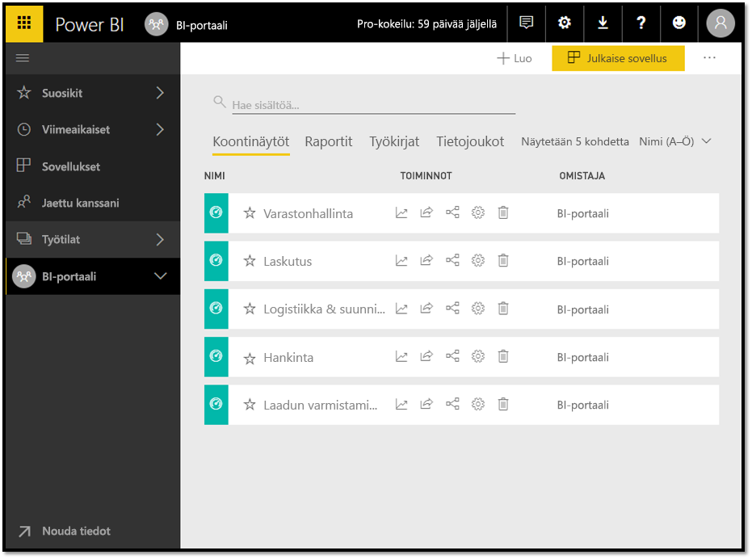

    Nyt kun sisältö luodaan työtilassa, contoso on valmis kutsu maan kumppani organisaatioiden vieras käyttäjiä käyttämään tätä sisältöä.

2. Kutsu vieraskäyttäjiä

    Contoso voi kutsua vieraskäyttäjiä sen BI-portaaliin Power BI:ssä kahdella tavalla:

    * Suunnitellut kutsut
    * Ad hoc -kutsut

    **Suunnitellut kutsut**

    Tässä lähestymistavassa Contoso kutsuu vieraskäyttäjät Azure AD:hen etukäteen ja tämän jälkeen jakaa heille Power BI -sisältöä. Contoso voi kutsua vieraskäyttäjiä Azure-portaalissa tai käyttämällä PowerShelliä. Vieraskäyttäjiä voi kutsua Azure-portaalissa seuraavalla tavalla:

    - Contoson Azure AD -järjestelmänvalvoja siirtyy seuraavasti: **Azure-portaali > Azure Active Directory > Käyttäjät ja ryhmät > Kaikki käyttäjät > Uusi vieraskäyttäjä**

    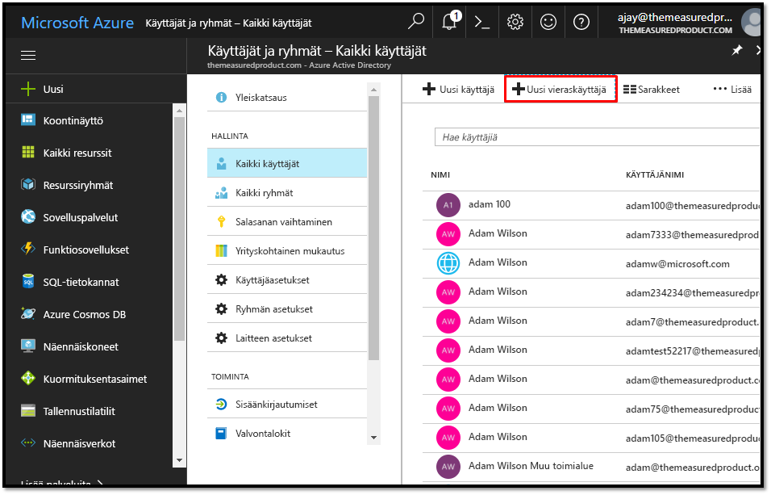

    - Lisää uusien vieraskäyttäjien kutsuviesti ja valitse Kutsu

    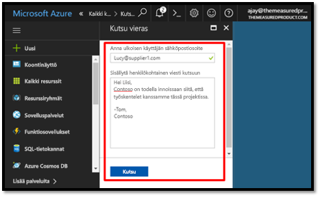

    > [!NOTE]
    > Jos haluat kutsua vieraskäyttäjiä Azure-portaalissa, ota yhteyttä Azure Active Directory -vuokraajasi järjestelmänvalvojaan.

    Contoso voi halutessaan kutsua monta vieraskäyttäjää PowerShellin avulla. Contoson Azure AD -järjestelmänvalvoja tallentaa kaikkien vieraskäyttäjien sähköpostiosoitteet CSV-tiedostoon. Tässä ovat [Azure Active Directory B2B -yhteistyökoodi ja PowerShell-mallit](https://docs.microsoft.com/azure/active-directory/b2b/code-samples) sekä ohjeet.

    Kutsun jälkeen vieraskäyttäjät saavat sähköpostiviestin, jossa on kutsulinkki.

    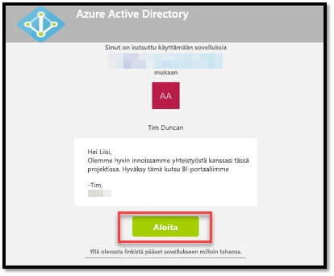

    Kun vieras käyttäjät napsauttavat linkkiä, he voivat käyttää contoso Azure AD-vuokra ajan sisältöä.

    > [!NOTE]
    > Kutsuviestin asettelua voi muuttaa käyttämällä Azure AD:n Tuotemukautus-ominaisuutta [tässä](https://docs.microsoft.com/azure/active-directory/active-directory-b2b-invitation-email) kuvatulla tavalla.

    **Ad hoc -kutsut**

    Entä jos Contoso ei tiedä kaikkia kutsuttavia vieraskäyttäjiä etukäteen? Tai entä jos BI-portaalin luonut Contoson analyytikko haluaa itse jakaa sisältöä vieraskäyttäjille? Tuemme myös tätä skenaariota Power BI:ssä ad hoc -kutsujen muodossa.

    Analyytikko voi vain lisätä ulkoiset käyttäjät sovelluksen käyttö oikeus listaan, kun he julkaisevat sitä. Vieras käyttäjät saavat kutsun, ja kun he hyväksyvät sen, heidät ohjataan automaattisesti Power BI sisältöön.

    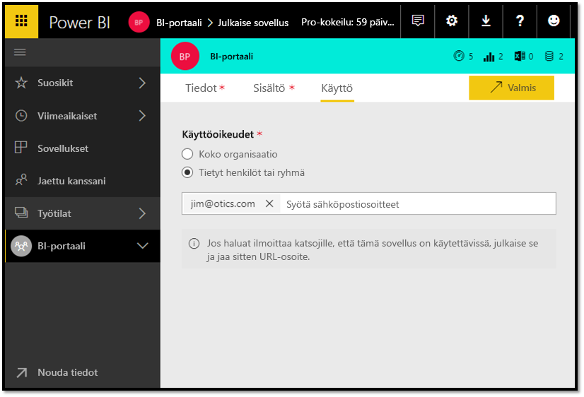

    > [!NOTE]
    > Kutsuja tarvitaan vain kun ulkopuolinen käyttäjä kutsutaan organisaatioosi ensimmäisen kerran.

3. Jaa sisältöä

    Nyt kun Contoson BI-tiimi on luonut BI-portaalin ja kutsunut vieraskäyttäjiä, he voivat jakaa portaalinsa loppukäyttäjille antamalla vieraskäyttäjille käyttöoikeuden sovellukseen ja julkistamalla sen. Power BI täydentää automaattisesti vieraskäyttäjät, jotka on lisätty aiemmin Contoso-vuokraajaan. Muille vieraskäyttäjille tarkoitettuja ad hoc -kutsuja voidaan lisätä tässä kohtaa.

    > [!NOTE]
    > Jos käytät käyttöoikeusryhmiä sovelluksen ulkoisten käyttäjien käyttöoikeuksien hallitsemiseen, käytä suunnitellut kutsut -menetelmää ja jaa sovelluksen linkki suoraan kullekin sitä tarvitsevalle ulkoiselle käyttäjälle. Muussa tapauksessa ulkoinen käyttäjä ei ehkä voi asentaa tai tarkastella sisältöä sovelluksen sisällä.

    Vieraskäyttäjät saavat sähköpostiviestin ja linkin sovellukseen.

    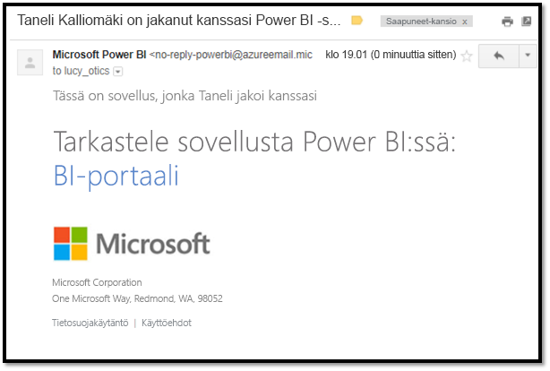

    Linkin napsauttamisen jälkeen vieraskäyttäjiä pyydetään tekemään todennus omien organisaatioidensa käyttäjätietojen avulla.

    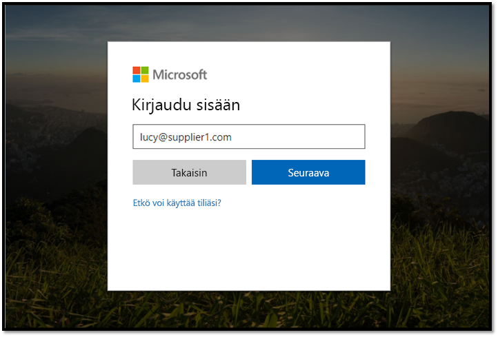

    Kun todentaminen on onnistunut, vieraskäyttäjät ohjataan Contoson BI-sovellukseen.

    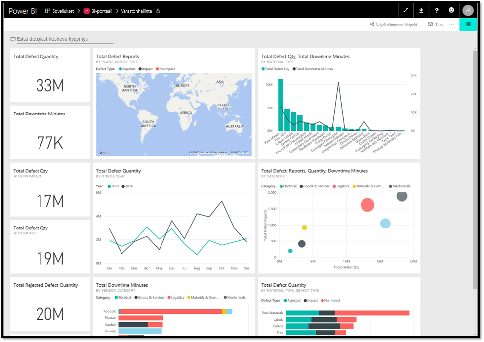

    Vieraskäyttäjät voivat tämän jälkeen siirtyä Contoson sovellukseen napsauttamalla sähköpostiviestissä olevaa linkkiä tai tekemällä linkistä kirjanmerkin. Contoso voi myös tehdä asiat helpoksi vieraskäyttäjille ja lisätä linkin mihin tahansa olemassa olevaan ja vieraskäyttäjien jo käyttämään ekstranet-portaaliin.

4. Seuraavat vaiheet

    Power BI -sovellusta ja Azure AD B2B:tä käyttämällä Contoso pystyi nopeasti luomaan toimittajilleen BI-portaalin ilman koodia. Tämä yksinkertaisti huomattavasti standardoidun analytiikan jakelua kaikille sitä tarvinneille toimittajille.

    Esimerkki esitteli, miten yksittäinen yleinen raportti voidaan jakaa toimittajille, mutta Power BI pystyy paljon muuhunkin. Raporttiin ja tietomalliin voidaan helposti lisätä rivitason suojaus, jolloin varmistetaan, että kukin kumppani näkee vain itselleen olennaiset tiedot. Tämän asiakirjan myöhempi Ulkoisten kumppanien tietosuoja -osio kuvaa prosessin tarkasti.

    Usein yksittäiset raportit ja koontinäytöt pitää upottaa aiemmin luotuun portaaliin. Näin voidaan tehdä käyttämällä monia esimerkissä esiteltyjä tekniikoita. Niissä tilanteissa voi kuitenkin olla helpompaa upottaa raportit tai koontinäytöt suoraan työtilasta. Ulkoisten käyttäjien kutsujen ja suojausoikeuksien määrittäminen edellyttää, että käyttäjät pysyvät samoina.

## Huppu: Miten Lucy from Supplier1 voi käyttää Contoson vuokra ajan Power BI sisältöä?

Nyt kun olemme on nähneet, miten Contoso voi saumattomasti jakaa Power BI-sisältöä kumppaniorganisaation vieraskäyttäjille, katsotaan, mitä kulissien takana tapahtuu.

Kun Contoso kutsuu käyttäjän [lucy@supplier1.com](mailto:lucy@supplier1.com) hakemistoonsa, Azure AD luo linkin käyttäjän [Lucy@supplier1.com](mailto:Lucy@supplier1.com) ja Contoso Azure AD -vuokraajan välille. Tämän linkin avulla Azure AD tietää, että Lucy@supplier1.com voi käyttää Contoso-vuokraajan sisältöä.

Kun Lucy yrittää käyttää Contoson Power BI -sovellusta, Azure AD tarkistaa, että Lucylla on oikeus käyttää Contoso-vuokraajaa, ja tarjoaa sitten Power BI:lle tunnuksen, joka ilmaisee, että Lucy on todennettu Contoso-vuokraajan sisällön käyttäjäksi. Power BI käyttää tätä tunnusta valtuutukseen ja varmistaa, että Lucylla on käyttöoikeus Contoson Power BI -sovellukseen.

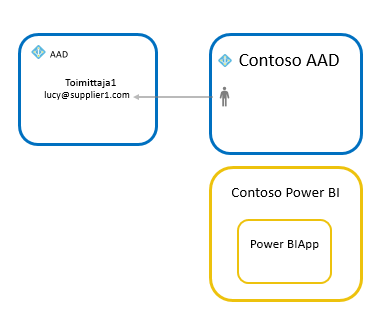

Power BI:n integrointi Azure AD B2B:n kanssa toimii kaikkien yrityssähköpostiosoitteiden kanssa. Jos käyttäjällä ei ole Azure AD:n käyttäjätietoja, häntä voidaan kehottaa luomaan sellaiset. Seuraavassa kuvassa näkyy yksityiskohtainen työnkulku:

On tärkeää tunnistaa, että Azure AD-tiliä käytetään tai luodaan ulkoisen osapuolen Azure AD:ssä, minkä ansiosta Lucy voi käyttää omaa käyttäjä nimeä ja Sala sanaa, ja hänen tunniste tietonsa lakkaavat automaattisesti toimimasta muissa vuokralaisina aina kun Lucy lähtee yrityksestä, kun hänen organisaationsa käyttää myös Azure ADmia.

## Käyttöoikeudet

Contoso voi valita yhden kolmesta menetelmästä, kun se antaa Power BI -sisältönsä käyttöoikeuksia toimittajiensa ja kumppaniorganisaatioidensa vieraskäyttäjille.

> [!NOTE]
> _Azure AD B2B's Free-taso riittää Power BI käyttämiseen Azure AD B2B-yhteyden avulla. Jotkin edistyneet Azure AD B2B-ominaisuudet, kuten dynaamiset ryhmät, edellyttävät lisä käyttö oikeuksia. Lisä tietoja on Azure AD B2B-dokumentaatiossa:_ [ _https://docs.microsoft.com/azure/active-directory/b2b/licensing-guidance_ ](https://docs.microsoft.com/azure/active-directory/b2b/licensing-guidance)

### Approach 1: contoso käyttää Power BI Premium

Tässä menetelmässä Contoso ostaa Power BI Premium -kapasiteetin ja määrittää BI-portaalinsa sisällön tähän kapasiteettiin. Näin kumppaniorganisaatioiden vieraskäyttäjät voivat käyttää Contoson Power BI -sovellusta ilman Power BI -käyttöoikeutta.

Ulkoiset käyttäjät saavat ainoastaan Power BI:n ilmaiskäyttäjille tarkoitetun kuluttajakokemuksen käyttäessään Power BI Premiumin sisältöä.

Contoso voi hyödyntää sovelluksissaan myös muita Power BI Premium -toimintoja, kuten parannettua päivitystaajuutta, varattua kapasiteettia sekä suuria malleja.

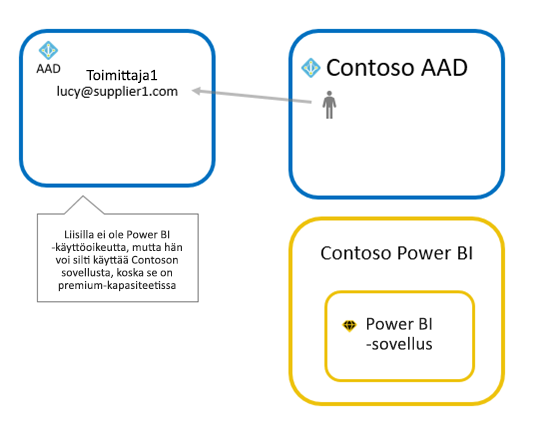

### Approach 2: contoso määrittää Power BI Pro käyttö oikeudet vieras käyttäjille

Tässä lähestymistavassa Contoso määrittää pro-käyttöoikeudet kumppaniorganisaatioiden vieraskäyttäjille – tämä voidaan tehdä Contoson Microsoft 365 -hallintakeskuksessa. Näin kumppaniorganisaatioiden vieraskäyttäjät voivat käyttää Contoson Power BI -sovellusta ilman, että heidän täytyy ostaa käyttöoikeutta itse. Tämä voi tulla kyseeseen, kun jaetaan ulkoisille käyttäjille, joiden organisaatiot eivät ole vielä ottaneet Power BI:tä käyttöön.

> [!NOTE]
> Contoson Pro-käyttö oikeus koskee vieras käyttäjiä vain silloin, kun he käyttävät sisältöä contoso-vuokraajaan. Pro-käyttöoikeudet antavat käyttöoikeuden sisältöön, jota ei ole Power BI Premium -kapasiteetissa. Ulkoiset käyttäjät, joilla on pro-käyttöoikeus, voivat oletusarvoisesti saada vain kulutukseen oikeuttavan käyttökokemuksen. Tätä voidaan muuttaa käyttämällä ulkoisia käyttäjiä, joiden avulla _voit muokata ja hallita sisältöä Power BI_ osassa myöhemmin tässä asia kirjassa kuvatulla tavalla.

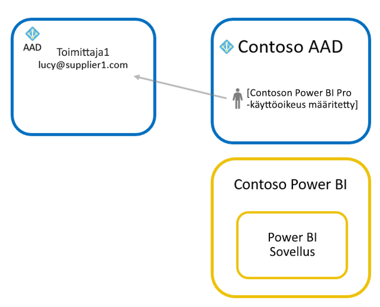

### Lähestymis tapa 3: vieras käyttäjät voivat tuoda oman Power BI Pro käyttö oikeutensa

Tässä menetelmässä Toimittaja1 määrittää Power BI Pro -käyttöoikeuden Lucylle. He voivat sitten käyttää Contoson Power BI-sovellusta tällä käyttö oikeudella. Koska Lucy voi käyttää omaa organisaationsa Pro-käyttö oikeutta, kun hän käyttää ulkoista Power BI-ympäristöä, tähän lähestymis tapaan viitataan toisinaan nimellä _Vie oma käyttö oikeutesi_ (byol). Jos molemmat organisaatiot käyttävät Power BI:tä, analytiikkaratkaisulle tarjoutuu hyödyllisiä käyttöoikeuksia ja samalla minimoidaan kulut, joita koituu käyttöoikeuksien määrittämisestä ulkopuolisille käyttäjille.

> [!NOTE]
> Käyttäjälle 1 myönnetty Pro-käyttö oikeus koskee kaikkia Power BI vuokraajia, joissa Lucy on vieras käyttäjä. Pro-käyttöoikeudet antavat käyttöoikeuden sisältöön, jota ei ole Power BI Premium -kapasiteetissa. Ulkoiset käyttäjät, joilla on pro-käyttöoikeus, voivat oletusarvoisesti saada vain kulutukseen oikeuttavan käyttökokemuksen. Tämä voidaan muuttaa käyttämällä ulkoisia käyttäjiä, joiden avulla _voit muokata ja hallita sisältöä Power BI_ osassa myöhemmin tässä asia kirjassa kuvatulla tavalla.

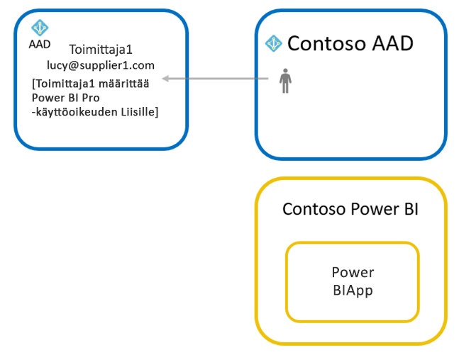

## Ulkoisten kumppanien tietosuoja

Toimiessaan yhteistyössä monien ulkoisten toimittajien kanssa Contoson pitää tavallisesti varmistaa, että jokainen toimittaja näkee vain omia tuotteitaan koskevat tiedot. Käyttäjään perustuva suojauksen ja dynaamisen rivitason suojauksen ansiosta tämä on helppoa Power BI:ssä.

### Käyttäjään perustuva suojaus

Yksi Power BI:n tehokkaimmista ominaisuuksista on rivitason suojaus. Tämän ominaisuuden avulla Contoso voi luoda yksittäisen raportin ja tietojoukon, mutta silti käyttää eri suojaussääntöjä kullekin käyttäjälle. Katso tarkemmin selitys artikkelista [Rivitason suojaus (RLS)](https://powerbi.microsoft.com/documentation/powerbi-admin-rls/).

Power BI:n integrointi Azure AD B2B:n kanssa antaa Contoson määrittää rivitason suojauksen sääntöjä vieraskäyttäjille heti, kun heidät on kutsuttu Contoso-vuokraajaan. Kuten olemme nähneet, Contoso voi lisätä vieraskäyttäjiä joko suunniteltujen tai ad hoc -kutsujen kautta. Jos Contoso haluaa pakottaa rivitason suojauksen, on suositeltavaa lisätä vieraskäyttäjiä etukäteen käyttämällä suunniteltuja kutsuja ja määrittämällä heidät käyttöoikeusrooleihin ennen sisällön jakamista. Jos Contoso sen sijaan käyttää ad hoc -kutsuja, voi kulua hetki, ennen kuin vieraskäyttäjät näkevät tietoja.

> [!NOTE]
> Tämä RLS-suojattujen tietojen käytön viive ad hoc -kutsuja käytettäessä voi johtaa IT-tiimille saapuviin tukipyyntöihin, koska käyttäjät näkevät joko tyhjiä tai rikkinäisiltä näyttäviä raportteja ja koontinäyttöjä avatessaan saamassaan sähköpostiviestissä olevan linkin. Siksi tässä skenaariossa on erittäin suositeltavaa käyttää suunniteltuja kutsuja.**

Käydään asia läpi tarkastelemalla esimerkkiä.

Kuten aiemmin mainittiin, Contosolla on toimittajia kaikkialla maailmassa, ja yritys haluaa varmistaa, että toimittajaorganisaatioiden käyttäjät saavat merkityksellisiä tietoja vain niiden omalta alueelta.  Contoson käyttäjät voivat sen sijaan käyttää kaikkea tietoa. Sen sijaan että luotaisiin useita erilaisia raportteja, Contoso luo yhden raportin ja suodattaa tiedot niitä tarkastelevien käyttäjien mukaan.

Contoso haluaa varmista, että tietoja voidaan suodattaa yhteyden muodostajien perusteella, joten Power BI Desktopissa luodaan kaksi roolia. Yksi suodattaa kaikki tiedot myyntialueesta ”Eurooppa” ja toinen alueesta ”Pohjois-Amerikka”.

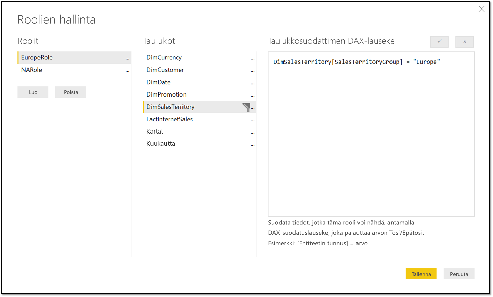

Aina kun raportissa on määritetty rooleja, käyttäjälle pitää olla määritettynä tietty rooli, jotta hän voi käyttää mitään tietoja. Roolien määrittämisen tapahtuu Power BI -palvelun sisällä ( **Tietojoukot > Suojaus** )

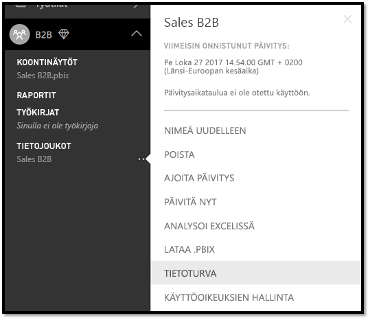

Tämä avaa sivun, jossa Contoson BI -tiimi voi nähdä luomansa kaksi roolia.  Nyt Contoson BI-tiimi voi määrittää käyttäjille roolit.

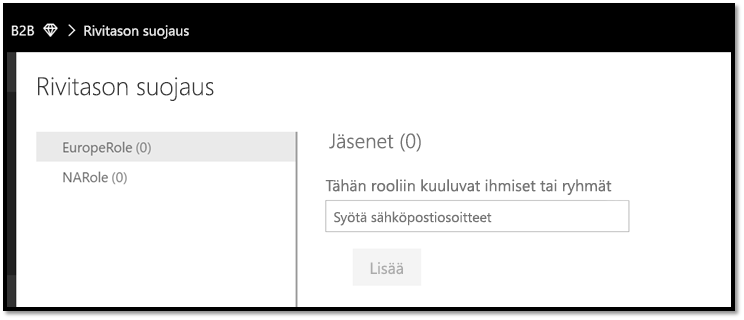

Esimerkissä Contoso lisää Eurooppa-roolin kumppaniorganisaation käyttäjälle, jonka sähköpostiosoite on ”[adam@themeasuredproduct.com](mailto:adam@themeasuredproduct.com)”:

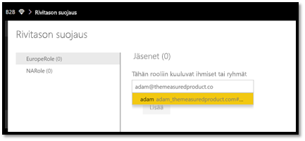

Kun Azure AD noutaa ratkaisun, Contoso näkee nimen ilmestyvän ikkunaan valmiina lisättäväksi:

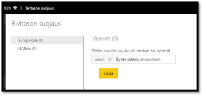

Nyt kun tämä käyttäjä avaa sovelluksen, joka jaettiin heidän kanssaan, hän näkee vain raportin, jossa on tietoja Euro opasta:

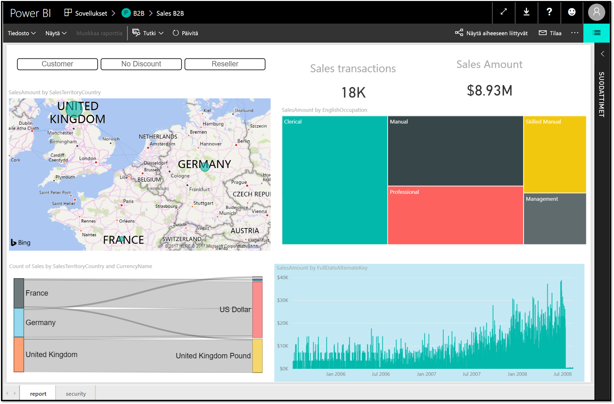

### Dynaaminen rivitason suojaus

Toinen kiinnostavia asia on nähdä, miten dynaaminen rivitason suojaus (RLS) toimii Azure AD B2B:n kanssa.

Lyhyesti sanottuna dynaaminen rivitason suojaus toimii suodattamalla mallin tietoja Power BI:hin yhdistäneen henkilön käyttäjänimen perusteella. Sen sijaan, että lisäisit käyttäjäryhmille useita rooleja, määrität mallin käyttäjät. Emme kuvaa tätä tarkasti. Kasper de Jong on kirjoittanut yksityiskohtaisesti kaikista rivitason suojauksen ominaisuuksista artikkelissa [Power BI Desktop Dynamic security cheat sheet](https://www.kasperonbi.com/power-bi-desktop-dynamic-security-cheat-sheet/) sekä [tässä raportissa](https://msdn.microsoft.com/library/jj127437.aspx) .

Tarkastellaan pientä esimerkkiä – Contosolla on yksinkertainen raportti myynnistä ryhmittäin:

Nyt tämä raportti pitää jakaa kahdelle vieraskäyttäjälle ja sisäiselle käyttäjälle – sisäinen käyttäjä näkee kaiken, mutta vieraskäyttäjät näkevät vain ryhmät, joihin heillä on käyttöoikeus. Tämä tarkoittaa, että vain vieraskäyttäjien tiedot pitää suodattaa. Jotta tiedot suodattuisivat oikein, Contoso käyttää dynaamista rivitason suojausmallia teknisessä raportissa ja blogikirjoituksessa kuvatulla tavalla. Toisin sanoen Contoso lisää käyttäjänimet tietoihin itse:

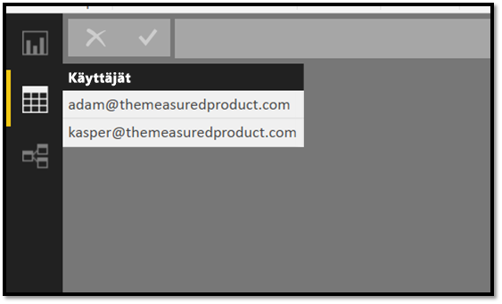

Tämän jälkeen Contoso luo oikean tietomallin, joka suodattaa tiedot asianmukaisesti, niin että suhteet ovat oikein:

Voidakseen suodattaa tiedot automaattisesti sen perusteella, kuka on kirjautunut sisään, Contoson pitää luoda rooli, joka sopii yhteyttä muodostavalle käyttäjälle. Tässä tapauksessa Contoso luo kaksi roolia – ensimmäinen on ”securityrole”, joka suodattaa Käyttäjät-taulukon Power BI:hin kirjautuneena olevan käyttäjänimen perusteella (tämä toimii myös Azure AD B2B:n vieraskäyttäjille).

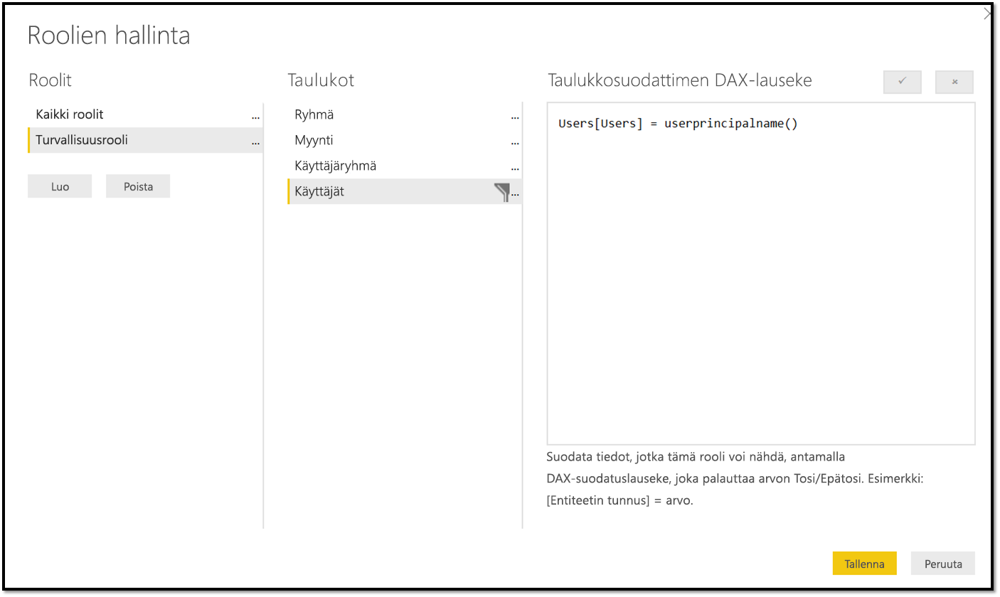

Contoso luo myös roolin ”AllRole” sisäisille käyttäjilleen, jotka näkevät kaiken – tällä roolilla ei ole mitään suojauspredikaattia.

Ladattuaan Power BI Desktop -tiedoston palveluun, Contoso voi määrittää vieraskäyttäjät rooliin ”SecurityRole” ja sisäiset käyttäjät rooliin ”AllRole”

Nyt, kun vieras käyttäjät avaavat raportin, he voivat vain tarkastella myyntiä ryhmästä A:

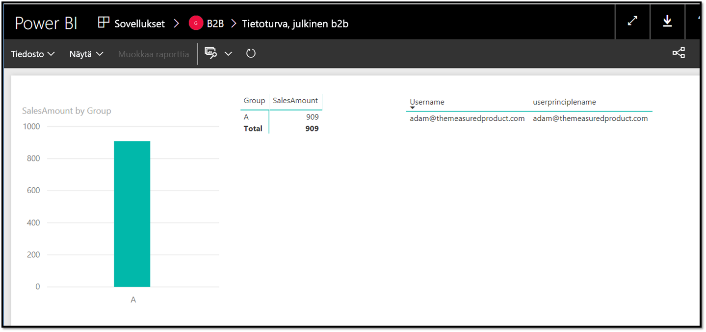

Oikeanpuolisessa matriisissa näet että sekä USERNAME()- että USERPRINCIPALNAME()-funktio palauttavat vieraskäyttäjän sähköpostiosoitteen.

Nyt sisäinen käyttäjä näkee kaikki tiedot:

Kuten huomaat, dynaaminen rivitason suojaus toimii sekä sisäisten että vierailevien käyttäjien kanssa.

> [!NOTE]
> Tämä skenaario toimii myös käytettäessä mallia Azure Analysis Servicesissä. Yleensä Azure Analysis Services on yhdistetty samaan Azure AD:hen kuin Power BI – tässä tapauksessa Azure Analysis Services tunnistaa myös vieraskäyttäjät, jotka on kutsuttu Azure AD B2B:n kautta.

## Yhdistäminen paikallisiin tietolähteisiin

Power BI tarjoaa Contosolle kyvyn hyödyntää suoraan sellaisia paikallisia tietolähteitä kuin [SQL Server Analysis Services](https://powerbi.microsoft.com/documentation/powerbi-gateway-enterprise-manage-ssas/) tai [SQL Server](https://powerbi.microsoft.com/documentation/powerbi-gateway-kerberos-for-sso-pbi-to-on-premises-data/)[paikallisen tietoyhdyskäytävän](https://powerbi.microsoft.com/documentation/powerbi-gateway-onprem/) ansiosta. Tietolähteisiin on mahdollista myös kirjautua samoilla tunnistetiedoilla kuin Power BI:hin.

> [!NOTE]
> Kun asennat yhdyskäytävän Power BI -vuokraajan yhteyden muodostamiseksi, sinun on käytettävä vuokraajassasi luotua käyttäjää. Ulkoiset käyttäjät eivät voi asentaa yhdyskäytävää ja yhdistää sitä vuokraajaasi.

Tämä saattaa olla monimutkaisempaa ulkoisille käyttäjille, koska ulkoiset käyttäjät ovat yleensä tuntemattomia paikallisessa AD:ssä. Power BI sallii vaihtoehtoisen menetelmän, jossa Contoso-järjestelmänvalvojat voivat yhdistää ulkoiset käyttäjänimet sisäisiin käyttäjänimiin artikkelissa [Tietolähteen hallinta – Analysis Services](https://powerbi.microsoft.com/documentation/powerbi-gateway-enterprise-manage-ssas/) kuvatulla tavalla. Esimerkiksi [lucy@supplier1.com](mailto:lucy@supplier1.com) voidaan yhdistää osoitteeseen [lucy\_supplier1\_com #EXT@contoso.com](mailto:lucy_supplier1_com).

Tämä menetelmä on sopiva, jos Contosolla on vain muutama käyttäjä tai jos Contoso voi yhdistää kaikki ulkoiset käyttäjät yhteen sisäiseen tiliin. Tilanteisiin, joissa kukin käyttäjän tarvitsee omat tunnistetietonsa, on olemassa edistyneempi menetelmä, joka käyttää yhdistämiseen [mukautettuja AD-määritteitä](https://technet.microsoft.com/library/cc961737.aspx) artikkelissa [Tietolähteen hallinta – Analysis Services](https://powerbi.microsoft.com/documentation/powerbi-gateway-enterprise-manage-ssas/) kuvatulla tavalla. Tämän ansiosta Contoson järjestelmänvalvoja voi tehdä yhdistämismäärityksen jokaiselle Azure AD:si käyttäjälle (myös ulkoisille B2B-käyttäjille).  Nämä määritteet voidaan määrittää AD-objektimallin kautta komentosarjoja tai koodia käyttämällä, jolloin Contoso voi tehdä yhdistämisen täysin automaattisesti tai ajoitetusti.

## Ulkoisten käyttäjien sisällönmuokkauksen ja -hallinnan käyttöönotto Power BI:ssä

Contoso voi antaa ulkoisten käyttäjien lisätä sisältöä organisaation sisällä aiemmin osiossa Power BI -sisällön muokkaus ja hallinta organisaatioiden välillä kuvatulla tavalla.

> [!NOTE]
> Jos haluat muokata ja hallita sisältöä organisaatiosi Power BI:ssä, käyttäjällä tulee olla Power BI Pro -käyttöoikeus muussa työtilassa kuin Oma työtila -osassa. Käyttäjät voivat hankkia Pro-käyttö oikeuksia tämän asia kirjan _käyttö oikeus_ osiossa kuvatulla tavalla.

Power BI -hallintaportaalin Vuokraaja-asetuksissa on **Salli ulkoisten vieraskäyttäjien muokata ja hallita sisältöä organisaatiossa** -asetus. Oletusarvon mukaan asetus on poistettu käytöstä, mikä tarkoittaa, että ulkoiset käyttäjät saavat oletusarvoisesti rajoitetun vain luku -kokemuksen. Asetus koskee käyttäjiä, joiden käyttäjätyypiksi on määritetty Vieras Azure AD:ssä. Seuraavassa taulukossa kuvataan, millaisia toimintoja käyttäjillä on käyttäjätyypistä ja asetusten määrityksestä riippuen.

| **Käyttäjätyyppi Azure AD:ssä** | **Salli ulkoisten vieraskäyttäjien muokata ja hallita sisältöä -asetus** | **Toiminta** |
| --- | --- | --- |
| Vieras | Poistettu käytöstä käyttäjälle (oletus) | Vain kulutus kohteittain -näkymä. Antaa vain luku -käyttöoikeudet raportteihin, koontinäyttöihin ja sovelluksiin, kun niitä tarkastellaan vieraskäyttäjälle lähetetyn URL-osoitteen kautta. Power BI -mobiilisovellukset antavat vieraskäyttäjälle vain luku -näkymän. |
| Vieras | Käytössä käyttäjälle | Ulkoinen käyttäjä saa käyttöoikeudet koko Power BI -käyttökokemukseen, vaikka jotkin ominaisuudet eivät ole hänen käytettävissään. Ulkoisen käyttäjän pitää kirjautua Power BI:hin käyttämällä Power BI -palvelun URL-osoitetta, johon on liitetty vuokraajan tiedot. Käyttäjä saa aloitussivun käyttökokemuksen sekä Oma työtila -osan ja voi käyttöoikeuksista riippuen selata, tarkastella ja luoda sisältöä.    Power BI -mobiilisovellukset antavat vieraskäyttäjälle vain luku -näkymän. |

> [!NOTE]
> Azure AD:n ulkoiset käyttäjille voidaan määrittää myös käyttäjätyyppi Jäsen. Tätä ei tällä hetkellä tueta Power BI:ssä.

Power BI -hallintaportaalissa asetus näkyy seuraavassa kuvassa esitetyllä tavalla.

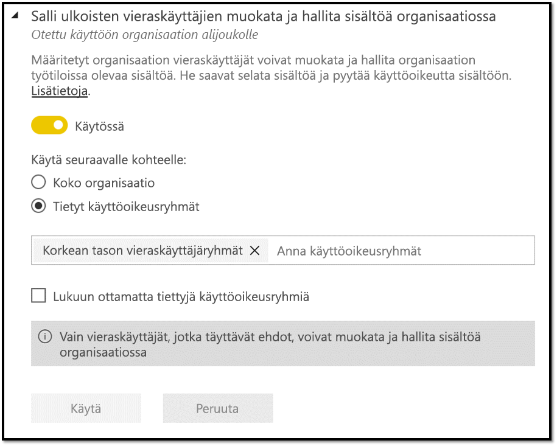

Vieraskäyttäjät saavat vain luku -oletuskokemuksen ja eivätkä voi muokata ja hallita sisältöä. Oletusarvo on poistettu käytöstä, mikä tarkoittaa, että kaikilla vieraskäyttäjillä on vain luku -käyttökokemus. Power BI -järjestelmänvalvoja voi joko ottaa asetuksen käyttöön kaikille organisaation vieraskäyttäjille tai tietyille Azure AD:ssä määritetyille käyttöoikeusryhmille. Seuraavassa kuvassa Contoson Power BI -järjestelmänvalvoja on luonut Azure AD:ssä käyttöoikeusryhmän, jolla määritetään, mitkä ulkoiset käyttäjät voivat muokata ja hallita sisältöä Contoson vuokraajassa.

Auta näitä käyttäjiä kirjautumaan Power BI:hin antamalla heille vuokraajan URL-osoite. Etsi vuokraajan URL-osoite seuraavien vaiheiden mukaisesti.

1. Valitse Power BI -palvelun yläreunan valikosta ohje ( **?** ) ja sitten **Tietoja Power BI:stä**.
2. Katso arvo kohdan **Vuokraajan URL-osoite** vierestä. Tämä on vuokraajan URL-osoite, jonka voit jakaa vieraskäyttäjille.

    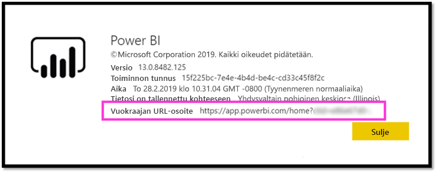

Kun käytät asetusta Salli ulkoisten vieraskäyttäjien muokata ja hallita sisältöä organisaatiossa, erikseen määritetyt vieraskäyttäjät saavat käyttää organisaatiosi Power BI:tä ja nähdä kaiken heille sallitun sisällön. He voivat käyttää aloitussivua, selata työtiloja ja lisätä niihin sisältöä, asentaa sovelluksia, joiden käyttöoikeuslistalla he ovat, ja heillä voi olla Oma työtila. He voivat luoda ja hallinnoida järjestelmänvalvojina uutta käyttökokemusta käyttäviä työtiloja.

> [!NOTE]
> Kun käytät tätä vaihtoehtoa, lue tämän asiakirjan Hallinto-osa, sillä Azure AD:n oletusasetukset eivät anna vieraskäyttäjien käyttää tiettyjä ominaisuuksia, kuten henkilöiden valitsinta, mikä voi johtaa rajoitettuun käyttökokemukseen.**

Eräät käyttökokemukset eivät ole niiden käyttäjien saatavilla, joiden käyttöoikeus perustuu vuokraaja-asetukseen Salli ulkoisten vieraskäyttäjien muokata ja hallita sisältöä organisaatiossa. Jos vieraskäyttäjät haluavat päivittää tai julkaista raportteja, heidän tulee käyttää Power BI -palvelun verkkokäyttöliittymää (mm. Nouda tiedot) Power Bi Desktop -tiedostojen lataamiseksi verkkoon. Seuraavia käyttökokemuksia ei tueta:

- Suorajulkaisu Power BI Desktopista Power BI -palveluun
- Vieraskäyttäjät eivät voi käyttää Power BI Desktopia yhteyden muodostamiseksi Power BI -palvelussa sijaitseviin palvelutietojoukkoihin
- Perinteiset työtilat, jotka on sidottu Office 365-ryhmään: vieras käyttäjä ei voi luoda tai olla näiden työtilojen järjestelmänvalvojia. He voivat olla jäseniä.
- Ad hoc -kutsujen lähettämistä ei tueta työtilojen käyttöoikeusluetteloilla
- Power BI Publisher for Exceliä ei tueta vieraskäyttäjillä
- Vieraskäyttäjät eivät voi asentaa Power BI Gatewaytä ja yhdistää sitä organisaatioosi
- Vieraskäyttäjät eivät voi asentaa sovelluksia julkaistaviksi koko organisaatiolle
- Vieraskäyttäjät eivät voi käyttää, luoda, päivittää eivätkä asentaa organisaation sisältöpaketteja
- Vieraskäyttäjät eivät voi käyttää Analysoi Excelissä -toimintoa
- Vieraskäyttäjiä ei voi mainita (@mentioned) kommentoitaessa (tämä toiminto lisätään tulevaan julkaisuversioon)
- Vieraskäyttäjät eivät voi käyttää tilauksia (tämä toiminto lisätään tulevaan julkaisuversioon)
- Vieraskäyttäjillä, jotka käyttävät tätä ominaisuutta, on oltava työpaikan tai oppilaitoksen tili. Vieraskäyttäjät, jotka käyttävät henkilökohtaista tiliä, kokevat enemmän rajoituksia kirjautumisrajoitusten vuoksi.

## Hallinto

### Lisää Azure AD -asetuksia, jotka vaikuttavat Azure AD B2B:hen liittyviin Power BI -käyttökokemuksiin

Azure AD B2B:n jakamista käytettäessä Azure Active Directoryn järjestelmänvalvoja määrittää ulkoisen käyttäjän käyttökokemuksen ominaisuuksia. Näitä hallitaan Ulkoisen yhteistyötilan asetukset -sivulla vuokraajan Azure Active Directory -asetuksissa.

Asetuksien tiedot ovat saatavilla täällä:

[https://docs.microsoft.com/azure/active-directory/b2b/delegate-invitations](https://docs.microsoft.com/azure/active-directory/b2b/delegate-invitations)

> [!NOTE]
> Vieraskäyttäjien käyttöoikeuksia on rajoitettu -asetus on oletusarvoisesti Kyllä, joten Power BI:n vieraskäyttäjien kokemuksia on rajoitettu erityisesti jakamisen osalta, eivätkä henkilöiden valitsimen käyttöliittymät toimi kyseisillä käyttäjillä. Varmista hyvä käyttökokemus ja määritä asetus tilaan Ei alla kuvatulla tavalla yhdessä Azure AD -järjestelmänvalvojasi kanssa.**

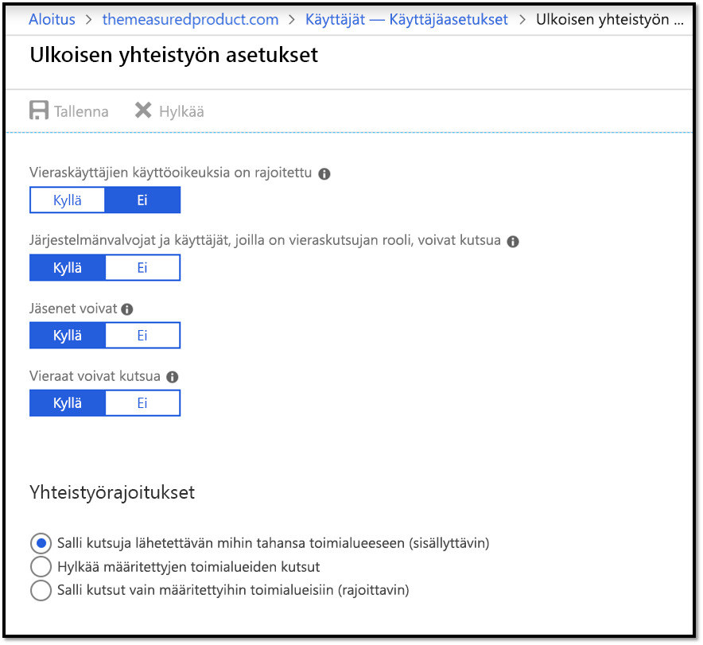

### Hallitse vieraskutsuja

Power BI -järjestelmänvalvojat voivat hallita ulkoista jakamista vain Power BI:n osalta Power BI -hallintaportaalissa. Sen sijaan vuoraajien järjestelmänvalvojat voivat lisäksi hallita ulkoista jakamista erilaisten Azure AD:n käytäntöjen avulla.  Näiden käytäntöjen ansiosta vuokraajan järjestelmänvalvojilla on erilaisia vaihtoehtoja:

- Loppukäyttäjien kutsujen poistaminen käytöstä
- Vain järjestelmänvalvojat ja käyttäjät, joilla on vieraskutsujan rooli, voivat lähettää kutsuja
- Järjestelmänvalvojat, vieraskutsujan rooli ja jäsenet voivat lähettää kutsuja
- Kaikki käyttäjät, mukaan lukien vieraat, voivat lähettää kutsuja

Voit lukea lisää näistä käytännöistä artikkelissa [Delegoi Azure Active Directory B2B -yhteistyökutsuja](https://docs.microsoft.com/azure/active-directory/active-directory-b2b-delegate-invitations).

Kaikkia ulkoisten käyttäjien toimintoja [valvotaan valvontaportaalissamme](https://powerbi.microsoft.com/documentation/powerbi-admin-auditing/).

### Vieraskäyttäjien ehdolliset käyttöoikeuskäytännöt

Contoso voi pakottaa ehdolliset käyttöoikeuskäytännöt vieraskäyttäjille, jotka käyttävät Contoso-vuokraajan sisältöä. Lue yksityiskohtaiset ohjeet artikkelista [B2B-yhteistyön ehdollinen käyttö](https://docs.microsoft.com/azure/active-directory/active-directory-b2b-mfa-instructions).

## Yleisiä vaihtoehtoisia menetelmiä

Azure AD B2B:llä on helppoa jakaa tietoja ja raportteja organisaatioissa, mutta usein käytettyjä tapoja on monia muitakin ja joskus ne saattavat olla parempiakin.

### Vaihtoehtoinen vaihto ehto 1: Luo päällekkäiset käyttäjä tiedot kumppani käyttäjille

Tässä vaihtoehdossa Contoson piti luoda manuaalisesti kaksoisidentiteetti jokaiselle Contoso-vuokraajan kumppanikäyttäjälle seuraavassa kuvassa esitetyllä tavalla. Tämän jälkeen Contoso voi jakaa määritetyille identiteeteille asianmukaiset raportit, koontinäytöt ja sovellukset Power BI:ssä.

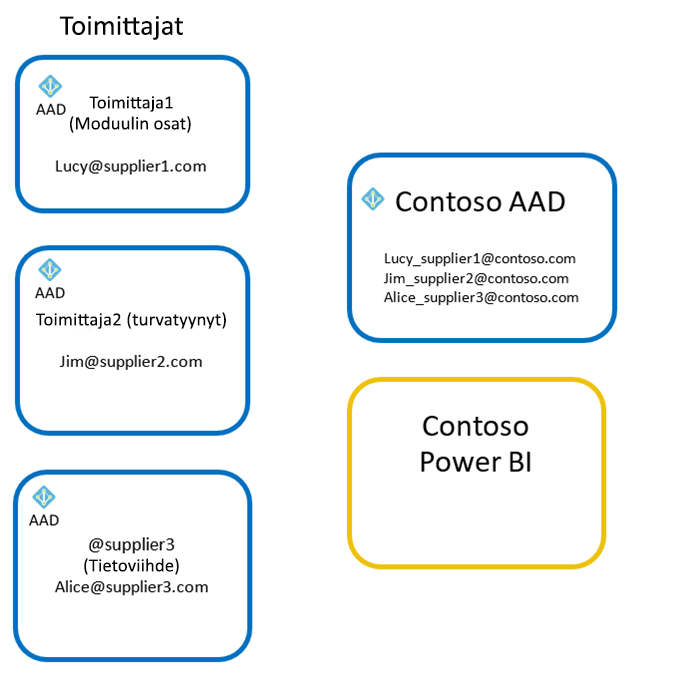

Syitä tämän vaihtoehdon valitsemiselle:

- Koska organisaatiosi hallitsee käyttäjän käyttäjätietoja, kaikki siihen liittyvät palvelut, kuten sähköposti, SharePoint jne., ovat myös organisaatiosi hallinnassa. IT-järjestelmänvalvojasi voivat vaihtaa salasanoja, estää tilien käytön tai valvoa toimintaa näissä palveluissa.
- Henkilökohtaisia tilejä liiketoiminnassaan käyttävien käyttäjien tiettyjen palveluiden käyttöä on usein rajoitettu, joten saatat tarvita organisaatiotilin.
- Jotkin palvelut toimivat vain organisaation käyttäjille. Esimerkiksi sisällön hallinta Intunella ulkoisten käyttäjien henkilökohtaisissa tai mobiililaitteissa Azure B2B:tä käyttämällä ei ehkä ole mahdollista.

Miksi vaihtoehtoa ei kannata valita:

- Kumppaniorganisaatioiden käyttäjien pitää muistaa kahdet tunnistetiedot – yksillä he pääsevät käyttämään oman organisaationsa sisältöä ja toiset antavat pääsyn Contoson sisältöön. Tämä on monimutkaista, ja kokemus hämmentää monia vieraskäyttäjiä.
- Contoson on ostettava ja määritettävä käyttäjille käyttäjäkohtaisia käyttöoikeuksia. Jos käyttäjän on kyettävä vastaanottamaan sähköpostia tai käyttämään Office-sovelluksia, he tarvitsevat asianmukaiset käyttöoikeudet, joihin kuuluu Power BI Pro -käyttöoikeus, jolla voi muokata ja jakaa sisältöä Power BI:ssä.
- Contoso saattaa haluta ottaa käyttöön tiukempia valtuutus- ja hallintokäytäntöjä ulkoisille käyttäjille sisäisiin käyttäjiin verrattuna. Tällöin Contoson pitää luoda organisaation sisäinen nimikkeistö ulkoisille käyttäjille ja kaikki Contoso-käyttäjät pitää kouluttaa nimikkeistön käyttöön.
- Kun käyttäjä poistuu organisaatiosta, hänellä on Contoson resurssien käyttöoikeudet niin kauan, kunnes Contoson järjestelmänvalvoja poistaa hänen tilinsä manuaalisesti
- Contoso-järjestelmänvalvojien pitää hallita käyttäjätietoja, esimerkiksi luoda ne, palauttaa salasanat jne.

### Vaihtoehtoinen vaihto ehto 2: mukautetun Power BI Embedded-sovelluksen luominen mukautetun todennuksen avulla

Contoson toinen vaihtoehto on luoda oma mukautettu upotettu Power BI -sovellus, joka käyttää mukautettua todentamista (['Sovellus omistaa tiedot'](https://docs.microsoft.com/power-bi/developer/embedded/embed-sample-for-customers)). Vaikka monilla organisaatioilla ei ole aikaa tai resursseja luoda mukautettua sovellusta, jolla ne voisivat jakaa Power BI-sisältöä ulkoisille kumppaneilleen, joillekin organisaatioille tämä on paras tapa, ja ansaitsee siksi huomiota.

Organisaatioilla on usein olemassa kumppaniportaaleja, jotka keskittävät kumppanien käyttöoikeudet kaikkiin organisaation resursseihin, eristävät ne organisaation sisäisistä resursseista ja tarjoavat virtaviivaistettuja kokemuksia kumppaneille, niin että ne tukevat monia kumppaneita ja yksittäisiä käyttäjiä.

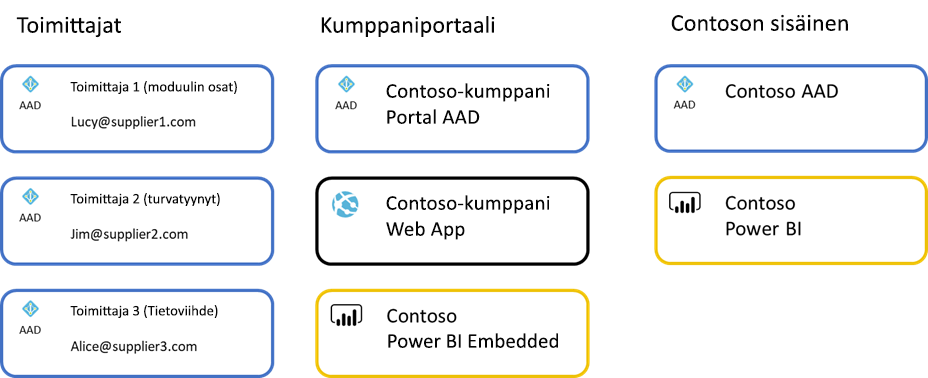

Yllä olevassa esimerkissä kunkin toimittajan käyttäjät kirjautuvat Contoson kumppaniportaaliin, jonka tunnistetietopalveluna on ADD. Se voisi käyttää AAD B2B:tä, Azure B2C:tä, alkuperäisiä käyttäjätietoja tai yhdistää moniin muihin tunnistetietopalveluihin. Käyttäjä kirjautuisi sisään ja käyttäisi kumppaniportaalia Azure-verkkosovelluksen tai samankaltaisen infrastruktuurin avulla.

Verkkosovelluksessa Power BI -raportit on upotettu Power BI Embedded -käyttöönotosta. Verkkosovellus virtaviivaistaa raporttien ja kaikkien liittyvien palveluiden käytön yhtenäiseksi käyttökokemukseksi, jonka tarkoitus on tehdä Contoson kanssa asioimisesta helppoa. Portaalin ympäristö eristetään Contoson sisäisestä AAD:stä ja Contoson sisäisestä Power BI -ympäristöstä, millä varmistetaan, etteivät toimittajat voi käyttää kyseisiä resursseja. Tiedot on yleensä tallennettu erilliseen kumppanitietovarastoon, mikä myös eristää tiedot. Eristämisestä on hyötyä, sillä se rajoittaa niiden ulkoisten käyttäjien lukumäärää, jotka voivat suoraan käyttää organisaatiosi tietoja, mikä puolestaan rajoittaa ulkoisten käyttäjien käytettävissä olevia tietoja ja vahingossa tapahtuvaa tietojen jakamista ulkopuolisten käyttäjien kanssa.

Power BI Embedded -sovellusta käyttämällä portaali voi hyödyntää käyttöoikeuksien etuja käyttämällä Azure-mallissa ostettua sovellustunnusta tai pääkäyttäjän plus premium -kapasiteettia. Tämä yksinkertaistaa loppukäyttäjien käyttöoikeuksien määrittämistä ja portaalia voi skaalata ylös tai alas odotettavissa olevan käytön perusteella. Portaali voi tarjoa yleisesti parempilaatuisen ja yhtenäisen käyttökokemuksen, sillä kumppanit käyttävät yhtä kumppanin tarpeet huomioon ottaen suunniteltua portaalia. Koska Power BI Embeddedille perustuvat ratkaisut on tavallisesti tarkoitettu usealle vuokraajalle, kumppaniorganisaatioiden eristämisen varmistaminen on helppoa.

Syitä tämän vaihtoehdon valitsemiselle:

- Helpompi hallita kun kumppaniorganisaatioiden määrä kasvaa. Koska kumppanit lisätään Contoson sisäisestä AAD-hakemistosta eristettyyn erilliseen hakemistoon, IT:n hallintovelvollisuudet yksinkertaistuvat eikä sisäisiä tietoja jaeta vahingossa ulkoisille käyttäjille.
- Tavallisesti kumppaniportaalit ovat pitkälle brändättyjä, ja niiden käyttökokemus on yhtenäinen kaikille kumppaneille ja virtaviivaistettu vastaamaan tyypillisten kumppanien tarpeisiin. Contoso voi tämän vuoksi tarjota kumppaneille paremman yleisen käyttökokemuksen integroimalla kaikki tarvittavat palvelut yhteen portaaliin.
- Mukautettujen skenaarioiden (esim. sisällön muokkaaminen Power BI Embeddedissa) käyttöoikeuksien kustannukset sisältyvät Azuren Power BI Premium -maksuun, eivätkä ne vaadi Power BI Pro -käyttöoikeuksien määritystä näille käyttäjille.
- Tarjoaa paremman eristyksen kaikille kumppaneille, jos rakennettu usean vuokraajan ratkaisuksi.
- Kumppaniportaali sisältää usein kumppanille muitakin työkaluja Power BI -raporttien, -koontinäyttöjen ja -sovellusten lisäksi.

Miksi vaihtoehtoa ei kannata valita:

- Portaalin luominen, käyttö ja ylläpito vaatii huomattavasti vaivaa, joten se on merkittävä sijoitus resursseihin ja aikaan.
- Ratkaisun toteuttaminen vie paljon enemmän aikaa kuin B2B jakamisen käyttö, sillä ratkaisu vaatii huolellista suunnittelua ja toteuttamista useissa työvirroissa.
- Kun kumppaneita ei ole monta, tämä vaihtoehto vaatii luultavasti liikaa vaivaa hyötyyn nähden.
- Tälle organisaatiolle ensisijainen skenaario on ad hoc -jakamista hyödyntävä yhteistyö.
- Raportit ja raporttinäkymät ovat erilaiset kullekin kumppanille. Tässä vaihtoehdossa hallinnan kulut ovat suuremmat kuin suoraan kumppaneille jaettaessa.

## Usein kysytyt kysymykset

**Voiko contoso lähettää kutsun, joka lunastetaan automaattisesti, jotta käyttäjä on vain "valmis menemään"? Onko käyttäjän aina napsautettava lunastus-URL-osoitetta?**

Käyttäjän on aina annettava suostumus napsauttamalla, ennen kuin hän voi käyttää sisältöä.

Jos aiot kutsua monta vieraskäyttäjää, suosittelemme delegoimaan tämän muille kuin Azure AD -järjestelmänvalvojillesi [lisäämällä käyttäjän resurssiorganisaation vieraskutsujan rooliin](https://docs.microsoft.com/azure/active-directory/active-directory-b2b-add-guest-to-role). Tämä käyttäjä voi kutsua muita kumppaniorganisaation käyttäjiä käyttämällä kirjautumiskäyttöliittymää, PowerShell-komentosarjoja tai ohjelmointirajapintoja. Tämä vähentää Azure AD-järjestelmänvalvojien työtaakkaa, sillä he eivät joudu kutsumaan kumppaniorganisaation käyttäjiä.

**Voiko Contoso pakottaa monimenetelmäisen todentamisen vieraskäyttäjille, jos sen kumppanit eivät käytä monimenetelmäistä todentamista?**

On. Lisätietoja artikkelista [B2B-yhteistyön ehdollinen käyttö](https://docs.microsoft.com/azure/active-directory/active-directory-b2b-mfa-instructions).

**Miten B2B-yhteistyö toimii, kun kutsuttu kumppani lisää oman paikallisen todentamisen liittoutumalla?**

Jos kumppanilla on Azure AD -vuokraaja, joka on liitetty paikalliseen todennusinfrastruktuuriin, paikallinen kertakirjautuminen (SSO) onnistuu automaattisesti. Jos kumppanilla ei ole Azure AD -vuokraajaa, uusille käyttäjille voidaan luoda Azure AD-tili.

**Voinko kutsua vieraskäyttäjiä, joilla on kuluttajille tarkoitettu sähköpostitili?**

Power BI tukee kuluttajille tarkoitettuja sähköpostitilejä käyttävien vieraskäyttäjien kutsumista. Tämä sisältää toimialueet kuten hotmail.com, outlook.com ja gmail.com. Käyttäjät voivat kuitenkin kokea rajoituksia, joita työ- tai koulutilejä käyttävillä ei ole.
