# Power BI Premium kapasiteettien käyttöönotto ja hallinta

**Yhteenveto:** Power BI Premium tarjoaa yhdenmukaisemman suoritus tehon, suurten tieto määrien tuen sekä yhtenäisen itsepalvelupalvelun ja Enterprise BI-ympäristön joustavuuden kaikille organisaatiossasi. Tämä tason 300 tekninen raportti on kirjoitettu erityisesti Power BI järjestelmänvalvojille sekä sisällöntekijöille ja julkaisijoille. Sen avulla he ymmärtävät Power BI Premium mahdollisuuksia ja selittävät, miten skaalautuvat ratkaisut suunnitellaan, otetaan käyttöön, seurataan ja tehdään.

**Tekijä:** [Peter Myers](https://www.linkedin.com/in/peterjsmyers) (tieto ympäristön MVP ja riippumaton bi-asiantuntija, jossa on bitwise-ratkaisuja)

**Tekniset tarkistajat:** Adam Saxton, Akshai Mirchandani, Bhavik Merchant, David Magar, Josh Caplan, Michael Blythe, Nimrod Shalit, Olivier Matrat, Swati Gupta

**Koskee seuraavia:** Power BI-palvelu, Power BI Premium ja Azuren Power BI Embedded kapasiteetit

> [!NOTE]
> Voit tallentaa tai tulostaa tämän teknisen raportin valitsemalla selaimesta **Tulosta** ja valitsemalla sitten **Tallenna PDF-tiedostona**.

## Power BI:n esittely

Power BI on yritys analytiikka palvelu, joka on suunniteltu tuottamaan merkityksellisiä ja perusteltuja päätöksiä. Sen julkaisemisen jälkeen vuonna 2015 siitä on nopeasti tullut suosittu palvelu, jota käytetään ratkaisujen toimittamiseen pien immille organisaatioille suurimmille yrityksille.

Se on saatavilla kahdella tavalla: pilvi palveluna ja paikallisen raportoinnin ratkaisuna nimeltä **Power BI-raporttipalvelin**. \[[1](#endnote-01)\]

Power BI pilvi palveluna on ohjelmisto palveluna (SaaS) \[[2](#endnote-02)\]. Se edustaa palveluiden ja sovellusten joukkoa, joiden avulla organisaatiot voivat kehittää, ottaa käyttöön, hallita ja vaihtaa liike toimintansa valvontaa.

Tämän raportti raportin tarkoituksena ei ole antaa kattavaa kuvausta Power BI-palvelu. Sen sijaan se keskittyy aihe isiin, jotka liittyvät Power BI Premium. Yleisiä tietoja Power BI on kattavassa [Power BI dokumentaatiossa](service-admin-premium-multi-geo.md). Tarkempi selvitys Power BI-palvelu, jossa keskitytään hyvin suoriviin yritys käyttöönottoihin, on kattava [suunnittelu Power BI Enterprise Deployment](https://aka.ms/pbienterprisedeploy) -raportti.

Tämän raportin aiheen yhteydessä tässä osiossa esitellään ja kuvataan kapasiteetteja, Power BI sisältö tyyppejä, mallin tallennus tiloja ja käyttö oikeuksia. Näiden aiheiden ymmärtäminen on tärkeää Power BI Premium käyttöönoton ja hallinnan onnistumisessa.

### Kapasiteetit

**Kapasiteetit** ovat keskeisiä Power BI käsite, joka edustaa joukko resursseja (tallennus tilaa, suoritinta ja muistia), jota käytetään Power BI sisällön isännöintiin ja toimittamiseen. Kapasiteetit ovat joko jaettuja tai varattuja. **Jaettu kapasiteetti** jaetaan muiden Microsoftin asiakkaiden kanssa, kun taas **varattu kapasiteetti** on varattu täysin yhdelle asiakkaalle. Varatut kapasiteetit esitellään Premium- [kapasiteettien](#premium-capacities) aiheessa.

Jaetussa kapasiteetissa työnkulut suoritetaan muiden asiakkaiden kanssa jaetuissa laskennallisissa resursseissa. Koska kapasiteetin on jaettava resursseja, on asetettava rajoituksia, joilla varmistetaan Fair Play, kuten mallin enimmäiskoko (1 gt) ja suurin päivittäinen päivitys tiheys (kahdeksan kertaa päivässä).

### Työtilat

Power BI työtilat sijaitsevat kapasiteetissa, ja ne edustavat suojaus-, yhteiskäyttö-ja käyttöönotto säilöjä. Kullakin Power BI -käyttäjällä on henkilökohtainen työtila, jota kutsutaan **omaksi työtilaksi**. Muita työtiloja voidaan luoda yhteistyön ja käyttöönoton mahdollistamiseksi, ja näitä kutsutaan **työtiloiksi**. Oletus arvon mukaan työtilat, mukaan lukien henkilökohtaiset työtilat, luodaan jaettuun kapasiteettiin.

### Power BI sisältö tyypit

Power BI Premium aiheiden ottamiseksi käyttöön on tärkeää aloittaa perusteellinen keskustelu Power BI arkkitehtuurista, mukaan lukien perussisältötyypit.

Kaikki Power BI sisältö tallennetaan ja niitä hallitaan työtiloissa, jotka ovat Power BI sisällön säilöjä. Jokaisella Power BI käyttäjällä on oma henkilökohtainen työtila, mutta yleinen paras käytäntö on luoda työtiloja. Työtilat mahdollistavat sisällön yhteisomistajuuden ja mahdollisuuden tehdä yhteistyötä sisällön parissa. Ne tarjoavat myös mahdollisuuden järjestää ja levittää sisältöä laajasti yleisöille sovelluksiksi.

Seuraavat Power BI sisältö on tallennettu työtiloihin:

- Tietovuot
- Tietojoukot
- Työkirjat
- Raportit
- Koontinäytöt

#### Tietovuot

Power BI datallows-organisaatioiden avulla organisaatiot voivat yhtenäistää tietoja erilaisista lähteistä. Niitä voidaan pitää malleina, jotka on valmisteltu ja järjestetty käytettäviksi malleissa, mutta niitä ei voi käyttää suoraan raportoinnin lähteenä. Ne hyödyntävät laajaa Microsoft Data-liittimien kokoelmaa, mikä sallii tietojen nauttimisen paikallisesti ja pilvipohjaisista tieto lähteistä.

Dataflow-kohteita voi luoda ja hallita vain työtiloissa, ja ne tallennetaan entiteeteiksi Common Data model (CDM)-muodossa Azure Data Lake Storage Gen2. Yleensä ne on ajoitettu päivittymään toistuvasti, jotta ne voivat tallentaa ajan tasalla olevat tiedot.

Jos haluat lisä tietoja, katso [Power BI (esikatselu)-asia kirjan itsepalvelutietojen prep](service-dataflows-overview.md) .

#### Tietojoukot

Power BI tieto joukot edustavat tietojen lähdettä, joka on valmis raportointia ja visualisointia varten. Tieto joukkoja on monenlaisia:

- Yhteyden muodostaminen aiemmin luotuun tieto malliin, jota ei ole isännöity Power BI kapasiteetissa
- Mallin sisältävän Power BI Desktop tiedoston lataaminen palvelimeen
- Excel-työkirjan (vähintään yhden Excel-taulukon ja/tai työkirjan tieto mallin) lataaminen palvelimeen tai pilkuin erotetun arvon (CSV) lataaminen palvelimeen
- Työntö-, virtaus-tai yhdistelmä virta tieto joukon luominen Power BI-palvelu avulla

Lukuun ottamatta virta tieto joukkoja \[[3](#endnote-03)\], tieto joukko edustaa tieto mallia, joka hyödyntää Analysis Services kehittyneillä mallinnus tekniikoilla.

Ota huomioon, että dokumentaatiossa toisinaan terminologia-tieto joukot ja mallit ovat vaihdettavissa. Yleensä Power BI-palvelu näkö kulmasta sitä kutsutaan tieto joukkona **, ja** kehitys perspektiivistä sitä kutsutaan **malliksi**. Tämän raportti raportin yhteydessä ne tarkoittavat paljolti samaa asiaa.

##### Ulkoisesti Isännöidyt mallit

Yhteyden muodostaminen ulkoisesti isännöityyn malliin edellyttää [paikallisen Tietoyhdyskäytävän](service-gateway-onprem.md) asentamista yhteyden muodostamiseen SQL Server Analysis Services, olipa se paikallisesti tai näennäiskoneen isännöimä infrastruktuuripalvelu (IaaS). Azure Analysis Services ei edellytä yhdyskäytävää. Tämä skenaario on usein järkevää, kun olemassa olevat malli sijoitukset ovat olemassa, ja ne muodostavat yleensä osan yrityksen tieto varastoon (EDW). Sen avulla Power BI voi suorittaa **reaaliaikaisen yhteyden** (LC) Analysis Services ja tehdä näin pakottamalla tietojen käyttö oikeudet käyttämällä Power BI raportin käyttäjän käyttäjä tietoja. SQL Server Analysis Services tuetaan sekä moniulotteisia malleja (kuutioita) että taulukko malleja. Kuten seuraavassa kuvassa näytetään, reaaliaikainen yhteyden tieto joukko välittää kyselyitä ulkoisesti isännöidyille malleille.

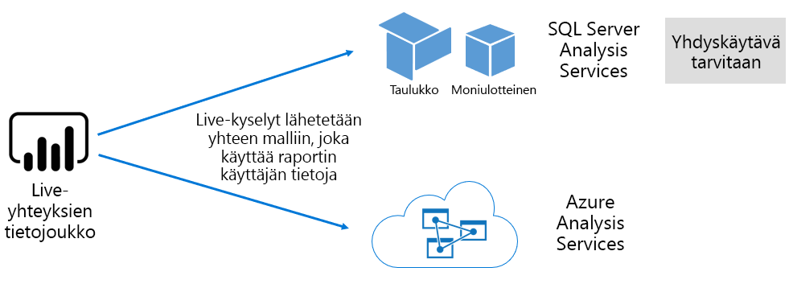

##### Power BI Desktop kehitetyt mallit

Power BI Desktop-Power BI kehittämiseen tarkoitettua asiakas sovellusta voidaan käyttää kehittämään mallia, joka on tehokkaasti Analysis Services taulukko malli. Malleja voidaan kehittää tuomalla tietoja dataflow-tiedoista, jotka voidaan sitten integroida muihin tieto lähteisiin. Vaikka mallintamisen ominaisuudet eivät ole tämän raportti alueen ulkopuolella, on tärkeää ymmärtää, että on olemassa kolmenlaisia malleja, joita voidaan kehittää Power BI Desktop avulla. Nämä tilat määrittävät, tuodaanko tiedot malliin vai onko ne edelleen tieto lähteessä. Kolme tilaa ovat: Import, DirectQuery ja Composite. Kunkin tilan koko keskustelu käsitellään [mallin tallennus tila tiloissa](#model-storage-modes) -aiheessa.

Ulkoisesti Isännöidyt mallit ja Power BI Desktopissa kehitetyt mallit voivat pakottaa rivi tason suoja uksen (RLS) rajoittamaan tietoja, jotka voidaan noutaa tietylle käyttäjälle. Esimerkiksi myyjät-käyttö oikeus ryhmään määritetyt käyttäjät voivat tarkastella vain niiden myynti alueiden raportti tietoja, joihin ne on määritetty. RLS-roolit voivat olla dynaamisia tai staattisia. **Dynaamiset roolit** suodatetaan raportin käyttäjän mukaan, kun taas **staattiset roolit** käyttävät samoja suodattimia kaikille rooliin määriteille käyttäjille.

##### Excel-työkirja mallit

Excel-työkirjoihin tai CSV-tiedostoihin perustuvien tieto joukkojen luominen johtaa mallin automaattiseen luontiin. Excel-taulukot ja CSV-tiedot tuodaan malli taulukoiden luontia varten, kun taas Excel-työkirjan tieto malli transponoidaan Power BI mallin luomi seksi. Kaikissa tapa uksissa tiedosto tiedot tuodaan malliin.

Sen jälkeen voidaan tehdä erotteluja Power BI tieto joukoista, jotka edustavat malleja:

- Ne ovat joko isännöityjä Power BI-palvelu tai Analysis Services isännöimiä ulkoisesti
- He voivat tallentaa tuotuja tietoja, tai he voivat antaa läpi vienti kysely pyyntöjä pohjana oleville tieto lähteille tai niiden yhdistelmän

Tässä on yhteenveto tärkeitä tietoja malleista Power BI tieto joukoista:

- SQL Server Analysis Services Isännöidyt mallit edellyttävät yhdyskäytävän suorittaa LC-kyselyitä
- Power BI Isännöidyt mallit, jotka tuodaan tietoja
  - On oltava ladattu kokonaan muistiin, jotta niistä voidaan tehdä kyselyitä
  - Edellytä päivittämistä, jotta tiedot pysyvät ajan tasalla, ja niiden on sisällettävä yhdyskäytäviä, kun lähde tietoja ei voi käyttää suoraan Inter netin kautta
- Power BI Isännöidyt mallit, jotka käyttävät DirectQuery (DQ)-tallennus tilaa, edellyttävät yhteyttä lähde tietoihin. Kun mallista tehdään kyselyitä, Power BI antaa lähde tietoihin kyselyjä, jotka noutavat nykyisiä tietoja. Tähän tilaan on sisällyttävä yhdyskäytäviä, kun lähde tietoja ei voi käyttää suoraan Inter netin kautta.
- Mallit saattavat pakottaa RLS-säännöt, valvoa suodattimia tiettyjen käyttäjien tietojen käytön rajoittamiseen

Jotta Power BI Premium voidaan ottaa käyttöön ja hallita onnistuneesti, on tärkeää ymmärtää, missä malleja isännöidään, missä niiden tallennus tila on, mikä on yhdyskäytävien riippuvuussuhteet, tuotujen tietojen koko ja päivitys tyyppi ja-tiheys. Näillä kaikilla voi olla merkittävä vaikutus Power BI Premium resursseihin. Lisäksi mallin suunnittelu itse, mukaan lukien sen tietojen valmistelu kyselyt ja lasku toimitukset, voi lisätä huomioon otettavia seikkoja.

On myös tärkeää ymmärtää, että Power BI Isännöidyt tuonti mallit voivat päivittyä aika taulun mukaan tai käynnistää käyttäjän pyynnöstä Power BI-palvelu.

Optimoitujen mallien suunnittelemisesta keskustellaan myöhemmin tässä teknisessä asia kirjassa [optimointi mallien](#optimizing-models) aiheessa.

#### Työkirjat

Power BI työkirjat ovat Power BI sisältö tyyppiä \[[4](#endnote-04)\]. Ne ovat Excel-työkirjoja, jotka on ladattu Power BI-palvelu, eikä niitä pidä sekoittaa palvelimeen ladattuihin Excel-työkirjoihin, jotka luovat tieto joukkoja (malleja). Työkirjan sisältö tyyppi edustaa yhteyttä työkirjaan, joka voidaan ladata Power BI-palvelu tai säilyttää pilvi tallennus tilassa OneDrivessa tai SharePoint Onlinessa.

On tärkeää ymmärtää, että tämä sisältö tyyppi ei ole käytettävissä tieto lähteenä Power BI tietojen visualisoinneille. Sen sijaan se voidaan avata työkirjan Power BI-palvelu Excel Onlinen avulla. Tämän sisältö tyypin pääasiallinen tarkoitus on antaa vanhojen Excel-työkirja raporttien olla käytettävissä Power BI-palvelu ja sallia sen tietojen visualisointien kiinnittämisen Power BI koonti näyttöihin.

Lisä tietoja on [Excel-työkirja tiedostojen Nouda tiedot](service-excel-workbook-files.md) -tiedostossa.

#### Raportit

Raportteja on kahdenlaisia: Power BI raportteja ja sivutettuja raportteja.

**Power BI raportit** tarjoavat vuorovaikutteisia tietojen visualisoinnin kokemuksia, jotka muodostavat yhteyden vain yhteen tieto joukkoon. Raportit on usein suunniteltu rohkaisemaan käyttäjien osallistumista, jotta he voivat käyttää satunnaisia ominaisuuksia, kuten suodatusta, viipalointi, ristiinsuodatusta ja korostusta, poraamista, poraamista, poraamista, Q & luonnollista kielen kyseenalaistaminen, kohdentaminen, sivun siirtyminen, spotlighting, kirjan merkkien katselu ja paljon muuta.

Tämän raportti mallin yhteydessä on tärkeää ymmärtää, miten Power BI arkkitehtuuri, Power BI raportin suunnittelu ja käyttäjien väliset vaikutukset voivat vaikuttaa Power BI-palvelu resursseihin:

- Jos haluat ladata ja käsitellä raportteja tuonti mallien perusteella, malli täytyy ladata kokonaan muistiin (isännöitynä Power BI-palvelu tai isännöimässä tilassa)
- Jokainen raportin visualisointi antaa kyselyn tietojen noutamiseksi kyselyn avulla
- Yleensä suodatuksen ja osittajan väliset toimenpiteet edellyttävät mallin kyselyä. Esimerkiksi osittajan valinnan muuttaminen-Oletus arvon mukaan-edellytä kunkin visualisoinnin lataamista uudelleen sivulla \[[5](#endnote-05)\]
- Power BI raportit eivät takaa nykyisten tietojen näyttämistä, ja ne saattavat vaatia käyttäjää päivittämään raportin ja lataamaan raportti sivun ja sen visualisoinnit
- Käyttäjät voivat tehdä kysymyksiä Q-& luonnollisella kielellä, jotta he voivat esittää kysymyksiä, antaa Power BI raportin suunnittelu sallii sen ja tieto joukko edustaa Power BI isännöidyn tietojen tuonti mallia tai Q & A-käyttöön määritettyä LC-tieto joukkoa

**Sivutetut raportit** , jotka sallivat SQL Server Reporting Services (SSRS) raporttien julkaisemisen ja hahmontamisen (\*. RDL-muoto). Kuten nimestäkin voi päätellä, sivutettuja raportteja käytetään yleisesti, kun vaatimukset edellyttävät tulostamista kiinteään sivu kokoon tai kun on olemassa muuttuja luetteloita tiedoista, jotka on laajennettava kokonaan. Esimerkiksi monisivuiseen hahmontamiseen suunniteltu lasku (visuaalisen visualisoinnin sijaan) ja tulostaminen.

Kaksi tuettua raportti tyyppiä tarjoavat vaihto ehdon raportin tekijöille, joiden avulla he voivat valita tyypin vaatimusten ja käyttö tarkoituksen perusteella. Yleensä Power BI raportit ovat ihanteellisia vuorovaikutteisten kokemusten avulla, jolloin käyttäjä voi tutkia ja löytää merkityksellisiä tietoja tiedoista, kun sivutetut raportit sopivat paremmin parametripohjaisiin sivun asetteluihin.

Raportti tyypistä riippumatta, reagoivien raporttien lataaminen ja tietojen päivittäminen (kun suodattimia tai parametreja muutetaan) on välttämätöntä luotettavan ja hyvin suoriutuneen käyttäjä kokemuksen aikaansaamiseksi.

#### Koontinäytöt

Power BI koonti näytöt on tarkoitettu seuranta kokemusten toimittamiseen, ja ne ovat käsitteellisesti hyvin erilaisia Power BI raporteista. Koonti näytöt on suunniteltu näyttämään yksittäisessä lasi paneelissa arvojen ja tietojen visualisointien ilmaisemista ruuduilla. Yleensä koonti näytöt tarjoavat vähemmän vuorovaikutus kokemuksia kuin Power BI raportteja, joidenkin koonti näyttöjen suunnittelussa ei odotettu vuoro vaikutusta. Esimerkiksi valvomaton koonti näyttö, joka esitetään palvelin huoneen muussa kuin kosketus näytössä. Toinen merkittävä ero on siinä, että koonti näytöt saattavat aiheuttaa tietoja useista tieto joukoista, kun taas Power BI raportin pohjana voi olla vain yksittäinen tieto joukko.

On tärkeää ymmärtää, että koonti näyttö on suunniteltu lataamaan nopeasti ja ilmaisemaan uusimmat tiedot (Power BI-palvelu) kaikkina aikoina. Se saavuttaa tämän tallentamalla ruudun kyselyn tulokset väli muistiin, ja se tekee tämän kullekin koonti näytölle. Sen on itse asiassa tehtävä tämä jokaiselle käyttäjälle, jolla on käyttö oikeus koonti näyttöön, joka perustuu dynaamiseen RLS-käyttöön pakovaan malliin.

Power BI-palvelu päivittää koonti näytön kysely väli muistit automaattisesti heti, kun Power BI Isännöidyt tuonti mallit päivitetään. LC-ja DQ-mallien tapa uksessa tieto joukon omistaja voi hallita sitä, kuinka usein Power BI-palvelu päivittää väli muistin, joka voidaan määrittää usein 15 minuutin välein tai harvoin kerran viikossa. Ota huomioon, että LC Query-väli muistin päivitykset kyselemme ensin mallin metatietoja, jotta voit tarkistaa, onko mallin päivitys tapahtunut viimeisimmän väli muistin päivityksen jälkeen, eikä se Jatka väli muistin päivittämistä, kun päivitys ei ole sittemmin tapahtunut. Tämä tarkistus ei ole mahdollinen DQ-malleille, joten väli muisti päivityksiä suoritetaan, onko lähde tiedot muuttuneet.

DQ:N ja LC-malleihin perustuvat koonti näyttöjen kyselyiden väli muisti päivitykset voivat vaikuttaa merkittävästi sekä Power BI-palvelu resursseihin että ulkoisiin tieto lähteisiin. Harkitse koonti näyttöä, jossa on 20 ruutua, jotka kaikki perustuvat Azure Analysis Services malliin, joka pakottaa dynaamisen RLS-kohteen ja joka päivittyy tunnin välein ja jonka avulla tämä koonti näyttö on jaettu 100-käyttäjien kanssa. Jos tieto joukko on määritetty päivittämään tunnin välein, tuloksena on vähintään 2000 (20 x 100) LC-kyselyä. Tämä saattaa asettaa valtavan kuormituksen Power BI-palvelu ja ulkoisiin tieto lähteisiin, ja se voi myös ylittää käytettävissä olevien resurssien rajoitukset. Kapasiteetti solmut ja-rajoitukset on kuvattu [kapasiteetti solmut](#capacity-nodes) -aiheessa.

Käyttäjät voivat käsitellä koonti näyttöä eri tavoilla, jotka edellyttävät Power BI-palvelu resursseja. He voivat erityisesti

- Käynnistä koonti näyttöjen ruudun päivitys, mikä voi aiheuttaa kaikkien aiheeseen liittyvien Power BI isännöityjen tietojen tuonti mallien tarvittaessa päivittämisen
- Esitä kysymyksiä Q-& luonnollisella kielellä, jotta voit esittää kysymyksiä (antamalla koonti näytön rakenne sallii sen, ja tieto joukko on Power BI isännöimä tietojen tuonti malli tai Q & A-käyttöön määritetty LC-tieto joukko)
- Nopeat merkitykselliset tiedot-ominaisuuden avulla voit Power BI löytää merkityksellisiä tietoja pohjana olevasta tieto joukosta ja reagoida Visualisointeihin, jotka näyttävät ja kuvailevat niitä (edellyttäen, että ruutu perustuu tieto joukkoon, joka on Power BI isännöidyn tietojen tuonti malli)
- Määritä raportti näkymän ruutujen hälytykset, jotka edellyttävät, että Power BI-palvelu verrata kynnys arvoja ruudun arvoihin-mahdollisesti niin usein kuin tunneittain-ja ilmoittaa käyttäjille, kun kynnys arvot ylittyvät (edellyttäen, että ruutu näyttää yksittäisen luku arvon ja perustuu tieto joukko, joka on Power BI isännöity tietojen tuonti malli)

### Mallin tallennus tilat

Muista, että Power BI Desktop sallii mallin kehittämisen yhdessä kolmesta tilasta. On tärkeää ymmärtää kunkin tieto mallin tallennus tilan perustelut sekä mahdolliset vaikutukset Power BI-palvelu resursseihin. Tässä osiossa esitellään kaikki kolme tilaa. Näistä keskustellaan tarkemmin myöhemmin tässä raportti mallissa optimoimalla mallit-aiheessa.

#### Tuonti tila

Tuonti tila on yleisin tila, jota käytetään mallien kehittämiseen, koska on erittäin nopea suoritus kyky, joka liittyy muistin käyttöön, mallintajien käytettävissä oleva suunnittelun joustavuus ja tiettyjen Power BI-palvelu-toimintojen tuki (Q & A, Nopeat merkitykselliset tiedot jne.). Se on oletus tila, kun uusi Power BI Desktop-ratkaisua luodaan.

On tärkeää ymmärtää, että tuodut tiedot tallennetaan aina levylle ja että ne on ladattu kokonaan muistiin, jotta niitä voidaan kysellä tai päivittää. Kun olet muistissa, tuo mallit-kohdassa on nopeat kyselyn tulokset. On myös tärkeää ymmärtää, että tuonti mallista ei ole mitään käsitystä, joka on ladattu osittain muistiin.

Kun tiedot on päivitetty, ne pakataan ja optimoidaan ja VertiPaq-säilö moduuli tallentaa sen levylle. Kun se ladataan levyltä muistiin, on mahdollista tarkastella 10X pakkausta, joten on kohtuullista olettaa, että 10 Giga tavua lähde tietoja voidaan pakata noin 1 Giga tavuun. Levy tilan koko voi saavuttaa 20 prosentin vähennyksen päällimmäisenä. \[[6](#endnote-06)\]

Suunnittelun joustavuus voidaan saavuttaa kolmella tavalla. Tietojen Mallintajat voivat tehdä seuraavaa:

- Integroi tiedot tallentamalla tietoja väli muistiin useista tieto lähteistä tieto lähteen tyypistä ja muodosta riippumatta
- Hyödynnä koko Power Query kaava kielen (epävirallisesti viitattua M) funktiota luotaessa tietojen valmistelu kyselyitä
- Hyödynnä kaikkia DAX (Data Analysis Expressions)-funktioita, kun parannamme mallia liiketoiminta logiikan avulla ja saavutimme laskettujen sarakkeiden, laskettujen taulu koiden ja mitta yksiköiden avulla

Kuten seuraavassa kuvassa näytetään, tuonti malli voi integroida tietoja mistä tahansa useista tuetuista tieto lähde tyypeistä.

Vaikka tuonti malleihin liittyy kuitenkin pakottavia etuja, myös haittoja on:

- Koko malli on ladattava muistiin, ennen kuin Power BI voi tehdä kyselyn mallista, mikä voi painostaa käytettävissä olevia resursseja, koska mallien määrä ja koko kasvavat
- Malli tiedot ovat vain yhtä ajankohtaisia kuin uusin päivitys, joten tuonti mallit on päivitettävä mieluiten ajoitetusti
- Täydellinen päivitys poistaa kaikki tiedot kaikista taulu koista ja lataa ne uudelleen tieto lähteestä. Tämä voi olla erittäin kallista Power BI-palvelu ja tieto lähteiden ajan ja resurssien suhteen. Power BI ei tue lisäävää päivitystä, joka voi välttää koko naisten taulu koiden katkaisemisen ja uudelleenlataamisen, ja tämä käsitellään [Power BI isännöidyissä malleissa](#optimizing-power-bi-hosted-models) .

Tuonti mallit edellyttävät Power BI-palvelu resurssi perspektiivistä:

- Tarpeeksi muistia mallin lataamiseen, kun sitä kysytään tai päivitetään
- Resurssien ja lisä muisti resurssien käsitteleminen tietojen päivittämiseksi

#### DirectQuery-tila

DirectQuery (DQ)-tilassa kehitetyt mallit eivät tuo tietoja. Sen sijaan ne koostuvat vain metatiedoista, jotka kyselevät alkuperäisten kyselyiden tekemistä pohjana olevaan tieto lähteeseen.

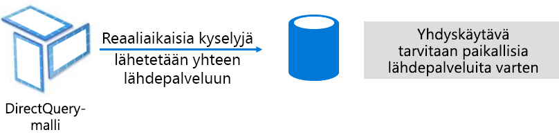

On olemassa kaksi pääsyytä harkita DQ-mallin kehittämistä. Ensimmäinen syy on se, että tieto määrät ovat liian suuria – silloinkin, kun tietojen vähentämis menetelmiä käytetään – ladataan malliin tai käytännössä päivitetään. Toinen syy on se, että raporttien ja koonti näyttöjen on tuotettava "lähes reaaliaikaisia" tietoja sen jälkeen, mitä voidaan saavuttaa ajoitettujen päivitys rajojen puitteissa (48 kertaa päivässä varattua kapasiteettia varten).

DQ-malleihin liittyy useita etuja:

- Mallin koon rajoitusten tuonti ei ole käytössä
- Mallit eivät edellytä päivittämistä
- Raportin käyttäjät näkevät uusimmat tiedot, kun ne ovat vuoro vaikutuksessa raportti suodattimien ja osittajien kanssa, ja ne voivat päivittää koko raportin nykyisten tietojen noutamista varten
- Koonti näytön kuvakkeet, kun ne perustuvat DQ-malleihin, voivat päivittää automaattisesti niin usein kuin 15 minuutin välein

DQ-malleihin liittyy kuitenkin lukuisia haittoja ja rajoituksia:

- Mallin on perustuttava yksittäiseen tuettuun tieto lähteeseen, joten tietojen integrointia on jo saavutettava tieto lähteessä. Tuetut tieto lähteet ovat Relaatio-ja analytiikka järjestelmiä, jotka tukevat monia suosittuja tieto säilöjä \[[7](#endnote-07)\].
- Suoritus kyky voi olla hidas, mikä voi vaikuttaa kielteisesti Power BI-palvelu (kyselyt voivat olla hyvin SUORITINTA vaativia) ja tieto lähteessä (joita ei voi optimoida analyyttisten kyselyiden yhteydessä)
- Power Query kyselyt eivät voi olla liian monimutkaisia, ja ne on rajoitettu M-lausekkeisiin ja funktioihin, jotka voidaan transponoida tieto lähteen ymmärtämällä alku perä isiin kyselyihin
- DAX-funktiot on rajoitettu niihin, jotka voidaan transponoida tieto lähteen ymmärtämällä alku perä isiin kyselyihin, eikä laskettuja taulu koita tai sisäisiä aika tietojen ominaisuuksia tue
- Oletus arvon mukaan malli kyselyt, jotka edellyttävät yli 1 000 000 rivin noutamista, epäonnistuvat
- Raportit ja koonti näytöt, joissa on useita visualisointeja, voivat näyttää ristiriitaisia tuloksia etenkin silloin, kun tieto lähde on epävakaa
- Q & A ja Nopeat merkitykselliset tiedot ei tueta

DQ-mallit edellyttävät Power BI-palvelu resurssi perspektiivistä:

- Vähän muistia mallin lataamiseen (vain metatiedot), kun se tekee kyselyitä
- Joskus merkittävät suoritin resurssit, jotka luovat ja käsittelevät tieto lähteeseen lähetettyjä kyselyitä

Lisä tietoja on [Use Direct-kyselyssä Power BI Desktop](desktop-use-directquery.md) -tiedostossa.

#### Yhdistelmä tila

Yhdistelmä tilassa kehitettyjen mallien avulla voidaan määrittää kunkin malli taulukon tallennus tila. Näin ollen se tukee tuonti-ja DQ-taulu koiden yhdistelmää. Se tukee myös laskettuja taulu koita (määritetty DAX-yhteydessä) ja useita DQ-tieto lähteitä.

Taulukon tallennus tila voidaan määrittää tuotaessa, Directquerynä tai Dual-muodossa. Dual Storage-tilaksi määritetty taulukko on sekä Import että DirectQuery, ja tämän avulla Power BI-palvelu voi määrittää tehokkaimman tilan, jota kysely käyttää kyselyn perusteella.

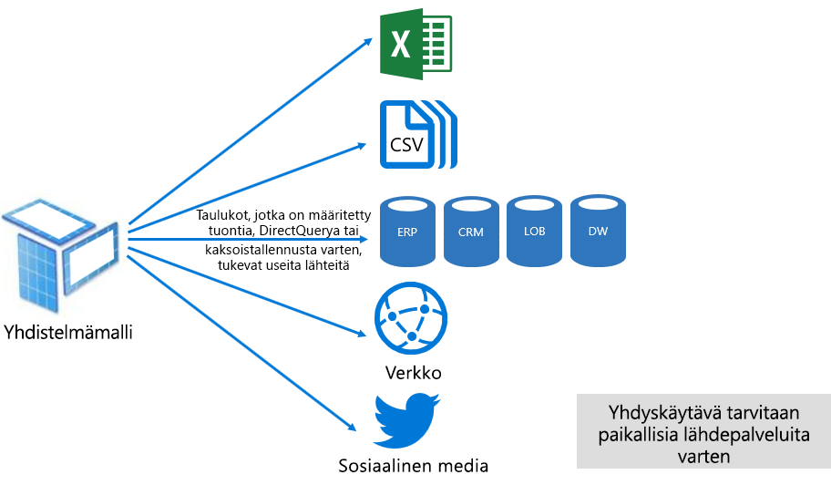

Yhdistelmä mallit pyrkivät toimittamaan parhaat tuonti-ja DirectQuery-tilat. Kun ne on määritetty oikein, ne voivat yhdistää suuren kyselyn suoritus kyvyn muistissa oleviin malleihin, jolloin ne pystyvät noutamaan lähes reaaliaikaisia tietoja tieto lähteistä.

Tietojen mallintajat, jotka kehittävät yhdistelmä malleja, määrittävät todennäköisesti dimensio tyyppi taulukot tuonti-tai kaksoistallennustilassa ja fakta tyyppi taulukoissa DirectQuery-tilassa. Harkitse esimerkiksi mallia, jolla on tuote dimensio tyyppi-taulukko Kaksoistilassa ja myynti fakta-tyyppinen taulukko DirectQuery-tilassa. Tuote taulukko voidaan tehdä tehokkaasti ja nopeasti kyselyitä muistissa raportin osittajan hahmontamista varten. Sales-taulukkoa voidaan sitten tehdä kysely DirectQuery-tilassa liitetyissä tuote-taulu koiden yhteydessä. Jälkimmäinen kysely saattaa mahdollistaa yksittäisen tehokkaan alkuperäisen kyselyn muodostamisen tuote-ja myynti taulukoiden liittymiseen sekä osittajan arvojen suodattamiseen.

Yleisesti ottaen kuhunkin malli tilaan liittyvät edut ja haitat voidaan katsoa käytettävän Table Storage-tilaan yhdistelmä malleissa.

Katso lisä tietoja Power BI Desktop-asia kirjan [Käytä yhdistelmä malleja](desktop-composite-models.md) .

### Käyttöoikeudet

Power BI on kolme käyttö oikeutta:

- Power BI (maksuton)
- Power BI Pro
- Power BI Premium

**Power BI maksuttoman** käyttö oikeuden avulla yksityishenkilö voi kirja utua sisään Power BI-palvelu ja työskennellä omassa työtilassa julkaisemalla malleja ja raportteja. On tärkeää ymmärtää, että Power BI sisältöä ei voi vaihtaa käyttämällä tätä käyttö oikeutta. Tämä käyttö oikeus on nimensä mukaan ilmainen.

**Power BI Pro** käyttö oikeuden avulla yksityishenkilö voi luoda ja tehdä yhteistyötä työtilojen välillä sekä Jaa ja levittää Power BI sisältöä. He voivat myös määrittää tieto joukkojensa päivityksen pitämään tiedot automaattisesti ajan tasalla, mukaan lukien paikallisista tieto lähteistä. Lisäksi he voivat valvoa ja hallita sitä, miten tietoja käytetään ja käytetään. Tämä käyttö oikeus vaaditaan, jotta jaettua sisältöä voidaan vastaanottaa muilta, ellei käyttäjään liitetä Power BI Premium varattua kapasiteettia.

**Power BI Premium** käyttö oikeus on vuokra ajan tason käyttö oikeus, ja sitä käsitellään [Esittelyssä Power BI Premium](#introducing-power-bi-premium) -osassa.

Lisä tietoja Power BI käyttö oikeuksista on [Power BI hinnoittelu](https://powerbi.microsoft.com/pricing/) sivulla.

## Esittelyssä Power BI Premium

Power BI Premium tarjoaa yhtenäisen itsepalvelupalvelun ja Enterprise BI-ympäristön, jossa on skaalautuva, luotettava suoritus kyky ja ennakoitavat kustannukset. Tämä saavutetaan ensisijaisesti myöntämällä varattuja resursseja organisaation Power BI-palvelu suorittamista varten.

Lisäksi Power BI Premium tarjoaa monia yritys ominaisuuksia:

- Kustannustehokas sisällön jakelu, joka mahdollistaisi Power BI sisällön jakamisen rajoittamattomaan Power BI maksuttomiin käyttäjiin, ulkoiset käyttäjät mukaan lukien
- Suuremman tieto joukon koon tuki \[[8](#endnote-08)\]
- Tieto joukkojen ja tieto joukkojen (enintään 48 kertaa päivässä) suuremmat päivitys nopeudet
- Tieto joukkojen ja tieto joukkojen lisäävä päivitys
- Dataflow-linkitetyt entiteetit ja muunnosten rinnakkainen suorittaminen
- Sivutetut raportit
- Power BI-raporttipalvelin paikallista raportointia varten
- Mahdollisuus upottaa sisältöä sovelluksiin sovelluksen käyttäjien puolesta (PaaS)

Monet näistä ominaisuuksista voidaan hyödyntää tehokkaiden ja skaalattavien yritys ratkaisujen toimittamiseen, ja ne sisältyvät [optimoinnissa Premium-kapasiteetit](#optimizing-premium-capacities) -osioon.

### Tila ukset ja käyttö oikeudet

Power BI Premium on vuokraajatason Office 365: n tilaus, joka on saatavilla kahdesta SKU- eli varastointiyksikköperheestä:

- **Em** SKU (EM1-EM3) for upottaminen, joka vaatii vuosittaisen sitoumuksen, laskutetaan kuukausittain
- **P** SKU (P1-P3) upottamiseen ja yritys toimintoihin, jotka edellyttävät kuukausittaista tai vuosittaista sitoutumista, laskutetaan kuukausittain ja sisältää lisenssin asentaa Power BI-raporttipalvelin paikallisesti

Vaihtoehtoinen tapa on ostaa Azuren Power BI Embedded-tilaus, jolla on yksi SKU-perhe **: SKU** (a1-A6) vain upottamista ja kapasiteetin testausta varten.

Kaikki varastointi yksiköt toimittavat v-ytimiä kapasiteetiltaan \[[9](#endnote-09)\], mutta em-varastointi yksiköt on rajoitettu pienempien upottamisen käyttöön. Vaikka tämän teknisen raportin paino pisteenä on P SKU, paljon siitä, mistä keskustellaan, koskee myös A-varastointi yksiköitä.

Verrattuna premium-pakettien varastointiyksiköihin Azuren SKU:t eivät vaadi aikasitoumusta ja ne laskutetaan tunneittain. Ne toimittavat täyden joustavuuden joka mahdollistaa skaalauksen kumpaankin suuntaan, keskeyttämisen, uudelleen jatkamisen ja poistamisen.

Azure Power BI Embedded on suurelta osin tämän raportti alueen ulkopuolella, mutta siitä keskustellaan testaus menetelmien aiheessa käytännöllisenä ja taloudellisena vaihto ehtona kuormituksen testaamiseksi ja mittaamiseksi.

Lisä tietoja Azure SKU-tiedoista on [azure Power BI Embedded-ohjeissa](/azure/power-bi-embedded/).

Järjestelmänvalvojat ostavat Power BI Premium -tilaukset Microsoft 365 -hallintakeskuksesta. Erityisesti vain Office 365: n yleiset järjestelmänvalvojat tai laskutuksen järjestelmänvalvojat voivat ostaa varastointi yksiköitä.

Kun vuokraaja on ostettu, se saa vastaavan määrän v-ytimiä, jotka määritetään kapasiteetteihin – tätä kutsutaan **v-ytimenä**. Esimerkiksi P3-SKU:n ostaminen antaa vuokraajan käyttöön 32 näennäisydintä.

Lisä tietoja on Ohje [aiheessa Power BI Premium](service-admin-premium-purchase.md) -tiedoston ostaminen.

### Premium-kapasiteetit

Toisin kuin jaetussa kapasiteetissa, jossa kuormitukset suoritetaan muiden asiakkaiden kanssa jaetuissa Laskennallisissa resursseissa, **varattu kapasiteetti** on organisaation yksinoikeus käyttöön. Se on eristetty käyttäen erillisiä laskennallisia resursseja, jotka tarjoavat luotettavan ja yhtenäisen suoritus tehon isännöityyn sisältöön.

Tämän tieto raportin paino piste on **Premium-kapasiteetti** , mikä tarkoittaa sitä, että se liittyy johonkin em-tai P-varastointi yksikköä.

#### Kapasiteetin solmut

Kuten tila ukset-ja käyttö oikeus aiheessa on kuvattu, on olemassa kaksi Power BI Premium SKU-perhettä: EM ja P. Kaikki Power BI Premium SKU ovat käytettävissä kapasiteetti solmuissa, joista kukin edustaa tiettyä määrää resursseja, jotka koostuvat suorittimesta, muistista ja tallennus tilasta. Resurssien lisäksi kullakin SKU:lla on käyttö rajoituksia Directqueryn (DQ) ja reaaliaikaisen yhteyden (LC) yhteyksille sekunnissa sekä rinnakkaisten mallien päivitysten määrän.

Käsittelyn suorittaa määrätty määrä näennäisytimiä, joka on jaettu tasan taustan ja edustan välillä.

**Taustan näennäisytimet** vastaavat Power BI:n ydintoiminnoista, joihin kuuluvat kyselyiden käsittely, välimuistin hallinta, R-palvelujen suorittaminen, mallien päivittäminen, luonnollisen kielen käsittely (Q&A) sekä raporttien ja kuvien palvelinpuolen hahmontaminen. Tausta palvelun v-ytimille on määritetty kiinteä muisti määrä, jota käytetään ensisijaisena isäntä malleihin, joita kutsutaan myös aktiivisiksi tieto joukoiksi.

**Frontend v-ytimet** vastaavat verkko palvelusta, koonti näytöstä ja raportti asiakirjan Hallin nasta, käyttö oikeuksien hallin nasta, ajoituksesta, ohjelmointi raja pinnoista, latauksista ja ladattavista tiedostoista sekä yleensä kaikkeen, mitä käyttäjä kokemukseen liittyy.

Tallennus tila-asetukseksi on 100 TB per kapasiteetti solmu.

Kunkin Premium SKU:N (ja yhtäpitävästi kokoisen SKU:N) resurssit ja rajoitukset on kuvattu seuraavassa taulukossa.

| Kapasiteetin solmut | V-ytimiä yhteensä | Taustan v-ytimet | RAM (GB) | Edustan v-ytimet | DQ/LC (per SEK) | Mallin uudelleen latauksen parallelisointi |
| --- | --- | --- | --- | --- | --- | --- |
| EM1/A1 | 1 | 0.5 | 3 | 0.5 | 3.75 | 1 |
| EM2/A2 | 2 | 1 | 5 | 1 | 7.5 | 2 |
| EM3/A3 | 4 | 2 | 10 | 2 | 15 | 3 |
| P1/A4 | 8 | 4 | 25 | 4 | 30 | 6 |
| P2/A5 | 16 | 8 | 50 | 8 | 60 | 12 |
| P3/A6 | 32 | 16 | 100 | 16 | 120 | 24 |
| | | | | | | |

#### Kapasiteetin kuormitukset

Kapasiteetin kuormitukset ovat käyttäjien käytettävissä olevia palveluita. Premium-ja Azure-kapasiteetit tukevat oletusarvoisesti vain tieto joukon työmäärää, joka liittyy käynnissä oleviin Power BI kyselyihin, joita ei voi poistaa käytöstä.

Lisä kuormitukset voidaan ottaa käyttöön sivutetuissa raporteissa, dataflow-ja AI-raporteissa. Jokainen ylimääräinen työmäärä edellyttää enimmäismuistin määrittämistä (prosentteina käytettävissä olevasta muistista), jota työmäärä voi käyttää.

#### Kapasiteettien toiminta

Power BI-palvelu pyrkii aina hyödyntämään kapasiteetti resursseja parhaalla tasolla, mutta se ei saa ylittää kapasiteettiin asetettuja rajoituksia.

Kapasiteetti toiminnot luokitellaan joko vuorovaikutteisiksi tai taustaksi. Vuorovaikutteisiin toimintoihin kuuluvat pyyntöjen hahmontaminen ja käyttäjien toimintaan reagoiminen (suodatus, Q&A-kyselyt jne.). Yleensä tuo mallin kysely on muistiresurssiintensiivinen, kun kyseltäessä LC/DQ-malleja on CPU-intensiivinen. Taustan toiminnot sisältävät tietovirran ja tuontimallin päivitykset sekä koontinäyttökyselyjen tallentamisen välimuistiin.

On tärkeää ymmärtää, että vuorovaikutteiset toiminnot ovat aina etusijalla tausta toimintoihin nähden parhaan mahdollisen käyttö kokemuksen takaamiseksi. Jos resurssit eivät riitä, taustatoiminnot lisätään jonoon, josta ne käsitellään resurssien vapautuessa. Tausta toiminnot, kuten tieto joukon päivitykset ja AI-Funktiot, voidaan pysäyttää Power BI-palvelu Keski prosessin aikana ja lisätä jonoon.

Tuonti mallit on ladattava kokonaan muistiin, jotta niistä voidaan tehdä kyselyitä tai päivittää. Power BI-palvelu hallitsee muistin käyttöä käyttämällä kehittyneitä algoritmeja, joilla varmistetaan käytettävissä olevan muistin maksimaalinen käyttö, ja se voi saavuttaa kapasiteetin ylittämisen: samalla kun kapasiteetti voi tallentaa monia tuonti malleja (enintään 100 TB Premium-kapasiteettia kohden), Kun niiden yhdistetty levy tila ylittää tuetun muistin (ja lisä muistia vaaditaan kyselyä ja päivittämistä varten), niitä ei voi ladata muistiin yhtä aikaa.

Tuonti mallit ladataan siis-ja poistetaan muistista-käytön mukaan. Tuonti malli ladataan, kun se tekee kyselyitä (vuorovaikutteinen toiminto), ei vielä muistissa tai kun se päivitetään (tausta toiminto).

Mallin poistamista muistista kutsutaan **häätämistä** varten, ja se on toiminto, jota Power BI voi suorittaa nopeasti mallien koon mukaan. Jos kapasiteetilla ei ole muistipaineita, mallit yksinkertaisesti ladataan muistiin, johon ne myös jäävät. \[[10](#endnote-10)\] kuitenkin, kun muistia ei ole riittävästi käytettävissä mallin lataamiseen, Power BI-palvelu on ensin vapauttaa muistia. Se vapauttaa muistia tunnistamalla malleja, jotka on poistettu käytöstä etsimällä malleja, joita ei ole käytetty viimeisten kolmen minuutin aikana \[[11](#endnote-11)\], ja häätämällä ne. Jos passiivisia malleja ei ole häädettäväksi, Power BI -palvelu pyrkii häätämään taustatoimintoja varten ladatut mallit. Tämä voi sisältää tausta kuormituksen häätämisen, kuten tekoäly kuormituksen. Viimeisenä keinona, 30 sekunnin kuluttua epäonnistuneista yrityksistä \[[11](#endnote-11)\], on, että vuorovaikutteinen toiminto epäonnistuu. Tässä tapa uksessa raportin käyttäjälle annetaan kauniisti ilmoitus virheestä, joka sisältää ehdotuksen yrittää uudelleen pian.

On tärkeää korostaa, että tieto joukon häätö on normaali ja odotettu toiminta. Sillä pyritään maksimoimaan muistin käyttö lataamalla ja poistamalla malleja, joiden yhteenlasketut koot voivat ylittää käytettävissä olevan muistin määrän. Tämä on tarkoituksellista ja täysin läpinäkyvää raportin käyttäjille. Suuret häätömäärät eivät välttämättä tarkoita, että kapasiteetti on riittämättömästi resursoitu. Ne voivat kuitenkin muotoutua ongelmaksi, jos kyselyihin tai päivityksiin reagointi kärsii suurten häätömäärien vuoksi.

Tuonti mallien päivitykset ovat aina muistiintensiivisiä, koska mallit on ladattava muistiin ja käsittely edellyttää lisä muistia. Täydellinen päivitys voi käyttää noin kaksinkertaisen määrän muistia mallin vaatimuksiin nähden. Näin varmistetaan, että mallista voidaan tehdä kyselyitä myös käsittelyn aikana (kyselyt lähetetään olemassa olevaan malliin, kunnes päivitys on valmis ja uudet malli tiedot ovat käytettävissä). Huomautuslisäävä päivitys vaatii vähemmän muistia, ja se voi olla nopeampaa, joten kapasiteetti resursseihin kohdistuvaa painetta voidaan vähentää huomattavasti. Mallien päivitykset voivat myös vaatia paljon suorittimelta. Tällaisia ovat varsinkin monimutkaiset Power Query -muunnokset tai lasketut taulukot tai sarakkeet, jotka ovat monimutkaisia tai perustuvat suuriin taulukoihin.

Päivitysten kaltaiset kyselyt edellyttävät, että malli ladataan muistiin. Jos muisti ei riitä, Power BI-palvelu yrittää häätää passiiviset mallit, ja jos tämä ei ole mahdollista (kaikkien mallien ollessa aktiivisia), päivitystyö lisätään jonoon. Päivitykset ovat yleensä erittäin paljon suoritin tehoa, jopa enemmän kuin kyselyitä. Tästä syystä samanaikaisilla päivityksillä on kapasiteettirajat, joita on määritetty puolitoista kertaa taustan näennäisytimien määrä, ylöspäin pyöristettynä. Jos on samanaikaisia päivityksiä on liian monta, ajoitettu päivitys asetetaan jonoon. Kun näin tapahtuu, päivityksen valmistuminen kestää normaalia kauemmin. Ota huomioon, että pyydettäessä suoritettavat päivitykset (joita käyttäjä pyyntö tai ohjelmointi raja pinta kutsu käynnistää) yrittää uudelleen kolme kertaa \[[11](#endnote-11)\], ja sitten epäonnistuu, jos resursseja ei edelleenkään ole tarpeeksi.

## Power BI Premium hallinta

Power BI Premium hallintaan kuuluu tilausten ostaminen sekä Premium-kapasiteettien luominen, hallinta ja valvonta.

### Kapasiteettien luominen ja hallinta

**Power BI hallinta** portaalin **kapasiteetti asetukset** -sivulla näkyy ostettujen ja käytettävissä olevien v-ytimien määrä (eli vielä määritetty kapasiteettiin) ja Premium-kapasiteettien luettelo. Sivun avulla Office 365: n yleiset järjestelmänvalvojat tai Power BI-palvelu järjestelmänvalvojat voivat luoda Premium-kapasiteetteja käytettävissä olevista v-ytimistä tai muokata nykyisiä Premium-kapasiteetteja.

Kun luot Premium-kapasiteettia, järjestelmänvalvojan täytyy määrittää:

- Kapasiteetin nimi (yksilöivä vuokra ajassa)
- Kapasiteetin järjestelmänvalvojat
- Kapasiteetin koko
- Tietojen Residenssi alue \[[12](#endnote-12)\]

Vähintään yksi kapasiteetin järjestelmänvalvoja täytyy määrittää. Kapasiteetin järjestelmänvalvojiksi määritetyt käyttäjät voivat

- Määritä työtilat kapasiteettiin
- Hallitse käyttö oikeuksia, lisää kapasiteetin järjestelmänvalvojia tai-käyttäjiä, joilla on määrityksen käyttö oikeudet (jotta he voivat määrittää työtiloja kapasiteettiin)
- Hallitse kuormituksia, jos haluat määrittää Sivutettujen raporttien ja dataflow-kuormituksen suurimman muistin käytön
- Käynnistä kapasiteetti uudelleen, jos haluat nollata kaikki toiminnot järjestelmän ylikuormituksesta \[[13](#endnote-13)\]

Kapasiteetin järjestelmänvalvojat eivät voi käyttää työtilan sisältöä (ellei eksplisiittisesti määritettyjä työtilan käyttö oikeuksia), eikä heillä ole käyttö oikeutta kaikkiin Power BI-hallinta alueisiin (ellei eksplisiittisesti määritetä), kuten käyttö mittareihin, valvonta lokeihin tai vuokra ajan asetuksiin. On tärkeää huomata, että kapasiteettien järjestelmänvalvojilla ei ole oikeutta uusien kapasiteettien luomiseen tai olemassa olevien kapasiteettien skaalaamiseen. Lisäksi ne määritetään per kapasiteetti-periaatteella ja varmistetaan, että he voivat tarkastella ja hallita vain niitä kapasiteetteja, joihin ne on määritetty.

Kapasiteetin koko on valittava käytettävissä olevasta SKU-asetusten listasta, jota rajoittavat käytettävissä olevien v-ytimien määrä varannossa. Varannosta voi luoda useita kapasiteetteja, jotka voivat olla perä isin yhdestä tai useammasta ostetusta varastointi paikasta. Esimerkiksi P3-varastointiyksikköä (32 näennäisydintä) voidaan käyttää kolmen kapasiteetin luomiseen: yksi P2 (16 näennäisydintä) ja kaksi P1:tä (2 x 8 näennäisydintä). Parempi suoritus kyky ja skaalaus voidaan saavuttaa luomalla pienempiä kapasiteetteja, ja tästä aiheesta keskustellaan [Premium-kapasiteettien optimointi](#optimizing-premium-capacities) -osiossa. Seuraavassa kuvassa on esimerkki asetukset kuvitteelliselle contoso-organisaatiolle, joka koostuu viidestä Premium-kapasiteetistä (3 x P1 ja 2 x P3), joista jokainen sisältää työtiloja ja useita työtiloja jaetussa kapasiteetissa.

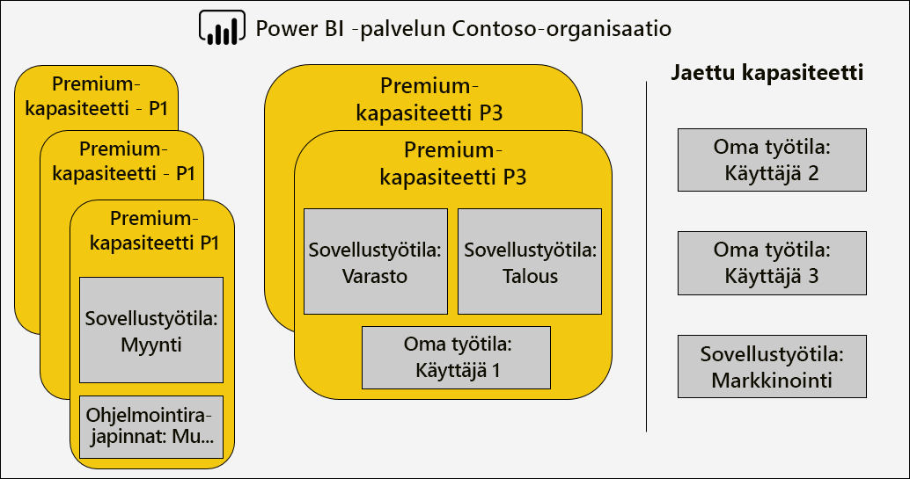

Premium-kapasiteetti voidaan määrittää jollekin muulle alueelle kuin Power BI vuokra ajan koti alueelle, ja se tarjoaa hallinta-ohjaus objektin, jonka kautta palvelin keskukset (määritettyjen maantieteellisten alueiden sisäpuolella) Power BI sisältö sijaitsee. \[[12](#endnote-12)\]

Power BI -palvelun järjestelmänvalvojat ja Officen 365:n yleiset järjestelmänvalvojat voivat muokata Premium-kapasiteetteja. He voivat erityisesti

- Muuta kapasiteetin kokoa, jos haluat skaalata tai skaalata resursseja. P-varastointi yksikköä ei kuitenkaan voi alentaa EM-varastointi yksikölle tai päivittää toisin päin.
- Lisää tai poista kapasiteetin järjestelmänvalvojia
- Lisää tai poista käyttäjiä, joilla on määrityksen käyttö oikeudet
- Lisää tai poista lisä kuormituksia
- Muuta alueita

Määrityskäyttöoikeudet vaaditaan työtilan määrittämiseen tietylle Premium-kapasiteetille. Käyttö oikeudet voidaan antaa koko organisaatiolle, tietyille käyttäjille tai ryhmälle.

Oletusarvoisesti Premium-kapasiteetit tukevat Power BI -kyselyjen suorittamiseen liittyviä kuormituksia. Se tukee myös kolmea ylimääräistä työmäärää: **sivutettuja raportteja**, **tieto määriä ja** **tekoäly**. Jokainen kuormitus edellyttää enimmäismuistin (prosenttiosuutena kaikesta käytettävissä olevasta muistista) määrittämistä, jota kuormitus voi käyttää. On tärkeää ymmärtää, että muistin enimmäisvarausten lisääminen voi vaikuttaa isännöityjen aktiivisten mallien määrään ja päivitysten suoritus kykyyn.

Muistin kohdistetaan tietovoille dynaamisesti, mutta sivutetuille raporteille staattisesti. Syy enimmäismuistin staattiseen varaamiseen on se, että sivutetut raportit suoritetaan kapasiteetin suojatussa rajoitetussa tilassa. Sivutettujen raporttien muisti on määritettävä varoen, sillä se vähentää käytettävissä olevaa muistia mallien lataamista varten.

|                     | EM3                      | P1                       | P2                      | P3                       |
|---------------------|--------------------------|--------------------------|-------------------------|--------------------------|
| Sivutetut raportit | – | Oletus 20 %, vähintään 10 % | Oletus 20 %, vähintään 5 % | Oletus 20 %, vähintään 2,5 % |
| Tietovuot | Oletus 20 %, vähintään 8 %  | Oletus 20 %, vähintään 4 %  | Oletus 20 %, vähintään 2 % | Oletus 20 %, vähintään 1 %  |
| Tekoäly | – | Oletus 20 %, vähintään 20 %  | Oletus 20 %, vähintään 10 % | Oletus 20 %, vähintään 5 %  |
| | | | | |

Premium-kapasiteetin poistaminen on mahdollista, eikä se aiheuta sen työtilojen ja sisällön poistamista. Sen sijaan se siirtää määritetyt työtilat jaettuun kapasiteettiin. Kun Premium-kapasiteetti luotiin eri alueella, työtila siirretään koti alueen jaettuun kapasiteettiin.

### Työtilojen määrittäminen kapasiteetteihin

Työtilat voidaan määrittää Premium-kapasiteettiin **Power BI-hallinta** **portaalissa** tai-työtilassa **-työtila-ruudussa.**

Kapasiteetin järjestelmänvalvojat sekä Office 365: n yleiset järjestelmänvalvojat tai Power BI-palvelu järjestelmänvalvojat voivat joukkomäärittää työtiloja **Power BI hallinta**  **portaalissa**. Joukkomääritys voi koskea seuraavia kohteita:

- **Työtilat käyttäjien mukaan** : kaikki näiden käyttäjien omistamat työtilat, mukaan lukien henkilökohtaiset työtilat, on määritetty Premium-kapasiteettiin. Tämä sisältää työtilojen uudelleenmäärityksen, kun ne on jo määritetty eri Premium-kapasiteettiin. Lisäksi käyttäjille myönnetään myös työtilan määrityskäyttöoikeudet.

- **Määritetyt työtilat**
- **Koko organisaation työtilat** : kaikki työtilat, henkilökohtaiset työtilat mukaan lukien, on määritetty Premium-kapasiteettiin. Lisäksi kaikille nykyisille ja tuleville käyttäjille määritetään työtilan määrityksen käyttö oikeudet. \[[14](#endnote-14)\]

Työtila voidaan lisätä Premium-kapasiteettiin käyttämällä **Työtila**-ruutua, jos käyttäjä on sekä työtilan järjestelmänvalvoja että hänellä on määrityskäyttöoikeudet.

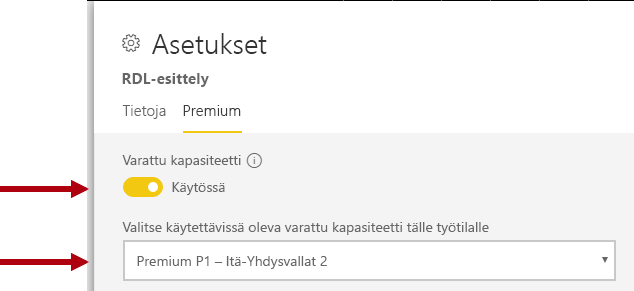

Työtilan järjestelmänvalvojat voivat poistaa työtilan kapasiteetista (jaettuun kapasiteettiin) ilman määrityskäyttöoikeuksia. Työtilojen poistaminen varatuista kapasiteeteista siirtää työtilan käytännössä jaettuun kapasiteettiin. Ota huomioon, että työtilan poistamisella Premium-kapasiteetista voi olla kielteisiä seurauksia: esimerkiksi jaettu sisältö ei ehkä ole enää käytettävissä ilmaisen Power BI:n lisensoiduille käyttäjille tai ajoitettu päivitys keskeytyy, kun jaettujen kapasiteettien tukemat määrät ylittyvät.

Power BI -palvelussa Premium-kapasiteettiin määritetyn työtilan tunnistaa helposti sen työtilan nimeä koristavasta vinoneliökuvakkeesta.

### Kapasiteetin valvonta

Premium-kapasiteettien valvonta antaa järjestelmänvalvojille käsityksen siitä, miten kapasiteetit toimivat. Kapasiteetteja voidaan seurata [Power BI Premium Capacity Metrics-sovelluksella](service-admin-premium-monitor-capacity.md) tai [Power BI-hallinta portaalissa](service-admin-premium-monitor-portal.md).

#### Tulkitaan mittareita

Mittareita tulee valvoa perusymmärryksen saamiseksi resurssien käytöstä ja kuormituksesta. Jos kapasiteetista tulee hidas, on tärkeää ymmärtää, mitä mittareita pitää valvoa ja mitä päätelmiä niistä voi tehdä.

Ihannetapauksessa kyselyiden pitäisi valmistua sekunnissa, jotta ne voivat tarjota reagoivia kokemuksia raportin käyttäjille ja mahdollistaa kyselyjen suuremman siirtomäärän. Taustaprosessien, kuten päivitysten, valmistumisen hidastuminen ei ole yleensä yhtä huolestuttavaa.

Yleensä hitaat raportit saattavat olla merkki ylikuumenevasta kapasiteetista. Kun raporttien lataaminen epäonnistuu, se on merkki ylikuumenneesta kapasiteetista. Kummassakin tilanteessa pääsyynä voi olla useita tekijöitä, kuten seuraavat tekijät:

- **Epäonnistuneet kyselyt** ovat varmasti merkki muistiin kohdistuvasta paineesta ja siitä, että mallia voitu ladata muistiin. Power BI -palvelu yrittää ladata mallin 30 sekunnin ajan ennen epäonnistumista.

- **Liian pitkät kyselyiden odotusajat** voivat johtua useista syistä:
  - Power BI-palvelu on ensin häädettävä malli (t) ja sitten ladattava kysely malli (muista, että suurempi tieto joukko häätö hinnat eivät yksinään viittaa kapasiteetin stressiin, ellei siihen liitetä pitkiä kyselyiden odotus aikoja, jotka ilmaisevat muistin tietojen poistamisen)
  - Mallin lataus ajat (erityisesti odottaa ladata suuren mallin muistiin)
  - Pitkät suoritettavat kyselyt
  - Liian monta LC\DQ-yhteyttä (kapasiteetti rajoitusten ylittäminen)
  - SUORITTIMEN kylläisyys
  - Monitasoiset raportti mallit, joissa on liian paljon visualisointeja sivulla (muista, että jokainen visualisointi on kysely)
- **Pitkät kyselyjen kestot** voivat olla merkkinä siitä, että malleja ei ole optimoitu, erityisesti silloin, kun kapasiteetissa on aktiivisena useita tietojoukkoja ja vain yksi tietojoukko tuottaa pitkiä kyselyjen kestoja. Tämä viittaa siihen, että kapasiteetilla on riittävät resurssit ja että kyseessä oleva tietojoukko ei ole paras mahdollinen tai että se on vain hidas. Pitkäkestoiset kyselyt voivat olla ongelmallisia, koska ne voivat estää muiden prosessien tarvitsemien resurssien käyttämisen.
- **Pitkien päivitysten odotus ajat tai AI-kutsun odotus ajat** ilmaisevat, että muisti ei riitä useiden aktiivisten mallien vuoksi, tai että ongelmallinen päivitys estää muita päivityksiä (jotka ylittävät rinnakkaiset päivitys rajat).

Tarkempi selvitys siitä, miten mittareita käytetään, käsitellään seuraavaksi [Optimoi Premium-kapasiteetit](#optimizing-premium-capacities) -osiossa.

## Premium-kapasiteettien optimointi

Kun Premium-kapasiteetin suoritus kykyyn liittyy ongelmia, yleinen ensimmäinen tapa on jo käyttöönotettujen ratkaisujen optimoiminen tai säätäminen hyväksyttävien vaste aikojen palauttamiseksi. Ensisijaisena ajatuksena on välttää ylimääräisen Premium-kapasiteetin hankkimista, ellei sitä voi perustella.

Kun ylimääräinen Premium-kapasiteetti vaaditaan, on kaksi vaihto ehtoa, joista keskustellaan myöhemmin tässä osiossa:

- Skaalaa Premium-kapasiteettia
- Uuden Premium-kapasiteetin lisääminen

Lopuksi testaus menetelmät ja Premium-kapasiteetin mitoitus tekevät tämän osan.

### Yleiset parhaat käytännöt

Parhaan hyödyntämisen ja suoritus kyvyn saavuttamiseksi on joitakin parhaita käytäntöjä, jotka voidaan ottaa huomioon yleisinä suosituksina. Näitä ovat esimerkiksi seuraavat:

- Työtilojen käyttäminen henkilökohtaisten työtilojen sijaan
- Liike toiminnan kriittisen ja Omatoiminen BI (SSBI)-palvelun erottaminen eri kapasiteetteihin

  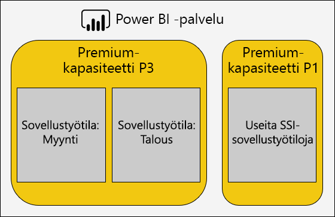

- Jos sisältöä jaetaan vain Power BI Pro käyttäjien kanssa, sisältöä ei välttämättä tarvitse tallentaa varattuun kapasiteettiin
- Käytä varattuja kapasiteetteja, kun etsit tiettyä päivitys aikaa tai kun tiettyjä ominaisuuksia vaaditaan, esimerkiksi suuria tieto joukkoja tai sivutettuja raportteja

### Yleisten kysymysten käsitteleminen

Power BI Premium käyttöönottojen optimoiminen on monimutkainen aihe, johon liittyy työmäärän vaatimusten, käytettävissä olevien resurssien ja niiden tehokkaan käytön ymmärtäminen.

Tässä ohje aiheessa käsitellään seitsemää yleistä tuki kysymystä, jotka kuvaavat mahdollisia ongelmia ja selityksiä sekä tietoja niiden tunnistamista ja ratkaisemista varten.

#### Miksi kapasiteetti on hidas ja mitä voin tehdä?

On monia syitä, jotka voivat vaikuttaa hitaaseen Premium-kapasiteettiin. Tämä kysymys edellyttää lisätietoja, jotta ymmärretään, mitä hitaalla tarkoitetaan. Onko raporttien lataaminen hidasta? Vai eikö niiden lataaminen onnistu? Latautuvatko tai päivittyvätkö raportin visualisoinnit hitaasti, kun käyttäjät ovat vuorovaikutuksessa raportin kanssa? Onko päivittäminen kestää kauemmin kuin odotettiin tai aiemmin kokenut?

Kun olet saanut käsityksen syystä, voit alkaa tutkia asiaa. Vastauksen seuraavaan kuuteen kysymykseen auttavat sinua ratkaisemaan tarkempia ongelmia.

#### Minkälainen sisältö käyttää eniten kapasiteettia?

**Power BI Premium -kapasiteettiarvot** -sovelluksella voit suodattaa kapasiteetin mukaan ja tarkastella työtilan sisällön suorituskyvyn mittareita. Suoritus kyvyn mittarit ja resurssien käyttö tunnit on mahdollista tarkistaa kuluneina seitsemänä päivänä kaikesta Premium-kapasiteettiin tallennetusta sisällöstä. Tämä on usein ensimmäinen vaihe, joka suoritetaan, kun vian määritys on yleinen huoli Premium-kapasiteetin suoritus kyvystä.

Tärkeimmät valvottavat arvot:

- Keskimääräinen suoritin ja suuren käyttö asteen määrä
- Keskimääräinen muisti ja suuren käyttö asteen määrä sekä muistin käyttö tiettyjen tieto joukkojen, tietojen ja Sivutettujen raporttien osalta
- Muistissa ladatut aktiiviset tieto joukot
- Kyselyiden kestot Keski määrin ja enintään
- Kyselyiden keskimääräinen odotus aika
- Tieto joukon ja tiedon kulku-päivitys aikojen Keski arvo
- Keskimääräiset AI-soitto ajat ja odotus ajat

Lisäksi Power BI Premium kapasiteetti mittarit-sovelluksessa aktiivinen muisti näyttää raporttiin varatun muistin kokonaismäärän, jota ei voi häätää, koska se on käytössä viimeisten kolmen minuutin aikana. Korkea päivityksen odotusaikapiikki saattaa korreloida suuren ja/tai aktiivisen tietojoukon kanssa.

"Top 5 by Average duration"-kaavio korostaa viittä ylintä tieto joukkoa, sivutettuja raportteja, tieto joukkoja ja AI-kutsuja, jotka kuluttavat kapasiteetti resursseja. Viiden parhaan luettelon sisältö on tutkimuksen ja mahdollisen optimoinnin hakijoita.

#### Miksi raportit ovat hitaita?

Seuraavissa taulukoissa näytetään mahdollisia ongelmia ja tapoja tunnistaa ja käsitellä niitä.

##### Riittämättömät kapasiteettiresurssit

| Mahdolliset selitykset | Tunnistaminen | Ratkaiseminen |
| --- | --- | --- |
| Suuren kokonaismäärän aktiivista muistia (mallia ei voi häätää, koska se on käytössä viimeisten kolmen minuutin aikana)   Useita suuren piikkiä kyselyn odotus aikoina   Monta suurta piikkiä päivityksen odotus aikoina | Valvo muistin mittareita \[[18](#endnote-18)\]ja häätö määrät \[[19](#endnote-19)\] | Pienennä mallin kokoa tai Muunna DirectQuery-tilaan – Lue tämän osion [Optimoi mallit](#optimizing-models) -aihe   Skaalaa kapasiteettia   Määritä sisältö eri kapasiteettiin |

##### Tehottomat raporttimallit

| Mahdolliset selitykset | Tunnistaminen | Ratkaiseminen |
| --- | --- | --- |
| Raportti sivut sisältävät useita visualisointeja (vuorovaikutteinen suodatus voi käynnistää vähintään yhden kyselyn visualisointia kohden)   Visualisoinnit noutavat enemmän tietoja kuin on tarpeen | Raportti mallien tarkastelu   Haastattelen raportin käyttäjiä ymmärtämään, miten he käsittelevät raportteja   Valvo tieto joukon kyselyjen mittareita \[[20](#endnote-20)\] | Uudelleensuunnittelu raportteja, joissa on vähemmän visualisointeja sivua kohden |

##### Tieto joukko on hidas (etenkin silloin, kun raportit ovat aiemmin suoritettuna)

| Mahdolliset selitykset | Tunnistaminen | Ratkaiseminen |
| --- | --- | --- |
| Yhä suurempi määrä tuonti tietoja   Monitasoinen tai tehoton laskenta logiikka, mukaan lukien RLS-roolit   Mallia ei ole optimoitu täysin   (DQ/LC) Yhdyskäytävän viive   Hitaan DQ-lähde kyselyn vastaus ajat | Tarkastele malli malleja   Valvo yhdyskäytävän resurssi laskureita | Lue tämän osion [Optimoi mallit](#optimizing-models) -aihe |

##### Suuri raportin samanaikainen käyttö

| Mahdolliset selitykset | Tunnistaminen | Ratkaiseminen |
| --- | --- | --- |
| Suuren kyselyn odotus ajat   SUORITTIMEN kylläisyys   DQ/LC-yhteyksien rajat ylittyivät | Valvo suorittimen käyttöä \[[21](#endnote-21)\], kyselyn odotus ajat ja DQ/LC-käyttö \[[22](#endnote-22)\] mittarit + kyselyn kestot – jos vaihteleva voi ilmaista samanaikaisuus ongelmia | Skaalaa kapasiteettia tai Määritä sisältö eri kapasiteettiin   Uudelleensuunnittelu raportteja, joissa on vähemmän visualisointeja sivua kohden |

#### Miksi raportit eivät lataudu?

Kun raporttien lataaminen epäonnistuu, se on pahin mahdollinen skenaario ja varma merkki siitä, että kapasiteetilla on liian vähän muistia ja että se on liian lämmitetty. Näin voi käydä, kun kaikille ladatuille malleille tehdään aktiivinen kysely, joten niitä ei voi häätää, ja kaikki päivitystoiminnot on keskeytetty tai ne ovat viivästyneet. Power BI -palvelu yrittää ladata tietojoukkoa 30 sekunnin ajan, ja käyttäjälle ilmoitetaan virheestä ja häntä pyydetään yrittämään pian uudelleen.

Tällä hetkellä raportin latausvirheiden valvontaan ei ole määritetty mittaria. Voit tunnistaa tämän ongelman mahdollisuuden seuraamalla järjestelmämuistia, erityisesti suurinta käyttöä ja suurimman käytön aikaa. Suuret tietojoukkojen häädöt ja pitkä tietojoukon päivityksen keskimääräinen odotusaika voi viitata siihen, että tämä ongelma on olemassa.

Jos tämä tapahtuu vain hyvin satunnaisesti, tätä ei välttämättä pidetä ensisijaisena ongelmana. Raportin käyttäjille ilmoitetaan, että palvelu on varattu ja että heidän kannattaa yrittää uudelleen lyhyen ajan kuluttua. Jos tämä tapahtuu liian usein, ongelma voidaan ratkaista suurentamalla Premium-kapasiteettia tai määrittämällä sisältö eri kapasiteettiin.

Kapasiteetin järjestelmänvalvojat (ja Power BI -palvelun järjestelmänvalvojat) voivat tarkkailla **kyselyvirheiden** arvoa ja päätellä sen perusteella, milloin näin tapahtuu. He voivat myös käynnistää kapasiteetin uudelleen ja näin nollata kaikki toiminnot järjestelmän ylikuormituksen varalta.

#### Miksi päivityksiä ei aloiteta aikataulun mukaisesti?

Ajoitettuja päivitysten alkamisaikoja ei taata. Muista, että Power BI -palvelu priorisoi aina vuorovaikutteisia toimintoja taustatoimintoihin verrattuna. Päivitys on taustatoiminto, joka voi ilmetä, kun kaksi ehtoa täyttyy:

- muistia on riittävästi
- Premium-kapasiteetin tuettujen samanaikaisten päivitysten määrää ei ylitetä.

Kun ehdot eivät täyty, päivitys on jonossa, kunnes ehdot ovat suotuisat.

Jos kyseessä on täysi päivitys, muista, että se edellyttää vähintään kaksinkertaista nykyisen tietojoukon muistin kokoa. Jos muistia ei ole käytettävissä tarpeeksi, päivitys ei voi alkaa, ennen kuin mallin häätö vapauttaa muistia. Viiveitä siis esiintyy, kunnes vähintään yhdestä tietojoukosta tulee passiivinen ja se voidaan häätää.

Muista, että samanaikaisten päivitysten tuettu enimmäismäärä on 1,5 kertaa taustan näennäisytimien määrä, pyöristettynä ylöspäin.

Ajoitettu päivitys epäonnistuu, kun sitä ei voi aloittaa ennen seuraavan ajoitetun päivityksen aloittamista. Manuaalisesti käyttöliittymästä käynnistetty pyydettäessä suoritettava päivitys yritetään suorittaa enintään kolme kertaa ennen epäonnistumista.

Kapasiteetin järjestelmänvalvojat (ja Power BI -palvelun järjestelmänvalvojat) voivat seurata **Päivityksen keskimääräinen odotusaika (minuutteina)** -arvoa määrittääkseen keskimääräisen viiveen ajoitetun ajan ja toiminnon aloittamisen välillä.

Varmista, että käytettävissä on tarpeeksi muistia, jotta voit vaikuttaa ajallaan tehtyihin tietojen päivityksiin, vaikka tämä ei yleensä olekaan järjestelmänvalvojan prioriteettina. Tämä saattaa edellyttää tietojoukkojen eristämistä kapasiteetteihin, joiden resurssit ovat varmasti riittävät. On myös mahdollista, että järjestelmänvalvojat voivat koordinoida tieto joukon omistajien kanssa, jotta niiden avulla voidaan porrastaa tai vähentää ajoitettujen tietojen päivitys aikoja, jotta törmäykset voidaan minimoida. Ota huomioon, että järjestelmänvalvoja ei voi tarkastella päivitys jonoa tai noutaa tieto joukon ajoituksia.

#### Miksi päivitykset ovat hitaita?

Päivitykset voivat olla hitaita, tai ne koetaan hitaiksi (asia, jota käsiteltiin edellisessä yleisessä kysymyksessä).

Kun päivitys on hidasta, se voi johtua useista syistä:

- SUORITIN ei riitä (päivitys voi olla hyvin SUORITINTA vaativa)
- Muisti ei riitä, mikä aiheuttaa päivityksen keskeyttämisen (joka edellyttää, että päivitys aloitetaan alusta, kun olosuhteet ovat suotuisat uudelleen)
- Muun kuin kapasiteetin syyt, mukaan lukien tieto lähde järjestelmän reagointi kyky, verkon viive, Virheelliset käyttö oikeudet tai yhdyskäytävän suoritus kyky
- Tietojen määrä – hyvä syy määrittää lisäävä päivitys, kuten alla on kuvattu

Kapasiteetin järjestelmänvalvojat (ja Power BI -palvelun järjestelmänvalvojat) voivat seurata **Päivityksen keskimääräinen kesto (minuutteina)** -arvoa määrittääkseen vertailuarvon ajan kuluessa tehtävään vertailuun sekä **Päivityksen keskimääräinen odotusaika (minuutteina)** -arvoa määrittääkseen keskimääräisen viiveen ajoitetun ajan ja toiminnon aloittamisen välillä.

Lisäävä päivitys voi vähentää huomattavasti tietojen päivittämisen kestoa etenkin suurissa mallitaulukoissa. Lisäävään päivitykseen liittyy neljä etua:

- **Päivitykset ovat nopeampia** : vain taulukon alijoukko tarvitsee lataamista, vähentää suorittimen ja muistin käyttöä, ja rinnakkaisuus voi olla suurempi päivitettäessä useita osioita
- **Päivitykset tapahtuvat vain tarvittaessa** : lisäävän päivityksen käytännöt voidaan määrittää lataamaan vain, kun tiedot ovat muuttuneet
- **Päivitykset ovat luotettavampia** : lyhyemmät käynnissä olevat yhteydet epävakaille tieto lähde järjestelmille ovat vähemmän alttiita yhteyden katkaisemista varten
- **Mallit pysyvät Trim** : Incremental päivitys-käytännöt voidaan määrittää poistamaan historia automaattisesti liukumis ajan jälkeen

Lisä tietoja on Power BI Premium-asia kirjan [lisäävää päivitystä käsittelevässä kohdassa](service-premium-incremental-refresh.md) .

#### Miksi tietojen päivityksiä ei suoriteta loppuun?

Kun tietojen päivitykset aloitetaan, mutta ne eivät valmistu, se voi johtua useista syistä:

- Muisti ei riitä, vaikka Premium-kapasiteetissa on vain yksi malli, eli mallin koko on hyvin suuri
- Muun kuin kapasiteetin syyt, mukaan lukien tieto lähde järjestelmän yhteyden katkaiseminen, Virheelliset käyttö oikeudet tai yhdyskäytävävirhe

Kapasiteetin järjestelmänvalvojat (ja Power BI -palvelun järjestelmänvalvojat) voivat tarkkailla **Muistin loppumisen vuoksi epäonnistuneet päivitykset** -arvoa.

#### Miksi AI-kutsut epäonnistuvat?

AI-kutsut voivat epäonnistua useista syistä. Vähimmäismuisti, joka vaaditaan tekoäly kuormituksen käynnistämiseen, on 5 gt, mutta se ei välttämättä riitä joillekin syöte tieto joukoille. Esimerkiksi automatisoitu Machine Learning model Training edellyttää vähintään kahdesti ja joskus useita kertoja syötteen tieto joukon kokoa. Myös tekoäly kutsu lopetetaan, jos sen suorittaminen kestää kauemmin kuin kaksi tuntia. Automaattisen kone oppi mallin koulutus kutsujen, jotka eivät ole täydellisiä kahdessa tunnissa, palautetaan paras malli kahdessa tunnissa.  AI-kutsut voidaan keskeyttää myös vuorovaikutteisten pyyntöjen avulla, jotka ovat etusijalla.

Järjestelmänvalvojien tulee valvoa AI-odotus aikoja muiden pyyntöjen varalta. Järjestelmänvalvojat voivat myös varmistaa, että AI-kuormitukseen on käytettävissä riittävästi muistia suhteessa syöte tietojen kokoon. Tähän voi sisältyä eristämis AI-kuormituksen eristäminen kapasiteeteille, joilla tiedetään olevan riittävät resurssit. On myös mahdollista, että järjestelmänvalvojat voivat koordinoida tiedon kulku-omistajia auttaakseen porrastaa tai vähentämään tiedon kulku-päivitys aikoja törmäysten minimoimiseksi. Ota huomioon, että järjestelmänvalvoja ei voi tarkastella AI-kutsu jonoa.

### Optimoidaan malleja

Mallin optimaalinen suunnittelu on hyvin tärkeää tehokkaan ja skaalattavan ratkaisun saamisessa. Koko keskustelu on kuitenkin tämän raportti alueen ulkopuolella. Sen sijaan tässä osiossa annetaan kerrotaan tärkeimmistä aiheista mallien optimoinnin suhteen.

#### Power BI isännöityjen mallien optimoiminen

Premium-kapasiteettiin isännöityjen mallien optimoiminen voidaan toteuttaa tieto lähteissä ja malli kerroksissa.

Mieti tuontimallin optimointimahdollisuuksia:

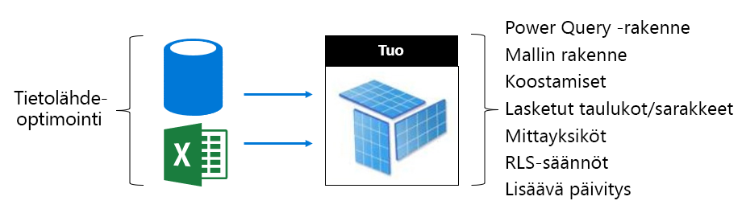

Tieto lähde kerroksessa:

- Relaatio tieto lähteet voidaan optimoida siten, että ne varmistavat nopeimman mahdollisen päivityksen integroimalla tiedot, ottamalla käyttöön sopivia indeksejä, määrittämällä lisääviin päivitys jaksoihin tasattavat taulukko osiot ja laskemalla lasku toimitukset (laskettujen malli taulukot ja-sarakkeet) tai laskenta logiikan lisääminen näkymiin
- Muut kuin relaatio tieto lähteet voidaan integroida aiemmin relaatio säilöihin
- Varmista, että yhdyskäytävissä on tarpeeksi resursseja, mieluiten erillisissä koneissa, joissa on riittävä verkon kaistanleveys ja jotka ovat lähellä tietolähteitä.

Mallikerroksessa:

- Power Query -kyselymallit voivat pienentää tai poistaa monimutkaisia muunnoksia ja etenkin niitä, jotka yhdistävät eri tietolähteitä (tietovarastot saavuttavat tämän Poimi-Muunna-Lataa-vaiheen aikana). Sen varmistaminen, että asianmukaiset tieto lähteen tieto suoja tasot on myös valittu, tämä voi estää Power BI lataamisen koko naisia tuloksia, jotta kyselyjen yhteenlaskettu tulos voidaan tuottaa.
- Mallirakenne määrittää ladattavat tiedot ja vaikuttaa suoraan mallin kokoon. Se voidaan suunnitella siten, että vältetään tarpeettomien tietojen lataaminen poistamalla sarakkeita, poistamalla rivejä (erityisesti historiallisia tietoja) tai lataamalla yhteenvedettyjä tietoja (yksityiskohtaisten tietojen lataamisen kustannuksella). Koon merkittävä pienentäminen onnistuu poistamalla suuren kardinaliteetin sarakkeet (erityisesti tekstisarakkeet), joita ei voi tallentaa tai pakata kovin tehokkaasti.
- Mallikyselyn suorituskykyä voidaan parantaa määrittämällä yksisuuntaisia suhteita, ellei kaksisuuntaisen suodatuksen sallimiseen ole pakottavaa syytä. Harkitse myös CROSSFILTER-toiminnon käyttämistä kaksisuuntaisen suodatuksen sijaan.
- Koostamistaulukot voivat saavuttaa nopeita kyselyvastauksia lataamalla ennalta yhteenvedetyt tiedot, mutta tämä kuitenkin kasvattaa mallin kokoa ja pidentää päivitysaikoja. Yleensä koostetaulukot tulee varata erittäin suurille malleille tai yhdistelmämalleille.
- Lasketut taulukot ja sarakkeet lisäävät mallin kokoa ja pidentävät päivitysaikoja. Yleensä pienempi tallennus tilan koko ja nopeampi päivitys aika voidaan saavuttaa, kun tiedot toteutuvat tai lasketaan tieto lähteessä. Jos tämä ei ole mahdollista, Power Queryn mukautettujen sarakkeiden avulla voidaan parantaa tallennustilan pakkausta.
- DAX-lausekkeiden säätäminen mittareita ja RLS-sääntöjä varten saattaa olla mahdollista, ehkäpä logiikan kirjoittamisella uudelleen kalliiden kaavojen välttämiseksi.
- Lisäävä päivitys voi merkittävästi lyhentää päivitysaikaa ja säästää muistia ja suoritinta. Lisäävä päivitys voidaan myös määrittää poistamaan historialliset tiedot, jolloin mallien koot pysyvät rajattuina.
- Malli voidaan suunnitella uudelleen kahtena mallina, kun kyselymallit poikkeavat toisistaan ja ovat ristiriitaisia. Jotkin raportit esimerkiksi esittävät korkean tason koosteita koko historiassa, ja ne kestävät 24 tunnin viiveen. Toiset raportit koskevat nykypäivän tietoja ja edellyttävät yksilöllisten tapahtumien vaiheittaista käyttöä. Sen sijaan, että suunnittelisit yksittäisen mallin täyttämään kaikkien raporttien tarpeet, voit luoda kaksi mallia, jotka on optimoitu kullekin vaatimukselle.

Mieti DirectQuery-mallin optimointimahdollisuuksia. Koska malli antaa kysely pyyntöjä pohjana olevalle tieto lähteelle, tieto lähteen optimointi on tärkeää reagoivien malli kyselyiden toimittamiseen.

 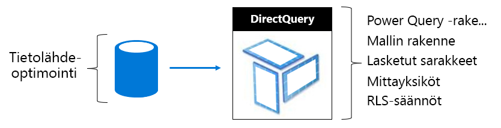

Tieto lähde kerroksessa:

- Tieto lähde voidaan optimoida siten, että se varmistaa mahdollisimman nopeimman tietojen integroinnin (joka ei ole mahdollista malli kerroksessa) ja käyttää sopivia indeksejä, määrittää taulukko osioita ja muodostaa Yhteenveto tietoja (Indeksoituja näkymiä). pienennetään laskennan määrää. Paras käyttö kokemus saavutetaan, kun läpi vienti kyselyt tarvitsevat vain suodattimia ja suorittavat sisäisiä liitoksia indeksoitujen taulu koiden tai näkymien välillä.
- Varmista, että yhdyskäytävissä on tarpeeksi resursseja, mieluiten erillisissä koneissa, joilla on riittävä verkon kaistan leveys ja jotka ovat lähellä tieto lähdettä

Mallikerroksessa:

- Power Query kysely suunnitelmien tulee mieluiten koskea ei muunnoksia – muussa tapa uksessa yritys pitää muunnokset ehdottomana vähimmäistekijänä
- Mallikyselyn suorituskykyä voidaan parantaa määrittämällä yksisuuntaisia suhteita, ellei kaksisuuntaisen suodatuksen sallimiseen ole pakottavaa syytä. Myös malli yhteydet tulee määrittää niin, että viite-eheys on pakotettu (kun näin on), ja tuloksena on tieto lähde kyselyitä, jotka käyttävät tehokkaampia sisäisiä liitoksia (Ulkoliitosten sijaan).
- Vältä Power Query kyselyn mukautettujen sarakkeiden tai mallin laskettua saraketta-toteutuvat nämä tieto lähteessä, kun se on mahdollista
- DAX-lausekkeiden säätäminen mittareita ja RLS-sääntöjä varten saattaa olla mahdollista, ehkäpä logiikan kirjoittamisella uudelleen kalliiden kaavojen välttämiseksi.

Mieti yhdistelmämallin optimointimahdollisuuksia. Muista, että yhdistelmämalli mahdollistaa tuonti- ja DirectQuery-taulukoiden yhdistelmän.

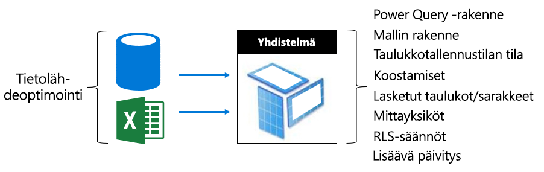

- Yleensä tuonti-ja DirectQuery-mallien optimointi aiheet koskevat yhdistelmä malli taulukoita, jotka käyttävät näitä tallennus tiloja.
- Pyri yleensä tasapainoiseen muotoiluun määrittämällä dimensiotyyppisiä taulukoita (jotka edustavat yritysentiteettejä) Kaksois-tallennustilana ja faktatyypin taulukkoja (usein suuria taulukoita, jotka edustavat toiminnallisia faktoja) DirectQuery-tallennustilana. Dual Storage-tila tarkoittaa sekä tuonti-että DirectQuery-tallennus tilaa, ja tämän avulla Power BI-palvelu voi määrittää tehokkaimman tallennus tilan, jota käytetään luotaessa alkuperäisen kyselyn läpi vienti.
- Varmista, että yhdyskäytävissä on tarpeeksi resursseja, mieluiten erillisissä koneissa, joissa on riittävä verkon kaistanleveys ja jotka ovat lähellä tietolähteitä.
- Tuonti-tallennustilaksi määritetyt koostetaulukot voivat parantaa kyselyjen suorituskykyä huomattavasti, kun niitä käytetään yhteenvedon tekemiseen DirectQuery-tallennustilan faktatyypin taulukoista. Tässä tapauksessa koostetaulukot lisäävät mallin kokoa ja pidentävät päivitysaikaa, ja usein tämä on hyväksyttävä kompromissi kyselyjen nopeuttamiseksi.

#### Ulkoisesti isännöityjen mallien optimointi

Monet [optimoinnista Power BI isännöidyissä malleissa](#optimizing-power-bi-hosted-models) käsitellyt optimointi mahdollisuudet koskevat myös Azure Analysis Services ja SQL Server Analysis Services kehitettyjä malleja. Selkeät poikkeukset ovat tiettyjä ominaisuuksia, joita ei tällä hetkellä tueta, mukaan lukien yhdistelmämallit ja koostetaulukot.

Lisäksi ulkoisesti isännöidyn tietojoukon kohdalla kannattaa ottaa huomioon tietokannan isännöinti suhteessa Power BI -palveluun. Jos kyseessä on Azure Analysis Services, Azure-resurssi luodaan samalla alueella kuin Power BI -vuokraaja (kotialue). Jos kyseessä on SQL Server Analysis Services ja IaaS, näennäiskonetta isännöidään samalla alueella, ja jos kyseessä on paikallinen, varmistetaan tehokas yhdyskäytävän määrittäminen.

Voi olla myös kiinnostavaa huomata, että Azure Analysis Servicesin tietokannat ja SQL Server Analysis Servicesin taulukkotietokannat edellyttävät, että niiden mallit ladataan kokonaan muistiin ja että ne pysyvät siellä aina tukemassa kyselyä. Power BI -palvelun tapaan muistia on oltava riittävästi päivittämiseen, jos mallin on pysyttävä online-tilassa päivityksen aikana. Kuitenkin toisin kuin Power BI -palvelussa, mallit eivät automaattisesti vanhene muistissa käytön mukaan. Power BI Premium tarjoaa näin ollen tehokkaamman lähestymistavan mallin kyselyiden maksimoimiseen pienemmällä muistin käytöllä.

### Kapasiteetin suunnittelu

Premium-kapasiteetin koko määrittää sen käytettävissä olevat muisti- ja suoritinresurssit sekä kapasiteettiin asetetut rajoitukset. Premium-kapasiteettien määrä kannattaa myös huomioida, sillä useiden Premium-kapasiteettien luominen voi auttaa eristämään kuormitukset toisistaan. Huomioi, että tallennustila on 100 Tt kapasiteetin solmua kohden, ja tämä todennäköisesti riittää hyvin mille tahansa työmäärälle.

Premium-kapasiteettien koon ja määrän määrittäminen voi olla haastavaa erityisesti ensimmäisten luomiesi kapasiteettien kohdalla. Ensimmäinen vaihe kapasiteetin koon määrittämisessä on ymmärtää keskimääräinen kuormitus, joka edustaa odotettua päivittäistä käyttöä. On tärkeää ymmärtää, että kaikki kuormitukset eivät ole yhtä suuret. Yhdessä ääripäässä voi olla esimerkiksi 100 samanaikaista käyttäjää, jotka käyttävät yhden visualisoinnin sisältävää raporttisivua – tämä on helposti toteutettavissa. Toisessa ääripäässä voi kuitenkin olla 100 samanaikaista käyttäjää, jotka käyttävät 100 eri raporttia, ja raporttisivulla on 100 visualisointia – tämä edellyttää kapasiteetin resursseilta paljon enemmän.

Kapasiteetin järjestelmänvalvojien on siis otettava huomioon monia ympäristöösi, sisältöösi ja odotettuun käyttöön liittyviä tekijöitä. Ensisijaisena tavoitteena on maksimoida kapasiteetin käyttöaste ja antaa samalla yhtenäiset kyselyajat sekä hyväksyttävät odotusajat ja häätömäärät. Huomioon otettavia seikkoja voivat olla seuraavat:

- **Mallin koko ja tietojen ominaisuudet** : tuonti mallit on ladattava täysin muistiin, jotta kyselyjä voidaan tehdä tai päivittää. LC/DQ-tietojoukot saattavat edellyttää huomattavasti suoritinaikaa ja mahdollisesti merkittävästi muistia monimutkaisten mittareiden tai RLS-sääntöjen arvioimiseksi. Kapasiteetin koko rajoittaa muistin ja suorittimen kokoa sekä LC/DQ-kyselyn siirtomäärää.
- **Samanaikaiset aktiiviset mallit** : eri tuonti mallien samanaikaiset kyselyt antavat parhaan vaste ajan ja suoritus kyvyn, kun ne pysyvät muistissa. Muistia on oltava riittävästi kaikkien useiden kyselyjen kohteena olevien mallien isännöintiin, ja lisämuisti on tarpeen niiden päivittämistä varten.
- **Tuo mallin päivitys** : päivitys tyyppi (täysi tai lisäävä), Power Query kyselyiden kesto ja monimutkaisuus sekä lasketun taulukon/sarakkeen logiikka voi vaikuttaa muistiin ja erityisesti suorittimen käyttöön. Kapasiteetin koko (1,5 kertaa taustan näennäisytimien määrä, pyöristettynä ylöspäin) rajoittaa samanaikaisia päivityksiä.
- **Samanaikaiset kyselyt** : useita samanaikaisia kyselyitä voi aiheuttaa reagoimattoman raportin, kun suoritin tai LC/DQ-yhteys ylittää kapasiteetti rajan. Tämä koskee etenkin raporttisivuja, jotka sisältävät useita visualisointeja.
- **Dataflow-, sivutetut raportit-ja AI-Funktiot** : kapasiteetti voidaan määrittää tuke massa dataflow-, sivutettuja raportteja-ja AI-funktioita, joista jokainen edellyttää määritettävissä olevaa enimmäisprosenttiosuutta kapasiteetti muistista. Muisti jaetaan dynaamisesti dataflow-kohteeseen, mutta se on määritetty staattisesti sivutettuihin raportteihin ja AI-kuormitukseen.

Näiden tekijöiden lisäksi kapasiteetin järjestelmänvalvojat voivat harkita useiden kapasiteettien luomista. Useat kapasiteetit mahdollistavat kuormituksen eristämisen, ja ne voidaan määrittää varmistamaan, että ensisijaisilla kuormituksilla on taatut resurssit. Voit esimerkiksi luoda kaksi kapasiteettia erottamaan liiketoiminnan kannalta tärkeät kuormitukset omatoimisen BI:n (SSBI) kuormituksista. Liiketoiminnan kannalta tärkeän kapasiteetin avulla voidaan eristää suuria yritysmalleja, jolloin ne saavat taatut resurssit ja käyttöoikeus myönnetään vain IT-osastolle. SSBI-kapasiteetin avulla voidaan isännöidä kasvavaa määrää pienempiä malleja, ja käyttöoikeus myönnetään yritysanalyytikoille. SSBI-kapasiteetti voi toisinaan esiintyä kyselyn tai päivityksen viiveitä, jotka ovat siedettäviä.

Kapasiteetin järjestelmänvalvojat voivat ajan mittaan tasapainottaa työtiloja eri kapasiteeteissa siirtämällä sisältöä työtilojen välillä tai työtiloja kapasiteettien välillä sekä suurentamalla tai pienentämällä kapasiteetteja. Yleensä voit isännöidä suurempia malleja, joita skaalaat ylös, ja suurempaan samanaikaisuuteen.

Muista, että käyttöoikeuden ostaminen antaa vuokraajalle näennäisytimiä. **P3**-tilauksella voidaan luoda yksi tai enintään neljä Premium-kapasiteettia eli 1 x P3 tai 2 x P2 tai 4 x P1. Lisäksi ennen kuin P2-kapasiteetti muunnetaan P3-kapasiteettiin, kannattaa harkita näennäisytimien jakamista kahden P1-kapasiteetin luomiseksi.

### Testaus menetelmät

Kun kapasiteetin koko on päätetty, testaaminen voidaan suorittaa luomalla hallittu ympäristö. Käytännöllinen ja taloudellinen vaihtoehto on luoda Azure (A-SKU) -kapasiteetti. Huomaa, että P1-kapasiteetti on samankokoinen kuin A4-kapasiteetti, P2-kapasiteetti samankokoinen kuin A5-kapasiteetti P3-kapasiteetti samankokoinen kuin A6-kapasiteetti. Azure-kapasiteetit voidaan luoda nopeasti, ja niistä laskutetaan tunneittain. Joten kun testaus on valmis, ne voidaan poistaa helposti, jolloin kustannuksia ei enää kerry.

Testisisältö voidaan lisätä Azure-kapasiteetissa luotuihin työtiloihin, minkä jälkeen yksittäinen käyttäjä voi suorittaa raportteja ja luoda kyselyistä realistisen ja edustavan kuormituksen. Jos käytössä on tuontimalleja, kunkin mallin kohdalla on myös suoritettava päivitys. Valvontatyökaluilla voidaan sitten tarkistaa kaikki arvot resurssien käytön ymmärtämiseksi.

On tärkeää, että testit ovat toistettavissa: testejä tulee suorittaa useita kertoja, ja niiden pitäisi antaa suunnilleen sama tulos joka kerta. Näiden tulosten keskiarvoa voidaan käyttää kuormituksen määrittämiseen ja arvioimiseen todellisissa tuotanto-olosuhteissa.

Jos olet jo määrittänyt kapasiteetin ja raportit, joille haluat tehdä testin, voit luoda kuormitustestin nopeasti [PowerShellin kuormituksen luontityökalun](https://aka.ms/PowerBILoadTestingTool) avulla. Työkalun avulla voit arvioida, kuinka monta kunkin raportin esiintymää kapasiteettisi pystyy suorittamaan tunnissa. Työkalun avulla voit lisäksi arvioida kapasiteettisi kyvyn yksittäisen raportin hahmontamiseen tai useiden eri raporttien hahmontamiseen rinnakkain. Lisä tietoja on videossa [Microsoft Power BI: Premium-kapasiteetti](https://www.youtube.com/watch?time_continue=1860&v=C6vk6wk9dcw).

Voit luoda monimutkaisemman testin kehittämällä kuormituksen testaussovelluksen, joka simuloi realistista kuormitusta. Lisätietoja on verkkoseminaarissa [Power BI -sovellusten kuormituksen testaus Visual Studion kuormitustestillä](https://www.youtube.com/watch?v=UFbCh5TaR4w).

## Tutkitaan reaalimaailman tilanteita

Tässä osiossa esitellään useita reaalimaailman tilanteita yleisten ongelmien tai haasteiden kuvaamiseen, niiden tunnistamiseen ja niiden ratkaisemiseen:

- [Tieto joukkojen pitäminen ajan tasalla](#keeping-datasets-up-to-date)
- [Hitaan vastaamisen tieto joukkojen tunnistaminen](#identifying-slow-responding-datasets)
- [Satunnaisesti Slow-responding-tieto joukkojen syiden tunnistaminen](#identifying-causes-for-sporadically-slow-responding-datasets)
- [Sen selvittäminen, onko muistia tarpeeksi](#determining-whether-there-is-enough-memory)
- [Sen selvittäminen, onko suoritin tarpeeksi](#determining-whether-there-is-enough-cpu)

Vaiheet sekä kaavio-ja taulukko esimerkit ovat **Power BI Premium Capacity Metrics-sovelluksesta** (sovellus), johon Power BI järjestelmänvalvojalla on käyttö oikeus.

### Tieto joukkojen pitäminen ajan tasalla

Tässä skenaariossa käynnistettiin tutkimus, kun käyttäjät valittivat, että raportti tiedot näyttivät toisinaan olevan vanhoja tai vanhentuneita.

Sovelluksessa järjestelmänvalvoja on vuoro vaikutuksessa **päivitysten** visualisoinnin kanssa ja lajittelee tieto joukot **suurimman odotus ajan** tilasto tietojen mukaan laskevassa järjestyksessä. Tämä auttaa heitä paljastamaan tieto joukot, joissa on pisin odotus aika, ryhmitelty työtilan nimen mukaan.

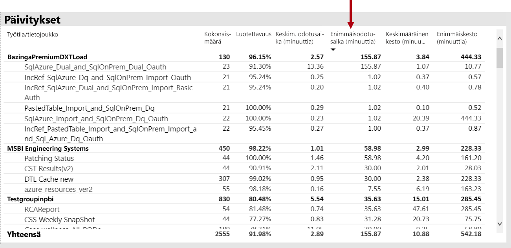

Lisäksi **tunnin Keski arvon päivityksen odotus ajat** -visualisoinnissa ne huomaavat, että päivityksen odotus ajat ovat aina HUIPUSSAAN noin kuusitoista joka päivä.

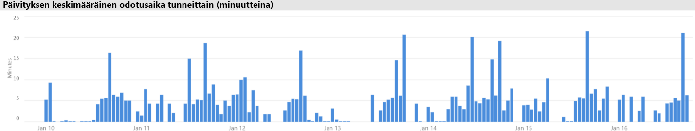

Näitä tuloksia varten on useita mahdollisia selityksiä:

- Liian monta päivitys yritystä voidaan tehdä samanaikaisesti, mikä ylittää kapasiteetti solmun asettamat rajoitukset (kuusi samanaikaista päivitystä P1-oletus muistivarauksella)

- Päivitettävät tieto joukot saattavat olla liian suuria mahtumaan käytettävissä olevaan muistiin (vaatii vähintään 2x koko päivityksen vaatima muisti)
- Tehoton Power Query logiikka voi johtaa muistin käytön piikkiin tieto joukon päivittämisen aikana. Varattu kapasiteetti voi toisinaan saavuttaa fyysisen enimmäismäärän, joka ei ole päivitys ja joka mahdollisesti vaikuttaa muihin kapasiteetin raportti näkymän toimintoihin.
- Usein kyselyn kohteena olevat tieto joukot, joiden on oltava muistissa, saattavat vaikuttaa muiden tieto joukkojen päivittämiseen rajallisen käytettävissä olevan muistin vuoksi

Power BI järjestelmänvalvoja voi auttaa selvittämään seuraavaa:

- Käytettävissä oleva muisti on vähissä tietojen päivittämisen aikana, kun käytettävissä oleva muisti on alle 2x päivitettävissä olevan tieto joukon koko
- Tieto joukot, joita ei päivitetty ja joita ei ollut muistissa ennen päivitystä, mutta jotka alkoivat näyttää vuoro vaikutteista liikennettä raskaiden päivitys aikojen aikana. Jos haluat nähdä, mitkä tieto joukot ladattiin muistiin tiettynä aikana, Power BI järjestelmänvalvoja voi tarkastella sovelluksen tieto joukot **-väli lehden** tieto joukot-aluetta ja ristiinsuodatinta tiettynä ajan kohtana napsauttamalla jotakin palkeista, joka on **ladattuna tunneittain**. Paikallinen piikki (näkyy alla olevassa kuvassa) ilmaisee tunnin, kun useita tieto joukkoja ladattiin muistiin, mikä voi viivyttää ajoitettujen päivitysten alkamista
- Lisääntynyt tieto joukko häädöt, kun tietojen päivittäminen on ajoitettu alkamaan, mikä ilmaisee, että liian monta eri vuoro vaikutteista raporttia on aiheuttanut liian paljon erilaisia vuorovaikutteisia raportteja ennen päivityksen ajan kohtaa. **Tunnin tieto joukon häädöt ja muistin kulutus** visualisointi voivat selvästi ilmaista häädöt.

Seuraavassa kuvassa näytetään paikallinen piikki ladatuilla tieto joukoilla, mikä ehdottaa vuorovaikutteisten kyselyiden viivästynyttä alkamista. Kun valitset aika jakson **tunneittain ladatusta** tieto joukosta, visualisointi Ristiinsuodattaa tieto **joukon koot** visualisoinnin.

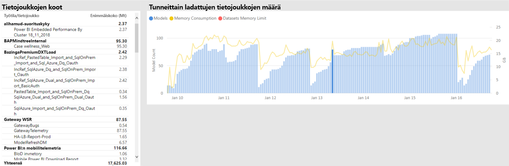

Power BI järjestelmänvalvoja voi yrittää ratkaista ongelman ryhtymällä toimiin varmistaakseen, että tietojen päivityksille on käytettävissä riittävästi muistia:

- Muodostetaan yhteyttä tieto joukon omistajiin ja pyydetään heitä suorittamaan tietojen päivittämisen aika tauluja
- Tieto joukko kyselyjen lataamisen vähentäminen poistamalla tarpeettomia koonti näyttöjä tai koonti näytön ruutua, erityisesti ne, jotka soveltavat rivi tason suojausta
- Tietojen päivittämisen nopeuttaminen optimoimalla Power Query logiikka, mallin lasketut sarakkeet tai taulukot, vähentämällä tieto joukon kokoja tai määrittämällä suurempia tieto joukkoja lisäävän tietojen päivittämisen suorittamista varten

### Hitaan vastaamisen tieto joukkojen tunnistaminen

Tässä skenaariossa aloitettiin tutkinta, kun käyttäjät valittivat, että tiettyjen raporttien avaaminen kesti kauan, ja ajoittain.

Power BI-järjestelmänvalvoja voi käyttää **kyselyn kestot** -visualisointia, jonka avulla voit määrittää huonoimmat suoritus joukot lajittelu joukkoina laskevasti **keskimääräisen keston**mukaan. Tässä visualisoinnissa näytetään myös tieto joukko kyselyjen määrät, joten näet, miten usein tieto joukkoja kysytään.

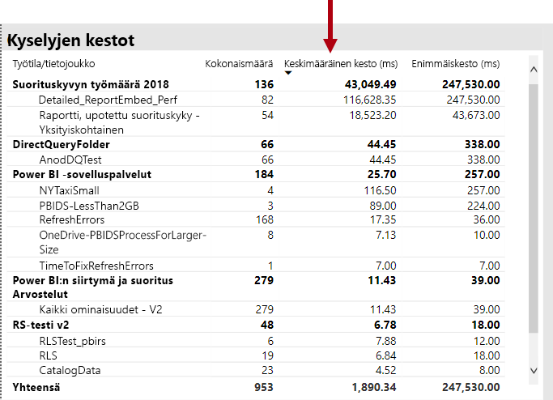

Power BI järjestelmänvalvoja voi lukea **kyselyn keston jakauma** -visualisoinnin, joka osoittaa, että suodatetun ajan jakson kokonaisjakauma on bucketed Query performance (< = 30ms, 0-100ms jne.). Yleensä kyselyt, jotka vievät yhden sekunnin tai vähemmän, pitävät reagoivina eniten käyttäjiä. kyselyt, jotka vievät kauemmin, pyrkivät luomaan huonon suoritus kyvyn vaikutelman.

**Tuntikohtainen kyselyn keston jakauma** -visualisointi sallii Power BI järjestelmänvalvojan tunnistaa tunnin jaksot, kun kapasiteetin suoritus kyky on voitu havaita huonoksi. Suuremmat palkki segmentit, jotka edustavat kyselyn kestoja sekunnin aikana, suurempi riski, että käyttäjät näkevät huonon suoritus tehon.

Visualisointi on vuorovaikutteinen, ja kun palkin segmentti on valittuna, vastaava **kyselyn kestot** -taulukko visualisointi raportti sivulla on ristiinsuodatettu näyttämään sen edustamat tieto joukot. Tämän ristiinsuodatuksen avulla Power BI järjestelmänvalvoja voi helposti tunnistaa, mitkä tieto joukot reagoivat hitaasti.

Seuraavassa kuvassa näytetään visualisointi suodatettuna **tuntikohtaisten kyselyiden keston jakeluiden**mukaan, ja siinä keskitytään pahimpiin suoritettuihin tieto joukkoihin tunnin aikana. 

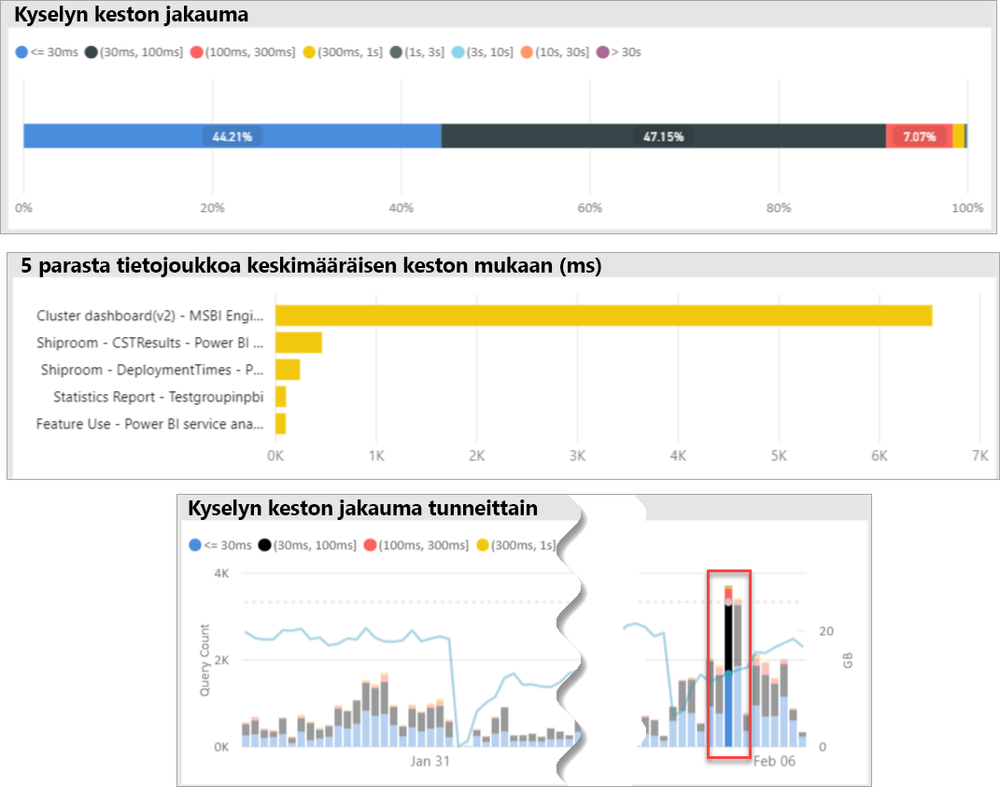

Kun tietyn 1 tunnin TimeSpan-kohteen huono suoritus tieto joukko tunnistetaan, Power BI järjestelmänvalvoja voi tutkia, aiheutuuko ylikuormitettu kapasiteetti tai onko se huonosti suunnitellun tieto joukon tai raportin vuoksi. Tämän saavuttamiseksi he voivat käyttää **kyselyn odotus aikoja** visualisointiin ja lajitella tieto joukkoja laskevasti keskimääräisen kyselyn odotus ajan mukaan. Jos suuri osa kyselyistä odottaa, suuren kysynnän tieto joukolle on todennäköisesti syynä monen kyselyn odottamiseen. Jos kyselyiden keskimääräinen odotus aika on merkittävä (> 100ms), tieto joukon ja raportin kannattaisi ehkä tarkistaa, voidaanko optimointeja tehdä. Esimerkiksi ehkä vähemmän visualisointeja annetuilla raportti sivuilla tai DAX-lausekkeen optimoinnissa.

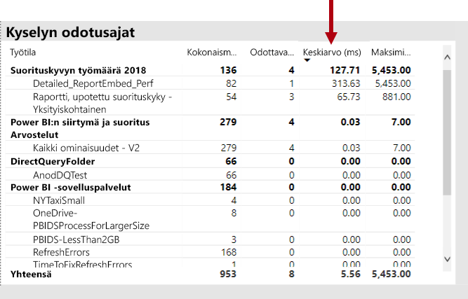

Kyselyn odotus aika voi kerääntyä tieto joukkoihin useilla eri perusteilla:

- Optimaalinen mallin suunnittelu, mitta yksikkö lausekkeet tai jopa raportin suunnittelu – kaikki olosuhteet, jotka voivat vaikuttaa pitkiin, käynnissä oleviin kyselyihin, jotka kuluttavat paljon suoritin tehoa. Tämä pakottaa uudet kyselyt odottamaan, kunnes CPU-säikeet ovat käytettävissä, ja voivat luoda saattue tehosteen (Think Traffic Jam), joka on yleisesti nähtävissä ruuhka-aikoina. **Kyselyn** odotus sivu on pääresurssi, joka määrittää, onko tieto joukoissa kyselyiden odotus aikoja Keski määrin.
- Suuren määrän samanaikaisia kapasiteetin käyttäjiä (satoja tuhansia), jotka kuluttavat samaa raporttia tai tieto joukkoa. Jopa hyvin suunnitellut tieto joukot voivat suorittaa huonosti samanaikaisuus kynnyksen ulkopuolella. Tämä ilmaistaan yleensä yhdellä tieto joukolla, joka näyttää kyselyiden määrän huomattavasti suuremman arvon kuin muissa tieto joukoissa (esimerkiksi 300 000 kyselyä yhdelle tieto joukolle verrattuna < 30K-kyselyihin kaikissa muissa tieto joukoissa). Jossakin vaiheessa kysely odottaa tätä tieto joukkoa, joka alkaa porrastaa, ja tämä näkyy **kyselyn kestot** -visualisoinnissa.
- Useat erilaiset tieto joukot kyselivat samanaikaisesti, mikä aiheutti tietojen poistamisen tieto joukoiksi usein ajan ja muistin loppumisen aikana. Tämä johtaa siihen, että käyttäjät kokevat hitaan suoritus tehon, kun tieto joukko ladataan muistiin. Jos haluat vahvistaa tämän, Power BI järjestelmänvalvoja voi viitata **tuntikohtaiseen tieto joukon häädön ja muistin kulutuksen** visualisointiin, mikä saattaa ilmaista, että suuren määrän muistiin ladattuja tieto joukkoja on toistuvasti häädetty.

### Sporadically Slow-responding-tieto joukkojen syiden tunnistaminen

Tässä skenaariossa käynnistettiin tutkimus, kun käyttäjät kuvasivat, että raportin visualisoinnit tuntuvat toisinaan hitaalta reagoimaan tai saattavat lakata vastaamasta, mutta muina aikoina ne olivat hyväksyttävän Responsive.

Sovelluksessa **kyselyn kestot** -osaa käytettiin etsimään syyllinen tieto joukko seuraavalla tavalla:

- **Kyselyn kestot** visualisoi järjestelmänvalvojan suodattaman tieto joukon tieto joukon mukaan (aloittaen kyselyn kohteena olevien ylimmistä tieto joukoista) ja tutki ristiinsuodatetut palkit **tuntikohtaisten kyselyjen jakeluiden** visualisoinnissa.
- Kun yksittäinen tunnin palkki osoitti merkittäviä muutoksia kaikkien kyselyn kesto-ryhmän vs. muiden yhden tunnin palkkien suhteen kyseisessä tieto joukossa (eli värien väliset suhteet muuttuvat huomattavasti), tämä tieto joukko osoitti, että tämä tieto joukko on muuttunut satunnaisesti suoritus kykyä.
- Yhden tunnin palkit, jotka näyttävät epäsäännöllisen osan huonoista suorittamista kyselyistä, ovat osoittaneet TimeSpan-arvon, jossa kyseiseen tieto joukkoon vaikutti meluisan naapurin vaikutus, joka aiheutui muiden tieto joukkojen toiminnoista.

Alla olevassa kuvassa on yksi tunti 30. tammi kuuta, jolloin havaittiin merkittävä takaisku tieto joukon suoritus kyvyssä, mikä ilmaistaan kohteen "(3, 10s]" suorituksen kesto-säilön koon mukaan. Kun napsautat, että tunnin palkki paljastaa kaikki muistiin ladatut tieto joukot, siten, että ehdokas tieto joukot aiheuttavat äänekkään naapurin vaikutuksen.

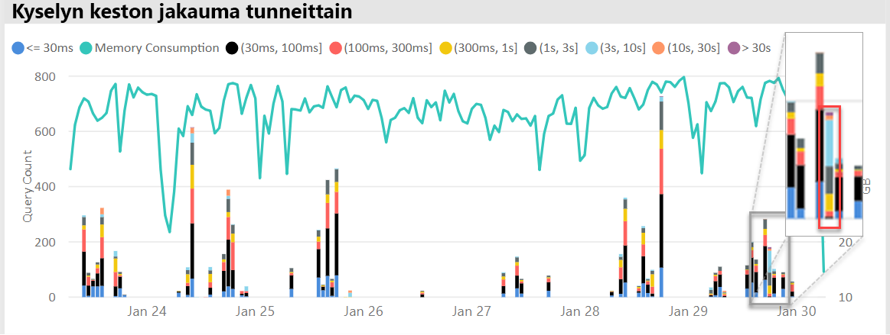

Kun ongelmallinen TimeSpan on tunnistettu (eli yllä olevassa kuvassa 30. tammi kuuta), Power BI järjestelmänvalvoja voi poistaa kaikki tieto joukko suodattimet ja suodattaa vain kyseisen TimeSpan-kohteen perusteella, mitä tieto joukkoja kyseisenä aikana kyseenalaistettiin aktiivisesti. Meluisa naapuri-tehosteen syyllinen tieto joukko on yleensä joko ylimmän kyselyn kohteena oleva tieto joukko tai se, jolla on pisin keskimääräinen kyselyn kesto.

Tämän ongelman ratkaisuna voi olla se, että eri työtiloissa olevat syytieto joukot jaetaan eri Premium-kapasiteetteihin tai jaettuun kapasiteettiin, jos tieto joukon koko, kulutus vaatimukset ja tietojen päivitys kuviot ovat tuettuja.

Myös käänteisarvo voi olla tosi. Power BI järjestelmänvalvoja voi tunnistaa ajat, jolloin tieto joukko kyselyn suoritus kyky paranee huomattavasti, ja etsi sitten, mitä katosi. Jos tästä pisteestä puuttuu joitakin tietoja, se voi olla avuksi ongelman aiheuttavaan ongelmaan.

### Sen selvittäminen, onko muistia tarpeeksi

Power BI järjestelmänvalvoja voi tarkistaa, onko muistia tarpeeksi, jotta se voi viimeistellä työmääränsä, määrittämällä **sovelluksen tieto joukot-väli lehdellä** **kulutetut muisti prosentit** . **All** (Total)-muisti edustaa muistiin ladattujen tieto joukkojen kuluttamaa muistia riippumatta siitä, ovatko ne aktiivisesti kyselyitä vai käsiteltyjä. **Aktiivinen** muisti edustaa aktiivisessa käsittelyssä olevien tieto joukkojen kuluttamaa muistia.

Terveessä kapasiteetissa visualisointi näyttää tältä, mikä näyttää kuilun kaikkien (Total) ja aktiivisen muistin välillä:

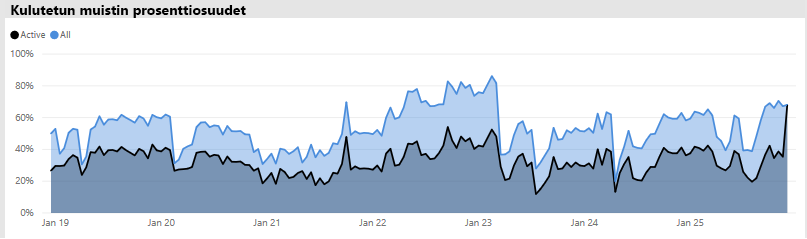

Kun kapasiteetti kokee muisti painetta, sama visualisointi näyttää selvästi aktiivisen muistin ja kokonaismuistin lähentymisen, mikä tarkoittaa sitä, että on mahdotonta ladata lisää tieto joukkoja muistiin kyseisenä ajan kohtana. Tässä tapa uksessa Power BI järjestelmänvalvoja voi napsauttaa **kapasiteetin uudelleenkäynnistämistä** (hallinta portaalin kapasiteetti asetukset-alueen **lisä asetuksissa** ). Kapasiteetin uudelleenkäynnistäminen aiheuttaa sen, että kaikki tieto joukot tyhjennetään muistista ja että ne voivat ladata muistiin tarvittaessa (kyselyjen tai tietojen päivittämisen mukaan).

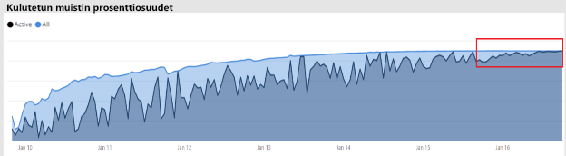

### Sen selvittäminen, onko suoritin tarpeeksi

Yleensä kapasiteetin keskimääräisen suorittimen käytön on pysyttävä alle 80 prosenttia. Tämän arvon ylittäminen tarkoittaa sitä, että kapasiteetti lähestyy suorittimen kylläisyyttä.

SUORITTIMEN kylläisyyden vaikutukset ilmaistaan toiminnoina, jotka vievät kauemmin kuin niiden pitäisi, koska kapasiteetti suorittaa useita suoritin kontekstin valitsimia, koska se yrittää käsitellä kaikkia toimintoja. Premium-kapasiteetissa, jossa on paljon samanaikaisia kyselyitä, tämä ilmaistaan suurilla kyselyiden odotus ajalla. Korkeiden kyselyiden odotus aikojen seura uksena reagointi on tavallista hitaampaa. Power BI järjestelmänvalvoja voi helposti tunnistaa, milloin suoritin on kyllästetty, tarkastelemalla **tuntikohtaisten kyselyiden odotus ajan** visualisointia. Kyselyiden odotus ajan jaksottaiset huiput ilmaisevat mahdollisen suorittimen kylläisyyden.

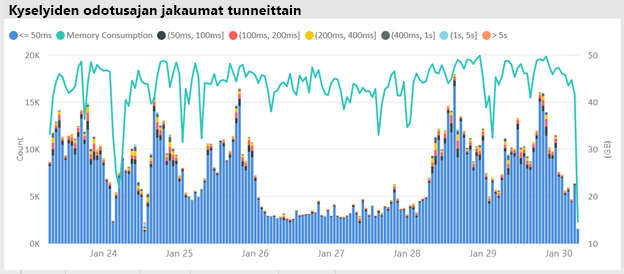

Samanlaista kaavaa voidaan toisinaan havaita tausta toiminnoissa, jos ne vaikuttavat suorittimen kyllästymiseen. Power BI järjestelmänvalvoja voi etsiä määritetyn tieto joukon ajoittain tapahtuvaa piikkiä, mikä voi ilmaista suorittimen kylläisyyttä ajan kuluessa (johtunee siitä, että muut meneillään olevat tieto joukko päivitykset ja/tai vuorovaikutteiset kyselyt) ovat käytössä. Tässä tapa uksessa sovelluksen **järjestelmä** näkymään viittaaminen ei välttämättä välttämättä paljasta, että suoritin on 100 prosenttia. **Järjestelmä** näkymä näyttää tunti keskiarvot, mutta suoritin voi kyllästyy useita minuutteja raskaita toimintoja, jotka näkyvät piikkarit odotus aikoina.

SUORITTIMEN kyllästymisen vaikutuksen näkemiseen on enemmän vivahteita. Kun odotettavien kyselyiden määrä on tärkeä, kyselyn odotus aika tapahtuu aina jossain määrin aiheuttamatta havaittavaa suoritus kyky heikkenee. Jotkin tieto joukot (joiden keskimääräinen kysely aika on pidempi, mikä osoittaa monimutkaisuutta tai kokoa) ovat alttiimpia suorittimen kyllästymisen vaikutuksille kuin toisissa. Jos haluat tunnistaa nämä tieto joukot helposti, Power BI järjestelmänvalvoja voi etsiä muutoksia palkkien väri koosteessa **tunnin odotus ajan jakauman** visualisoinnissa. Kun olet saanut Outlier-palkin, he voivat etsiä tieto joukkoja, joilla oli kysely odotus aikaa tuona aikana, ja tarkastella myös keskimääräisen kyselyn odotus aikaa verrattuna keskimääräiseen kyselyn kestoon. Kun nämä kaksi mittaus arvoa ovat yhtä laajoja ja tieto joukon kysely työmäärä on muu kuin triviaali, on todennäköistä, että tieto joukkoon vaikuttaa riittämätön suoritin.

Tämä vaikutus voi olla erityisen ilmeinen, kun useita käyttäjiä käyttää lyhyinä toistuvissa kyselyissä (esimerkiksi koulutus istunnossa) tieto joukkoa, mikä aiheuttaa suoritin kylläisyyttä kunkin purskeen aikana. Tässä tapa uksessa merkittävät kyselyn odotus ajat tässä tieto joukossa voivat olla kokeneita ja vaikuttaa myös muihin kapasiteetin tieto joukkoihin (äänekäs naapurin vaikutus).

Joissakin tapa uksissa Power BI järjestelmänvalvojat voivat pyytää, että tieto joukon omistajat luovat vähemmän pysyvän kyselyn kuormituksen luomalla koonti näytön (joka tekee kyselyitä tietyin väli muistissa olevien taulu koita sisältävien tieto joukkojen päivityksillä) raportin sijaan. Tämä voi auttaa estämään piikkejä, kun koonti näyttö on ladattu. Tämä ratkaisu ei ehkä aina ole mahdollinen annetulle liiketoiminta vaatimudelle, mutta se voi olla tehokas tapa välttää suorittimen kylläisyyttä muuttamatta tieto joukkoa.

## Päätelmät

Power BI Premium tarjoaa yhdenmukaisemman suoritus tehon, suurten tieto määrien tuen sekä yhtenäisen itsepalvelupalvelun ja Enterprise BI-ympäristön joustavuuden kaikille organisaatiossasi. Tämä tason 300 tekninen raportti on kirjoitettu erityisesti Power BI järjestelmänvalvojille sekä sisällöntekijöille ja julkaisijoille. Sen avulla he ymmärtävät Power BI Premium mahdollisuuksia ja selittävät, miten skaalautuvat ratkaisut suunnitellaan, otetaan käyttöön, seurataan ja tehdään.

Jos haluat ottaa käyttöön ja hallita Power BI Premium kapasiteetteja, järjestelmänvalvojat ja mallin kehittäjät tarvitsevat erittäin hyvän käsityksen kapasiteettien toiminnasta, niiden Hallin nasta ja seuran nasta sekä siitä, miten malleja voi optimoida, jotta ne voivat reagoida asianmukaisesti suoritus kykyyn liittyvät ongelmat ja pullon kaulat niiden ilmetessä.

## Lopeta muistiinpanot

\[1\] tässä teknisessä asia kirjassa käsitellään Power BI Premium, jota vain Power BI-pilvi palvelu tukee, joten Power BI-raporttipalvelin ei ole laajessa tilassa, lukuun ottamatta sitä, että Power BI-raporttipalvelin asentamisen vaatima käyttö oikeus sisältyy Jotkin Power BI Premium SKU.

\[2\] Power BI pilvi palveluna, kun sitä käytetään sisällön upottamiseen sovelluksen käyttäjien puolesta, on Platform-as-a-Service (PaaS). Tämän tyyppisen upottamisen voi saavuttaa erilaisilla kahdella tuotteella, joista yksi on Power BI Premium.

\[3\] työntö-, virtaus-ja hybridi tieto joukkoja ei tallenneta Premium-kapasiteetteihin, joten ne eivät ole vastike Premium-kapasiteettien käyttöönotosta, Hallin nasta ja valvonnasta.

\[4\] Excel-työkirjoja Power BI sisältö tyyppinä ei tallenneta Premium-kapasiteetteihin, joten ne eivät ole vastike Premium-kapasiteettien käyttöönotosta, Hallin nasta tai valvonnasta.

\[5\] visualisoinnit voidaan määrittää ohittamaan osittajan väliset suhteet. Jos haluat lisä tietoja, katso [Power BI raportti asiakirjan visualisointi](service-reports-visual-interactions.md) toiminnot.

\[6\] koon eron voi määrittää vertaamalla Power BI Desktop tiedoston kokoa Tehtävienhallinnan muistiin käyttäen tiedostoa.

\[7\] Microsoft-tieto lähteiden tuki sisältää SQL Server, Azure-tieto tiilet, Azure HDInsight Spark (beeta), Azure SQL-tieto kannan ja Azure SQL Data Warehouse. Lisä tietoja muista lähteistä on Power BI-asia kirjan [Direct Queryn tukemissa tieto lähteissä](desktop-directquery-data-sources.md) .

\[8\] Power BI Premium tukee Power BI Desktop (. pbix) tiedoston lataamista enintään 10 Giga tavun kokoiseksi. Kun tieto joukko on ladattu, sen koko voi kasvaa jopa 12 Giga tavuun päivityksen seura uksena. Latauksen enimmäiskoko vaihtelee SKU:N mukaan. Lisä tietoja on suurten tieto joukkojen asia kirjojen [Power BI Premium tuessa](service-premium-large-datasets.md) .

\[9\] SKU, joissa on alle neljä v-ydintä, eivät toimi varatussa infrastruktuurissa. Tämä sisältää EM1-, EM2-, a1-ja a2-varastointi yksiköt.

\[10\] vaikka harvinaisia, malleja voidaan poistaa muistista palvelun toiminnasta johtuen.

\[11\] nämä ajoitukset saattavat muuttua milloin tahansa.

\[12\] tätä kutsutaan Multi-Geo-kohteeksi, joka on tällä hetkellä esikatselussa. Multi-geon käyttöönotto liittyy yleensä yrityksen tai julkishallinnon vaatimustenmukaisuusehtoihin, eivät niinkään suorituskykyyn tai skaalaukseen. Raporttien ja raporttinäkymien lataamiseen liittyy edelleen metatietopyyntöjä kotialueelle. Jos haluat lisä tietoja, katso [Power BI Premium (esikatselu)-asia kirjan Multi-Geo-tuki](service-admin-premium-multi-geo.md) .

\[13\] on mahdollista, että käyttäjät voivat aiheuttaa suoritus kykyyn liittyviä ongelmia ylikuormittaa Power BI-palvelu töillä, kirjoittaa liian monimutkaisia kyselyitä, luoda kehä viittauksia ja niin edelleen.

\[14\] koko organisaation työtilojen määrittämisen vaihto ehtoa ei suositella, ja kohdennettua lähestymis tapaa suositaan. Yleensä ei ole parasta käyttää henkilökohtaisia työtiloja tuotanto sisällölle.

\[15\] on mahdollista valvoa varastointi yksiköitä sovelluksessa tai Azure-portaali, mutta ei Power BI hallinta portaalissa. Jos haluat valvoa varastointi yksiköitä, raportin päivitys epäonnistuu, jos sovellusta ei ole lisätty resurssin lukijarooliin. Lisä tietoja on [monitorin Power BI Premium-ja Power BI Embedded valmiudet](service-admin-premium-monitor-capacity.md) -asia kirjassa.

\[16\] päivitykset voivat odottaa, kun SUORITINTA tai muistia ei ole tarpeeksi käynnistykseen.

\[17\] muistin tieto joukon koko voi olla suurempi kuin koko levyllä enintään 20 prosentilla.

\[18\] keskimääräinen muistin käyttö (gt) ja suurin muistin kulutus (gt)

\[19\] tieto joukon häädöt

\[20\] tieto joukko kyselyä, tieto joukon keskimääräinen kyselyn kesto (MS), tieto joukon odotus määrä ja tieto joukon keskimääräinen odotus aika (MS)

\[21\] suorittimen suuren käytön määrä ja suurimman käyttö asteen suoritin aika (viimeiset seitsemän päivää)

\[22\] DQ/LC – suuren käyttö asteen määrä ja korkeimman käyttö asteen DQ/LC-aika (viimeiset seitsemän päivää)
